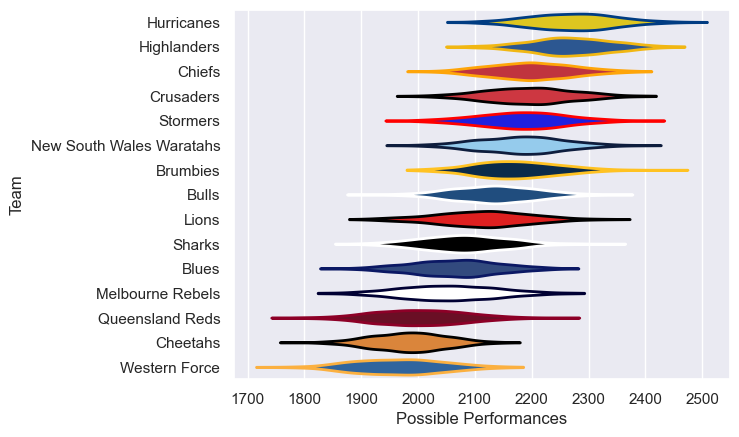

---  
title: "Super Rugby Pacific 2015"  
date: 2025-07-29 6:00:00 -0500  
categories: model review projection  
layout: article  
aside:  
    toc: true  
---
# Current Team Rankings

# Standings

## Current Standings

| Club                     |   Played |   Wins |   Point Differential |   Losing Bonus Points |   Try Bonus Points |   Competition Points |
|:-------------------------|---------:|-------:|---------------------:|----------------------:|-------------------:|---------------------:|
| Hurricanes               |       18 |     15 |                  183 |                     2 |                 10 |                   72 |
| Highlanders              |       19 |     14 |                  152 |                     3 |                  7 |                   66 |
| Brumbies                 |       18 |     10 |                  108 |                     5 |                  7 |                   52 |
| New South Wales Waratahs |       17 |     11 |                   78 |                     3 |                  5 |                   52 |
| Chiefs                   |       17 |     10 |                   63 |                     4 |                  3 |                   47 |
| Stormers                 |       17 |     10 |                   30 |                     1 |                  2 |                   45 |
| Crusaders                |       16 |      9 |                  143 |                     2 |                  5 |                   43 |
| Lions                    |       16 |      9 |                  -22 |                     2 |                  2 |                   42 |
| Bulls                    |       16 |      7 |                    9 |                     6 |                  3 |                   37 |
| Melbourne Rebels         |       16 |      7 |                  -35 |                     5 |                  3 |                   36 |
| Sharks                   |       16 |      7 |                  -63 |                     3 |                  3 |                   34 |
| Cheetahs                 |       16 |      5 |                 -174 |                     2 |                  4 |                   26 |
| Queensland Reds          |       16 |      4 |                 -187 |                     3 |                  3 |                   22 |
| Blues                    |       16 |      3 |                 -146 |                     6 |                  2 |                   20 |
| Western Force            |       16 |      3 |                 -139 |                     4 |                  3 |                   19 |

# Completed Match Review

| Model | Percent Correct Predictions | Spread Error |
| ------ | ------ | ------ |
| Club Level | 61.6% | 11.6 |
| Player Level: Lineup | nan% | nan |
| Player Level: Minutes | nan% | nan |

