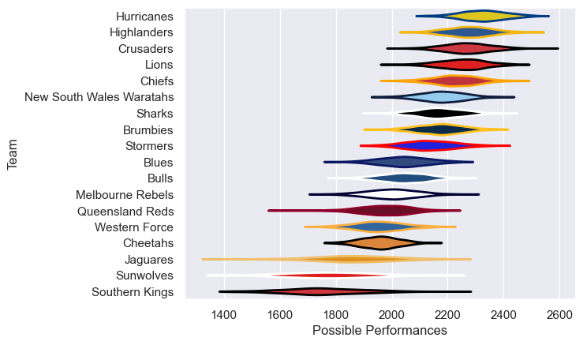

---  
title: "Super Rugby Pacific 2016 Status"  
date: 2025-07-28 6:00:00 -0500  
categories: model review projection  
layout: article  
aside:  
    toc: true  
---
# Current Team Rankings

# Standings

## Current Standings

| Club                     |   Played |   Wins |   Point Differential |   Losing Bonus Points |   Try Bonus Points |   Competition Points |
|:-------------------------|---------:|-------:|---------------------:|----------------------:|-------------------:|---------------------:|
| Hurricanes               |       18 |     14 |                  218 |                     2 |                 10 |                   68 |
| Lions                    |       18 |     13 |                  198 |                     1 |                 12 |                   65 |
| Chiefs                   |       17 |     12 |                  173 |                     1 |                 11 |                   60 |
| Highlanders              |       17 |     12 |                  143 |                     4 |                  7 |                   59 |
| Crusaders                |       16 |     11 |                  153 |                     1 |                  7 |                   52 |
| Stormers                 |       16 |     10 |                  127 |                     4 |                  4 |                   50 |
| Brumbies                 |       16 |     10 |                   93 |                     1 |                  6 |                   47 |
| Sharks                   |       16 |      9 |                   50 |                     3 |                  4 |                   45 |
| Bulls                    |       15 |      9 |                   60 |                     0 |                  6 |                   44 |
| New South Wales Waratahs |       15 |      8 |                   96 |                     4 |                  7 |                   43 |
| Blues                    |       15 |      8 |                   -6 |                     3 |                  4 |                   41 |
| Melbourne Rebels         |       15 |      7 |                 -121 |                     1 |                  8 |                   37 |
| Cheetahs                 |       15 |      4 |                  -48 |                     4 |                  4 |                   24 |
| Jaguares                 |       15 |      4 |                  -51 |                     5 |                  3 |                   24 |
| Queensland Reds          |       15 |      3 |                 -168 |                     3 |                  2 |                   19 |
| Western Force            |       15 |      2 |                 -181 |                     5 |                  1 |                   14 |
| Sunwolves                |       15 |      1 |                 -334 |                     3 |                  4 |                   13 |
| Southern Kings           |       15 |      2 |                 -402 |                     0 |                  2 |                   10 |

# Completed Match Review

| Model | Percent Correct Predictions | Spread Error |
| ------ | ------ | ------ |
| Club Level | 71.1% | 12.9 |
| Player Level: Lineup | nan% | nan |
| Player Level: Minutes | nan% | nan |

