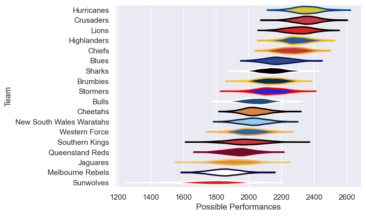

---  
title: "Super Rugby Pacific 2017 Status"  
date: 2025-07-28 6:00:00 -0500  
categories: model review projection  
layout: article  
aside:  
    toc: true  
---
# Current Team Rankings

# Standings

## Current Standings

| Club                     |   Played |   Wins |   Point Differential |   Losing Bonus Points |   Try Bonus Points |   Competition Points |
|:-------------------------|---------:|-------:|---------------------:|----------------------:|-------------------:|---------------------:|
| Crusaders                |       18 |     17 |                  280 |                     0 |                  9 |                   77 |
| Lions                    |       18 |     16 |                  331 |                     0 |                  9 |                   73 |
| Hurricanes               |       17 |     13 |                  328 |                     1 |                 14 |                   67 |
| Chiefs                   |       17 |     13 |                  133 |                     1 |                  7 |                   62 |
| Highlanders              |       16 |     11 |                  163 |                     2 |                  7 |                   53 |
| Stormers                 |       16 |     10 |                   48 |                     1 |                  8 |                   49 |
| Sharks                   |       16 |      9 |                   67 |                     4 |                  3 |                   45 |
| Blues                    |       15 |      7 |                   34 |                     3 |                  6 |                   39 |
| Jaguares                 |       15 |      7 |                   18 |                     4 |                  6 |                   38 |
| Brumbies                 |       16 |      6 |                   17 |                     7 |                  5 |                   36 |
| Southern Kings           |       15 |      6 |                  -79 |                     3 |                  6 |                   33 |
| Western Force            |       15 |      6 |                  -91 |                     1 |                  2 |                   27 |
| New South Wales Waratahs |       15 |      4 |                 -126 |                     2 |                  8 |                   26 |
| Cheetahs                 |       15 |      4 |                 -156 |                     4 |                  6 |                   26 |
| Queensland Reds          |       15 |      4 |                 -158 |                     4 |                  6 |                   26 |
| Bulls                    |       15 |      4 |                 -120 |                     4 |                  4 |                   24 |
| Sunwolves                |       15 |      2 |                 -356 |                     3 |                  4 |                   15 |
| Melbourne Rebels         |       15 |      1 |                 -333 |                     3 |                    |                    9 |

# Completed Match Review

| Model | Percent Correct Predictions | Spread Error |
| ------ | ------ | ------ |
| Club Level | 75.4% | 12.2 |
| Player Level: Lineup | nan% | nan |
| Player Level: Minutes | nan% | nan |

