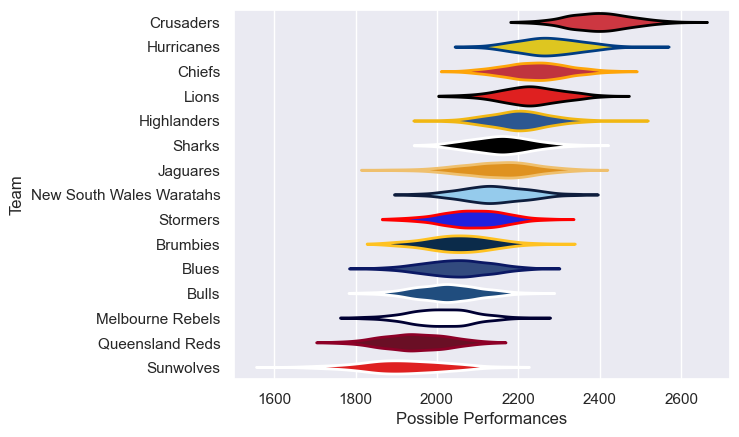

---  
title: "Super Rugby Pacific 2018"  
date: 2025-07-29 6:00:00 -0500  
categories: model review projection  
layout: article  
aside:  
    toc: true  
---
# Current Team Rankings

# Standings

## Current Standings

| Club                     |   Played |   Wins |   Point Differential |   Losing Bonus Points |   Try Bonus Points |   Competition Points |
|:-------------------------|---------:|-------:|---------------------:|----------------------:|-------------------:|---------------------:|
| Crusaders                |       19 |     17 |                  314 |                     0 |                 14 |                   82 |
| Lions                    |       19 |     11 |                  100 |                     4 |                 15 |                   63 |
| Hurricanes               |       18 |     12 |                  114 |                     2 |                 12 |                   62 |
| New South Wales Waratahs |       18 |     10 |                  101 |                     2 |                 12 |                   56 |
| Chiefs                   |       17 |     11 |                   94 |                     3 |                  8 |                   55 |
| Highlanders              |       17 |     10 |                  -15 |                     2 |                  8 |                   50 |
| Jaguares                 |       17 |      9 |                  -26 |                     0 |                  5 |                   41 |
| Melbourne Rebels         |       16 |      7 |                  -21 |                     3 |                  8 |                   39 |
| Brumbies                 |       16 |      7 |                  -29 |                     4 |                  6 |                   38 |
| Sharks                   |       17 |      7 |                  -35 |                     4 |                  3 |                   37 |
| Bulls                    |       16 |      6 |                  -61 |                     3 |                  8 |                   35 |
| Stormers                 |       16 |      6 |                  -33 |                     5 |                  4 |                   33 |
| Queensland Reds          |       16 |      6 |                 -112 |                     3 |                  5 |                   32 |
| Blues                    |       16 |      4 |                 -131 |                     4 |                  6 |                   26 |
| Sunwolves                |       16 |      3 |                 -260 |                     2 |                  5 |                   19 |

# Completed Match Review

| Model | Percent Correct Predictions | Spread Error |
| ------ | ------ | ------ |
| Club Level | 71.7% | 12.2 |
| Player Level: Lineup | nan% | nan |
| Player Level: Minutes | nan% | nan |

