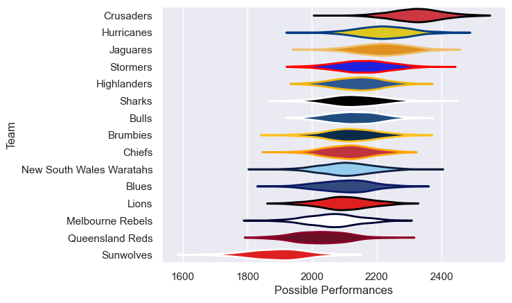

---  
title: "Super Rugby Pacific 2019"  
date: 2025-07-29 6:00:00 -0500  
categories: model review projection  
layout: article  
aside:  
    toc: true  
---
# Current Team Rankings

# Standings

## Current Standings

| Club                     |   Played |   Wins |   Point Differential |   Losing Bonus Points |   Try Bonus Points |   Competition Points |
|:-------------------------|---------:|-------:|---------------------:|----------------------:|-------------------:|---------------------:|
| Crusaders                |       19 |     14 |                  284 |                     0 |                 11 |                   73 |
| Hurricanes               |       18 |     13 |                   90 |                     1 |                 11 |                   66 |
| Jaguares                 |       19 |     13 |                  130 |                     2 |                  6 |                   60 |
| Brumbies                 |       18 |     11 |                   57 |                     3 |                 10 |                   57 |
| Bulls                    |       17 |      8 |                   34 |                     3 |                  4 |                   43 |
| Chiefs                   |       17 |      7 |                  -19 |                     3 |                  8 |                   43 |
| Highlanders              |       17 |      6 |                   25 |                     4 |                  8 |                   42 |
| Melbourne Rebels         |       16 |      7 |                  -72 |                     3 |                  8 |                   39 |
| Lions                    |       16 |      8 |                  -77 |                     1 |                  6 |                   39 |
| Stormers                 |       16 |      7 |                  -22 |                     4 |                  4 |                   38 |
| Sharks                   |       17 |      7 |                  -17 |                     4 |                  3 |                   37 |
| New South Wales Waratahs |       16 |      6 |                  -48 |                     6 |                  5 |                   35 |
| Blues                    |       16 |      5 |                  -22 |                     6 |                  6 |                   34 |
| Queensland Reds          |       16 |      6 |                  -53 |                     3 |                  6 |                   33 |
| Sunwolves                |       16 |      2 |                 -290 |                     4 |                  2 |                   14 |

# Completed Match Review

| Model | Percent Correct Predictions | Spread Error |
| ------ | ------ | ------ |
| Club Level | 65.4% | 12.5 |
| Player Level: Lineup | nan% | nan |
| Player Level: Minutes | nan% | nan |

