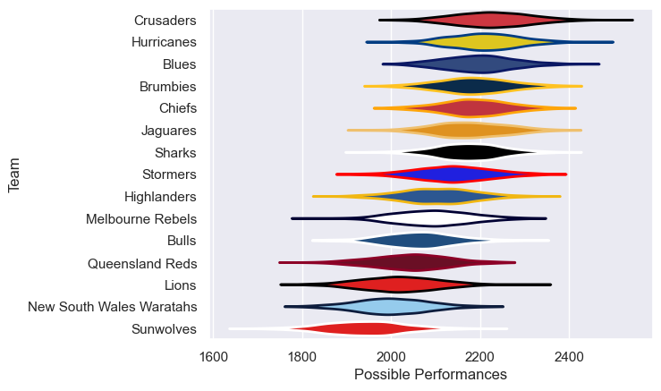

---  
title: "Super Rugby Pacific 2020"  
date: 2025-07-29 6:00:00 -0500  
categories: model review projection  
layout: article  
aside:  
    toc: true  
---
# Current Team Rankings

# Standings

## Current Standings

| Club                     |   Played |   Wins |   Point Differential |   Losing Bonus Points |   Try Bonus Points |   Competition Points |
|:-------------------------|---------:|-------:|---------------------:|----------------------:|-------------------:|---------------------:|
| Brumbies                 |       16 |      5 |                   93 |                     1 |                  5 |                   46 |
| Sharks                   |       16 |      6 |                   60 |                     0 |                  4 |                   46 |
| Crusaders                |       16 |      5 |                   84 |                     0 |                  3 |                   43 |
| Blues                    |       16 |      5 |                   58 |                     0 |                  3 |                   41 |
| Chiefs                   |       16 |      4 |                   66 |                     1 |                  3 |                   40 |
| Hurricanes               |       16 |      4 |                   33 |                     0 |                  2 |                   38 |
| Stormers                 |       16 |      4 |                   24 |                     0 |                  2 |                   38 |
| Jaguares                 |       16 |      3 |                   34 |                     1 |                  3 |                   36 |
| Melbourne Rebels         |       16 |      3 |                    6 |                     0 |                  4 |                   36 |
| Queensland Reds          |       16 |      2 |                   43 |                     3 |                  4 |                   33 |
| Highlanders              |       16 |      1 |                  -72 |                     1 |                    |                   27 |
| Lions                    |       16 |      1 |                  -91 |                     1 |                  2 |                   27 |
| Bulls                    |       16 |      1 |                  -37 |                     1 |                  1 |                   26 |
| New South Wales Waratahs |       16 |      1 |                 -110 |                     0 |                  1 |                   25 |
| Sunwolves                |       16 |      1 |                 -191 |                     0 |                  1 |                   25 |

# Completed Match Review

| Model | Percent Correct Predictions | Spread Error |
| ------ | ------ | ------ |
| Club Level | 23.3% | 9.8 |
| Player Level: Lineup | nan% | nan |
| Player Level: Minutes | nan% | nan |

