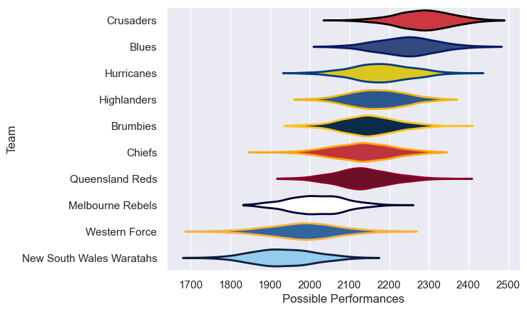

---  
title: "Super Rugby Pacific 2021"  
date: 2025-07-29 6:00:00 -0500  
categories: model review projection  
layout: article  
aside:  
    toc: true  
---
# Current Team Rankings

# Standings

## Current Standings

| Club                     |   Played |   Wins |   Point Differential |   Losing Bonus Points |   Try Bonus Points |   Competition Points |
|:-------------------------|---------:|-------:|---------------------:|----------------------:|-------------------:|---------------------:|
| Blues                    |        6 |      6 |                  127 |                     0 |                  5 |                   29 |
| Crusaders                |        5 |      5 |                   97 |                     0 |                  5 |                   25 |
| Highlanders              |        6 |      5 |                   95 |                     0 |                  4 |                   24 |
| Hurricanes               |        5 |      4 |                  102 |                     1 |                  4 |                   21 |
| Chiefs                   |        5 |      4 |                   59 |                     1 |                  4 |                   21 |
| Queensland Reds          |        5 |      1 |                  -86 |                     1 |                  2 |                    7 |
| Brumbies                 |        5 |      1 |                  -70 |                     1 |                  1 |                    6 |
| Melbourne Rebels         |        5 |      0 |                 -120 |                     0 |                  3 |                    3 |
| Western Force            |        5 |      0 |                  -66 |                     1 |                    |                    1 |
| New South Wales Waratahs |        5 |      0 |                 -138 |                     0 |                  1 |                    1 |

# Completed Match Review

| Model | Percent Correct Predictions | Spread Error |
| ------ | ------ | ------ |
| Club Level | 92.3% | 15.1 |
| Player Level: Lineup | nan% | nan |
| Player Level: Minutes | nan% | nan |

