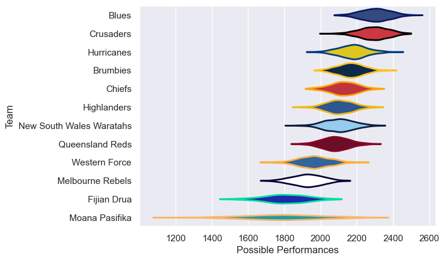

---  
title: "Super Rugby Pacific 2022 Status"  
date: 2025-07-28 6:00:00 -0500  
categories: model review projection  
layout: article  
aside:  
    toc: true  
---
# Current Team Rankings

# Standings

## Current Standings

| Club                     |   Played |   Wins |   Point Differential |   Losing Bonus Points |   Try Bonus Points |   Competition Points |
|:-------------------------|---------:|-------:|---------------------:|----------------------:|-------------------:|---------------------:|
| Crusaders                |       17 |     14 |                  251 |                     3 |                 11 |                   70 |
| Blues                    |       17 |     15 |                  204 |                     1 |                  9 |                   70 |
| Brumbies                 |       16 |     11 |                  107 |                     2 |                  9 |                   55 |
| Chiefs                   |       18 |      9 |                   36 |                     1 |                  6 |                   51 |
| Hurricanes               |       15 |      8 |                  101 |                     4 |                  8 |                   44 |
| New South Wales Waratahs |       15 |      8 |                   24 |                     4 |                  5 |                   41 |
| Queensland Reds          |       15 |      8 |                   -7 |                     2 |                  6 |                   40 |
| Melbourne Rebels         |       14 |      4 |                 -149 |                     4 |                  6 |                   26 |
| Highlanders              |       15 |      4 |                  -26 |                     5 |                  3 |                   24 |
| Western Force            |       14 |      4 |                 -117 |                     5 |                  3 |                   24 |
| Fijian Drua              |       14 |      2 |                 -257 |                     4 |                  2 |                   14 |
| Moana Pasifika           |       12 |      2 |                 -167 |                     2 |                  2 |                   12 |

# Completed Match Review

| Model | Percent Correct Predictions | Spread Error |
| ------ | ------ | ------ |
| Club Level | 68.1% | 10.8 |
| Player Level: Lineup | nan% | nan |
| Player Level: Minutes | nan% | nan |

