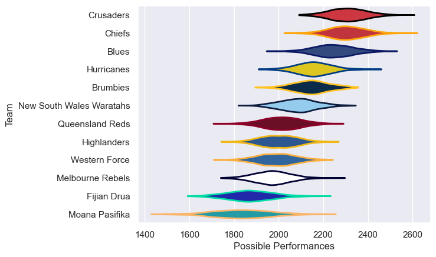

---  
title: "Super Rugby Pacific 2023 Status"  
date: 2025-07-28 6:00:00 -0500  
categories: model review projection  
layout: article  
aside:  
    toc: true  
---
# Current Team Rankings

# Standings

## Current Standings

| Club                     |   Played |   Wins |   Point Differential |   Losing Bonus Points |   Try Bonus Points |   Competition Points |
|:-------------------------|---------:|-------:|---------------------:|----------------------:|-------------------:|---------------------:|
| Chiefs                   |       17 |     15 |                  243 |                     2 |                  9 |                   71 |
| Crusaders                |       17 |     13 |                  262 |                     2 |                 12 |                   66 |
| Blues                    |       16 |     11 |                  146 |                     3 |                  9 |                   56 |
| Brumbies                 |       16 |     11 |                   72 |                     1 |                  9 |                   54 |
| Hurricanes               |       15 |      9 |                  138 |                     3 |                 11 |                   50 |
| New South Wales Waratahs |       15 |      6 |                  -50 |                     3 |                  6 |                   33 |
| Fijian Drua              |       15 |      6 |                 -163 |                     1 |                  7 |                   32 |
| Queensland Reds          |       15 |      5 |                  -69 |                     3 |                  7 |                   30 |
| Melbourne Rebels         |       14 |      4 |                  -78 |                     4 |                  8 |                   28 |
| Highlanders              |       14 |      5 |                  -97 |                     2 |                  6 |                   28 |
| Western Force            |       14 |      5 |                 -148 |                     1 |                  5 |                   26 |
| Moana Pasifika           |       14 |      1 |                 -256 |                     4 |                  7 |                   15 |

# Completed Match Review

| Model | Percent Correct Predictions | Spread Error |
| ------ | ------ | ------ |
| Club Level | 79.1% | 12.3 |
| Player Level: Lineup | nan% | nan |
| Player Level: Minutes | nan% | nan |

