---  
title: "Super Rugby Pacific 2023 Status"  
date: 2023-05-19 6:00:00 -0500  
categories: model review projection  
layout: article  
aside:  
    toc: true  
---
# Current Team Rankings

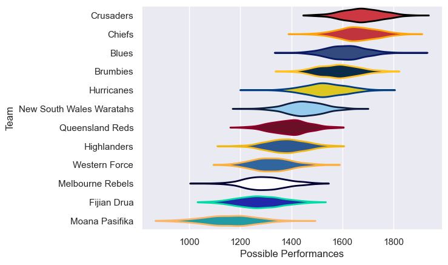
# Standings

## Current Standings

| Club                     |   Played |   Wins |   Point Differential |   Losing Bonus Points |   Try Bonus Points |   Competition Points |
|:-------------------------|---------:|-------:|---------------------:|----------------------:|-------------------:|---------------------:|
| Chiefs                   |       11 |     10 |                  181 |                     1 |                  5 |                   46 |
| Crusaders                |       12 |      9 |                  156 |                     1 |                  5 |                   42 |
| Brumbies                 |       11 |      9 |                   90 |                     1 |                  4 |                   41 |
| Blues                    |       12 |      8 |                  136 |                     3 |                  3 |                   38 |
| Hurricanes               |       11 |      8 |                  163 |                     2 |                  3 |                   37 |
| New South Wales Waratahs |       11 |      5 |                   -2 |                     3 |                  3 |                   26 |
| Queensland Reds          |       12 |      5 |                  -31 |                     2 |                  1 |                   23 |
| Western Force            |       11 |      4 |                 -101 |                     1 |                  1 |                   18 |
| Fijian Drua              |       11 |      4 |                 -133 |                     1 |                  0 |                   17 |
| Melbourne Rebels         |       11 |      3 |                  -97 |                     3 |                  0 |                   15 |
| Highlanders              |       11 |      3 |                  -98 |                     1 |                  2 |                   15 |
| Moana Pasifika           |       12 |      0 |                 -264 |                     3 |                  0 |                    3 |

## Projected Remaining Table

| Club                     |   Matches Remaining |   Wins |   Point Differential |   Losing Bonus Points |   Try Bonus Points |   Competition Points |
|:-------------------------|--------------------:|-------:|---------------------:|----------------------:|-------------------:|---------------------:|
| Chiefs                   |                   3 |    2.5 |                 24.1 |                   0.4 |                2.4 |                 12.9 |
| Brumbies                 |                   3 |    2.4 |                 24.8 |                   0.5 |                2.3 |                 12.3 |
| New South Wales Waratahs |                   3 |    2   |                 14.8 |                   0.1 |                2   |                 10   |
| Blues                    |                   2 |    1.9 |                 22.9 |                   0.1 |                1.9 |                  9.7 |
| Crusaders                |                   2 |    1.8 |                 17.8 |                   0.2 |                1.7 |                  9   |
| Highlanders              |                   3 |    1.6 |                 -5.5 |                   0.4 |                1.5 |                  8.2 |
| Fijian Drua              |                   3 |    1.3 |                 -5.1 |                   0.7 |                1.2 |                  7   |
| Queensland Reds          |                   2 |    1   |                 -0.3 |                   0.8 |                0.8 |                  5.5 |
| Melbourne Rebels         |                   3 |    0.8 |                -21.3 |                   0.7 |                0.7 |                  4.4 |
| Western Force            |                   3 |    0.4 |                -24.4 |                   0.9 |                0.3 |                  2.9 |
| Hurricanes               |                   3 |    0.3 |                -21.6 |                   1.1 |                0.2 |                  2.7 |
| Moana Pasifika           |                   2 |    0.1 |                -26.2 |                   0.3 |                0.1 |                  0.8 |

## Projected Total Table

| Club                     |   Total Matches |   Wins |   Point Differential |   Losing Bonus Points |   Try Bonus Points |   Competition Points |
|:-------------------------|----------------:|-------:|---------------------:|----------------------:|-------------------:|---------------------:|
| Chiefs                   |              14 |   12.5 |                205.1 |                   1.4 |                7.4 |                 58.9 |
| Brumbies                 |              14 |   11.4 |                114.8 |                   1.5 |                6.3 |                 53.3 |
| Crusaders                |              14 |   10.8 |                173.8 |                   1.2 |                6.7 |                 51   |
| Blues                    |              14 |    9.9 |                158.9 |                   3.1 |                4.9 |                 47.7 |
| Hurricanes               |              14 |    8.3 |                141.4 |                   3.1 |                3.2 |                 39.7 |
| New South Wales Waratahs |              14 |    7   |                 12.8 |                   3.1 |                5   |                 36   |
| Queensland Reds          |              14 |    6   |                -31.3 |                   2.8 |                1.8 |                 28.5 |
| Fijian Drua              |              14 |    5.3 |               -138.1 |                   1.7 |                1.2 |                 24   |
| Highlanders              |              14 |    4.6 |               -103.5 |                   1.4 |                3.5 |                 23.2 |
| Western Force            |              14 |    4.4 |               -125.4 |                   1.9 |                1.3 |                 20.9 |
| Melbourne Rebels         |              14 |    3.8 |               -118.3 |                   3.7 |                0.7 |                 19.4 |
| Moana Pasifika           |              14 |    0.1 |               -290.2 |                   3.3 |                0.1 |                  3.8 |

## Projected Playoff Results

|                          | Reach Quarterfinals   | Reach Semifinals   | Reach Final   | Win Final   |
|:-------------------------|:----------------------|:-------------------|:--------------|:------------|
| Chiefs                   | 100.0 %               | 100.0 %            | 86.7 %        | 67.6 %      |
| Crusaders                | 100.0 %               | 99.3 %             | 69.5 %        | 25.5 %      |
| Brumbies                 | 100.0 %               | 97.9 %             | 27.4 %        | 4.1 %       |
| Blues                    | 100.0 %               | 92.2 %             | 16.2 %        | 2.8 %       |
| Hurricanes               | 100.0 %               | 8.1 %              | 0.2 %         | 0.0 %       |
| New South Wales Waratahs | 100.0 %               | 2.2 %              | 0.0 %         | 0.0 %       |
| Queensland Reds          | 90.2 %                | 0.3 %              | 0.0 %         | 0.0 %       |
| Highlanders              | 48.7 %                | 0.0 %              | 0.0 %         | 0.0 %       |
| Fijian Drua              | 45.4 %                | 0.0 %              | 0.0 %         | 0.0 %       |
| Western Force            | 10.3 %                | 0.0 %              | 0.0 %         | 0.0 %       |
| Melbourne Rebels         | 5.4 %                 | 0.0 %              | 0.0 %         | 0.0 %       |

# Completed Match Review

| Model | Percent Correct Predictions | Spread Error |
| ------ | ------ | ------ |
| Club Level | 79.4% | 12.3 |
| Player Level: Lineup | 72.2% | 13.9 |
| Player Level: Minutes | 77.9% | 13.8 |

# Future Predictions

## Week 13

### Western Force V Brumbies on 2023/05/20

Average Margin: Brumbies by 9.3

### New South Wales Waratahs V Fijian Drua on 2023/05/20

Average Margin: New South Wales Waratahs by 11.9

### Highlanders V Melbourne Rebels on 2023/05/20

Average Margin: Highlanders by 7.1

### Chiefs V Hurricanes on 2023/05/20

Average Margin: Chiefs by 10.2

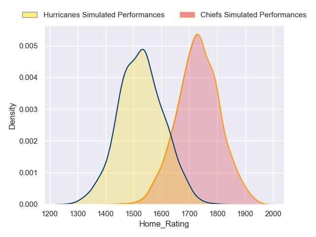
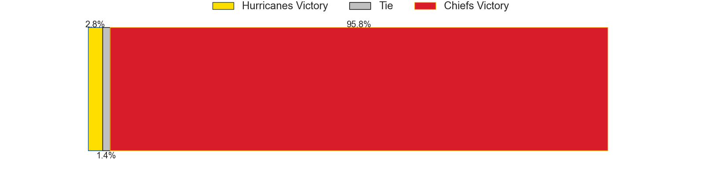
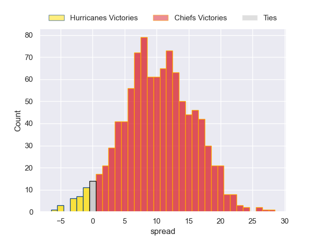

## Week 14

### Highlanders V Queensland Reds on 2023/05/26

Average Margin: Highlanders by 2.7

### Melbourne Rebels V Western Force on 2023/05/26

Average Margin: Melbourne Rebels by 2.4

### Fijian Drua V Moana Pasifika on 2023/05/27

Average Margin: Fijian Drua by 9.0

### Crusaders V New South Wales Waratahs on 2023/05/27

Average Margin: Crusaders by 14.4

### Blues V Hurricanes on 2023/05/27

Average Margin: Blues by 7.9

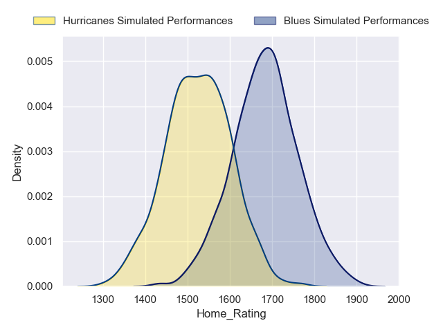

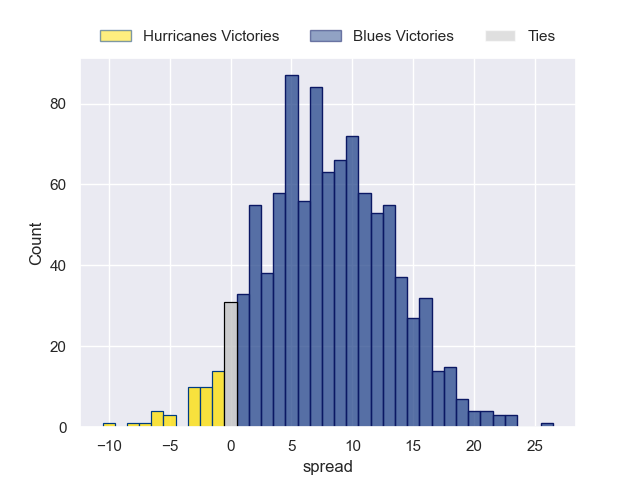

### Brumbies V Chiefs on 2023/05/27

Average Margin: Chiefs by 1.1

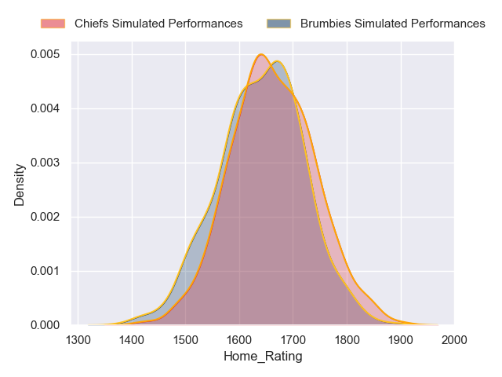

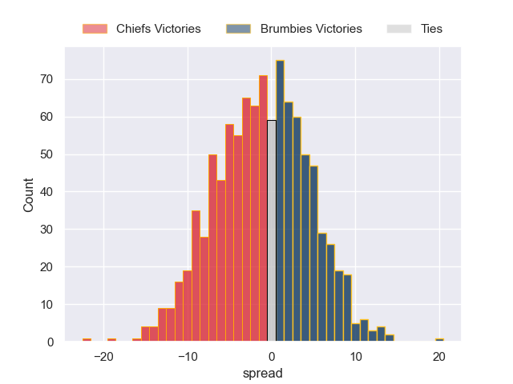

## Week 15

### Blues V Highlanders on 2023/06/02

Average Margin: Blues by 15.5

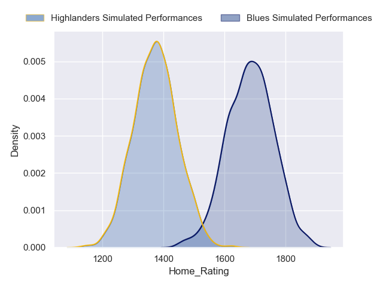

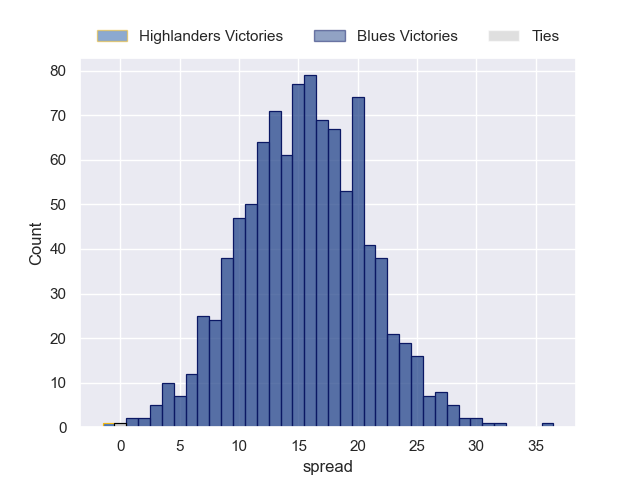

### Brumbies V Melbourne Rebels on 2023/06/02

Average Margin: Brumbies by 17.0

### Fijian Drua V Queensland Reds on 2023/06/03

Average Margin: Queensland Reds by 2.4

### Hurricanes V Crusaders on 2023/06/03

Average Margin: Crusaders by 3.9

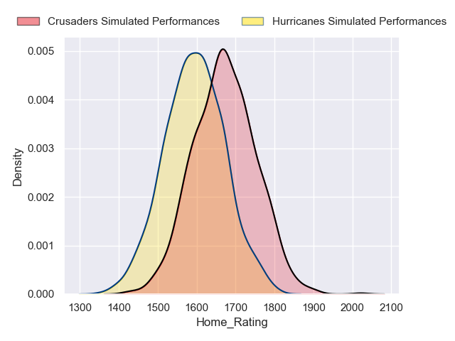

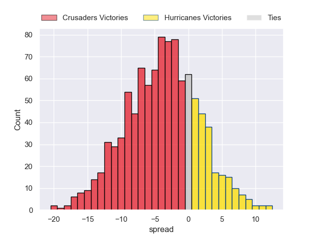

### Western Force V Chiefs on 2023/06/03

Average Margin: Chiefs by 13.3

### New South Wales Waratahs V Moana Pasifika on 2023/06/03

Average Margin: New South Wales Waratahs by 17.8

