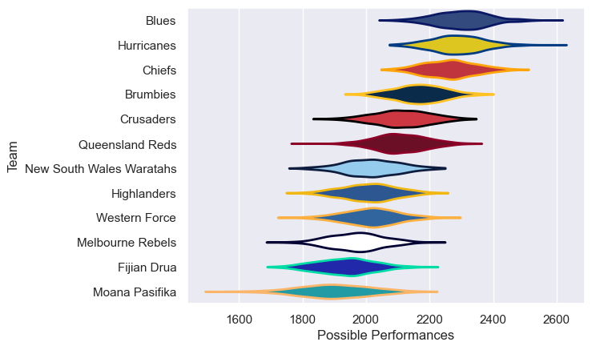

---  
title: "Super Rugby Pacific 2024 Status"  
date: 2025-07-28 6:00:00 -0500  
categories: model review projection  
layout: article  
aside:  
    toc: true  
---
# Current Team Rankings

# Standings

## Current Standings

| Club                     |   Played |   Wins |   Point Differential |   Losing Bonus Points |   Try Bonus Points |   Competition Points |
|:-------------------------|---------:|-------:|---------------------:|----------------------:|-------------------:|---------------------:|
| Blues                    |       17 |     15 |                  331 |                     1 |                 13 |                   74 |
| Hurricanes               |       16 |     13 |                  215 |                     1 |                 12 |                   65 |
| Brumbies                 |       16 |     13 |                  101 |                     0 |                  8 |                   60 |
| Chiefs                   |       17 |     11 |                  177 |                     2 |                  9 |                   55 |
| Queensland Reds          |       15 |      8 |                   82 |                     4 |                 10 |                   46 |
| Crusaders                |       14 |      4 |                   -6 |                     6 |                  9 |                   31 |
| Highlanders              |       15 |      6 |                 -113 |                     2 |                  4 |                   30 |
| Fijian Drua              |       15 |      6 |                 -133 |                     1 |                  4 |                   29 |
| Melbourne Rebels         |       15 |      5 |                 -174 |                     2 |                  7 |                   29 |
| Western Force            |       14 |      4 |                 -132 |                     3 |                  4 |                   23 |
| Moana Pasifika           |       14 |      4 |                 -220 |                     2 |                  3 |                   21 |
| New South Wales Waratahs |       14 |      2 |                 -128 |                     5 |                  4 |                   17 |

# Completed Match Review

| Model | Percent Correct Predictions | Spread Error |
| ------ | ------ | ------ |
| Club Level | 74.7% | 13.4 |
| Player Level: Lineup | nan% | nan |
| Player Level: Minutes | nan% | nan |

