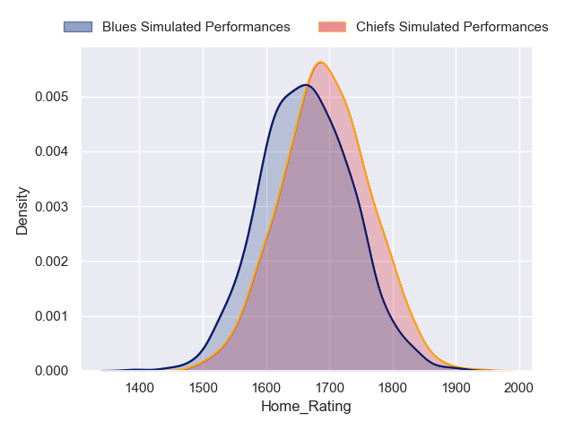
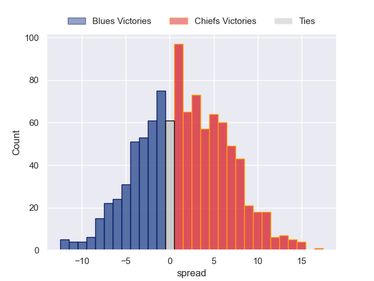

---  
title: "Super Rugby Pacific 2024 Status"  
date: 2024-06-21 6:00:00 -0500  
categories: model review projection  
layout: article  
aside:  
    toc: true  
---
# Current Team Rankings

# Standings

## Current Standings

| Club                     |   Played |   Wins |   Point Differential |   Losing Bonus Points |   Try Bonus Points |   Competition Points |
|:-------------------------|---------:|-------:|---------------------:|----------------------:|-------------------:|---------------------:|
| Blues                    |       16 |     14 |                  300 |                     1 |                  8 |                   65 |
| Hurricanes               |       16 |     13 |                  215 |                     1 |                  8 |                   61 |
| Brumbies                 |       17 |     14 |                  108 |                     0 |                nan |                   61 |
| Chiefs                   |       16 |     11 |                  208 |                     2 |                  6 |                   52 |
| Queensland Reds          |       15 |      8 |                   82 |                     4 |                  4 |                   40 |
| Highlanders              |       15 |      6 |                 -113 |                     2 |                  2 |                   28 |
| Fijian Drua              |       15 |      6 |                 -133 |                     1 |                  1 |                   26 |
| Melbourne Rebels         |       15 |      5 |                 -174 |                     2 |                  4 |                   26 |
| Crusaders                |       15 |      4 |                  -13 |                     7 |                nan |                   25 |
| Moana Pasifika           |       15 |      5 |                 -205 |                     2 |                nan |                   22 |
| Western Force            |       14 |      4 |                 -132 |                     3 |                  1 |                   20 |
| New South Wales Waratahs |       15 |      2 |                 -143 |                     5 |                nan |                   13 |

## Projected Remaining Table

| Club   |   Matches Remaining |   Wins |   Point Differential |   Losing Bonus Points |   Try Bonus Points |   Competition Points |
|:-------|--------------------:|-------:|---------------------:|----------------------:|-------------------:|---------------------:|
| Chiefs |                   1 |    0.7 |               1.7572 |                   0.3 |                0   |                  2.9 |
| Blues  |                   1 |    0.3 |              -1.7572 |                   0.5 |                0.2 |                  2.1 |

## Projected Total Table

| Club                     |   Total Matches |   Wins |   Point Differential |   Losing Bonus Points |   Try Bonus Points |   Competition Points |
|:-------------------------|----------------:|-------:|---------------------:|----------------------:|-------------------:|---------------------:|
| Blues                    |              17 |   14.3 |              298.243 |                   1.5 |                8.2 |                 67.1 |
| Hurricanes               |              16 |   13   |              215     |                   1   |                8   |                 61   |
| Brumbies                 |              17 |   14   |              108     |                   0   |                0   |                 61   |
| Chiefs                   |              17 |   11.7 |              209.757 |                   2.3 |                6   |                 54.9 |
| Queensland Reds          |              15 |    8   |               82     |                   4   |                4   |                 40   |
| Highlanders              |              15 |    6   |             -113     |                   2   |                2   |                 28   |
| Fijian Drua              |              15 |    6   |             -133     |                   1   |                1   |                 26   |
| Melbourne Rebels         |              15 |    5   |             -174     |                   2   |                4   |                 26   |
| Crusaders                |              15 |    4   |              -13     |                   7   |                0   |                 25   |
| Moana Pasifika           |              15 |    5   |             -205     |                   2   |                0   |                 22   |
| Western Force            |              14 |    4   |             -132     |                   3   |                1   |                 20   |
| New South Wales Waratahs |              15 |    2   |             -143     |                   5   |                0   |                 13   |

# Completed Match Review

| Model | Percent Correct Predictions | Spread Error |
| ------ | ------ | ------ |
| Club Level | 73.9% | 13.0 |
| Player Level: Lineup | 76.3% | 13.2 |
| Player Level: Minutes | 78.3% | 13.4 |

# Future Predictions

## Week 18

### Chiefs V Blues on 2024/06/21

Average Margin: Chiefs by 1.8

Average Scoreline: 31-29

