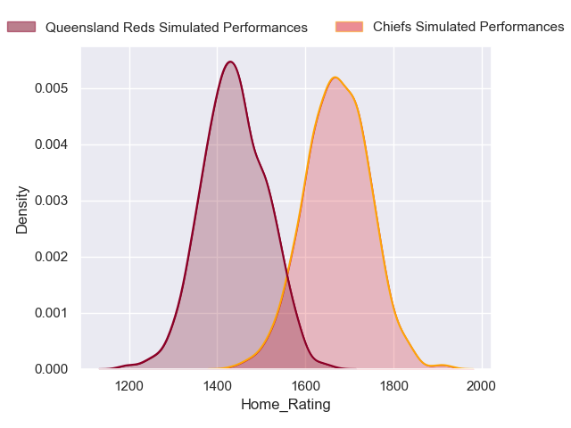
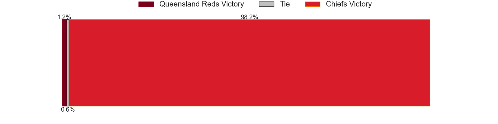
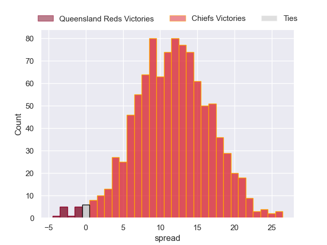
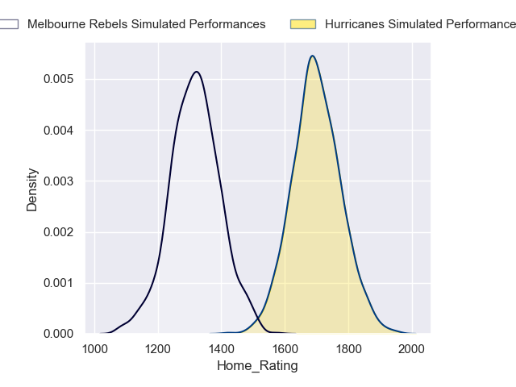
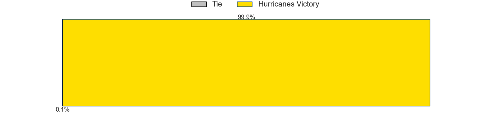
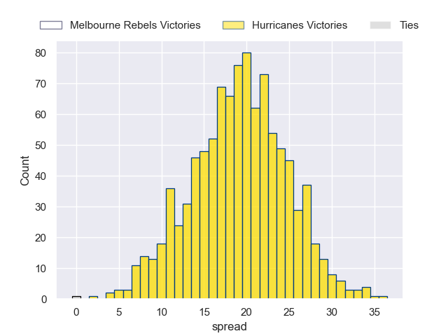
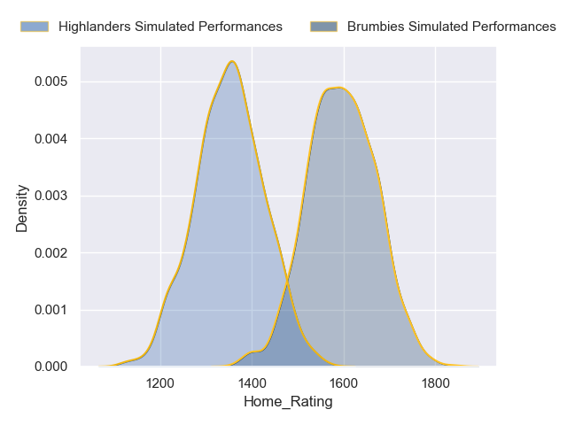
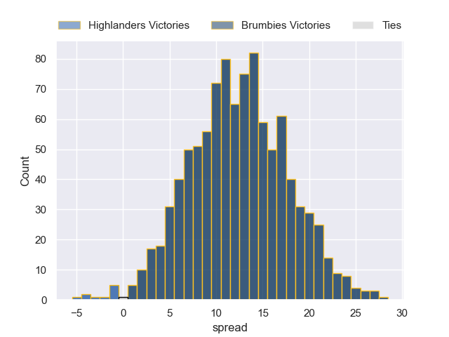
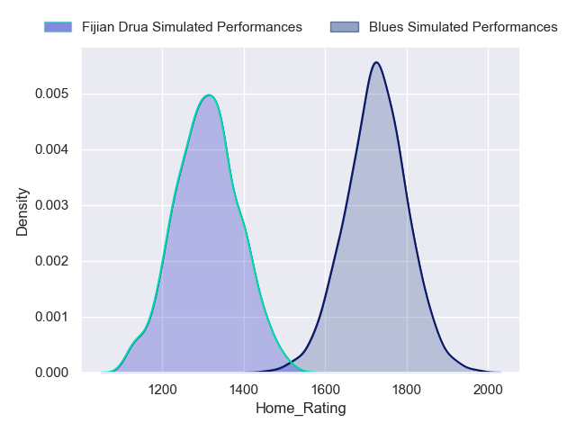
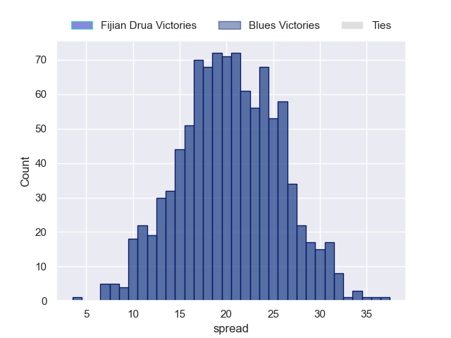

---  
title: "Super Rugby Pacific 2024 Status"  
date: 2024-06-03 6:00:00 -0500  
categories: model review projection  
layout: article  
aside:  
    toc: true  
---
# Current Team Rankings

# Standings

## Current Standings

| Club                     |   Played |   Wins |   Point Differential |   Losing Bonus Points |   Try Bonus Points |   Competition Points |
|:-------------------------|---------:|-------:|---------------------:|----------------------:|-------------------:|---------------------:|
| Hurricanes               |       14 |     12 |                  199 |                     1 |                  7 |                   56 |
| Brumbies                 |       15 |     13 |                  106 |                     0 |                nan |                   56 |
| Blues                    |       14 |     12 |                  255 |                     1 |                  6 |                   55 |
| Chiefs                   |       14 |      9 |                  175 |                     2 |                  5 |                   43 |
| Queensland Reds          |       14 |      8 |                  104 |                     4 |                  4 |                   40 |
| Highlanders              |       14 |      6 |                  -97 |                     2 |                  2 |                   28 |
| Fijian Drua              |       14 |      6 |                 -102 |                     1 |                  1 |                   26 |
| Melbourne Rebels         |       14 |      5 |                 -147 |                     2 |                  4 |                   26 |
| Crusaders                |       15 |      4 |                  -13 |                     7 |                nan |                   25 |
| Moana Pasifika           |       15 |      5 |                 -205 |                     2 |                nan |                   22 |
| Western Force            |       14 |      4 |                 -132 |                     3 |                  1 |                   20 |
| New South Wales Waratahs |       15 |      2 |                 -143 |                     5 |                nan |                   13 |

## Projected Remaining Table

| Club             |   Matches Remaining |   Wins |   Point Differential |   Losing Bonus Points |   Try Bonus Points |   Competition Points |
|:-----------------|--------------------:|-------:|---------------------:|----------------------:|-------------------:|---------------------:|
| Hurricanes       |                   1 |      1 |              19.4423 |                   0   |                0.7 |                  4.7 |
| Blues            |                   1 |      1 |              20.8049 |                   0   |                0.6 |                  4.6 |
| Brumbies         |                   1 |      1 |              12.2179 |                   0   |                0.5 |                  4.4 |
| Chiefs           |                   1 |      1 |              10.7221 |                   0   |                0.3 |                  4.2 |
| Queensland Reds  |                   1 |      0 |             -10.7221 |                   0.2 |                0   |                  0.3 |
| Highlanders      |                   1 |      0 |             -12.2179 |                   0.2 |                0   |                  0.2 |
| Melbourne Rebels |                   1 |      0 |             -19.4423 |                   0   |                0   |                  0   |
| Fijian Drua      |                   1 |      0 |             -20.8049 |                   0   |                0   |                  0   |

## Projected Total Table

| Club                     |   Total Matches |   Wins |   Point Differential |   Losing Bonus Points |   Try Bonus Points |   Competition Points |
|:-------------------------|----------------:|-------:|---------------------:|----------------------:|-------------------:|---------------------:|
| Hurricanes               |              15 |     13 |             218.442  |                   1   |                7.7 |                 60.7 |
| Brumbies                 |              16 |     14 |             118.218  |                   0   |                0.5 |                 60.4 |
| Blues                    |              15 |     13 |             275.805  |                   1   |                6.6 |                 59.6 |
| Chiefs                   |              15 |     10 |             185.722  |                   2   |                5.3 |                 47.2 |
| Queensland Reds          |              15 |      8 |              93.2779 |                   4.2 |                4   |                 40.3 |
| Highlanders              |              15 |      6 |            -109.218  |                   2.2 |                2   |                 28.2 |
| Fijian Drua              |              15 |      6 |            -122.805  |                   1   |                1   |                 26   |
| Melbourne Rebels         |              15 |      5 |            -166.442  |                   2   |                4   |                 26   |
| Crusaders                |              15 |      4 |             -13      |                   7   |                0   |                 25   |
| Moana Pasifika           |              15 |      5 |            -205      |                   2   |                0   |                 22   |
| Western Force            |              14 |      4 |            -132      |                   3   |                1   |                 20   |
| New South Wales Waratahs |              15 |      2 |            -143      |                   5   |                0   |                 13   |

# Completed Match Review

| Model | Percent Correct Predictions | Spread Error |
| ------ | ------ | ------ |
| Club Level | 73.3% | 13.4 |
| Player Level: Lineup | 76.7% | 13.5 |
| Player Level: Minutes | 77.9% | 13.6 |

# Future Predictions

## Week 16

### Chiefs V Queensland Reds on 2024/06/07

Average Margin: Chiefs by 10.7

Average Scoreline: 31-20

### Hurricanes V Melbourne Rebels on 2024/06/07

Average Margin: Hurricanes by 19.4

Average Scoreline: 36-17

### Brumbies V Highlanders on 2024/06/08

Average Margin: Brumbies by 12.2

Average Scoreline: 35-22

### Blues V Fijian Drua on 2024/06/08

Average Margin: Blues by 20.8

Average Scoreline: 43-22

