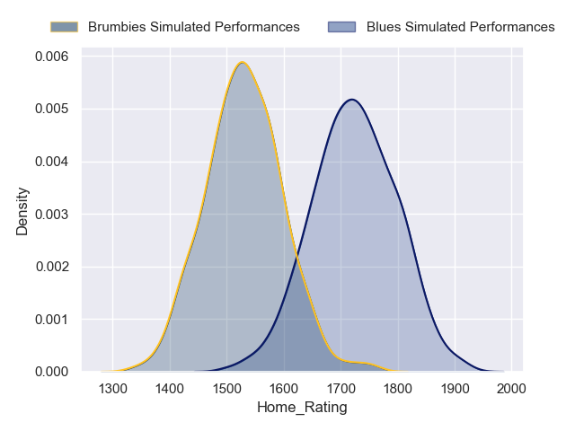
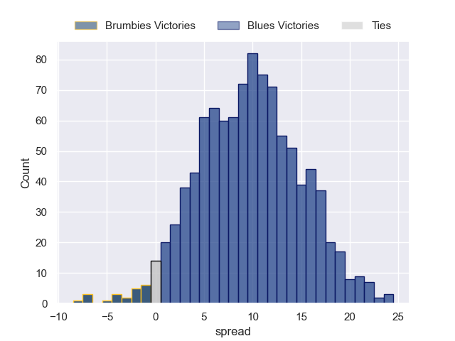
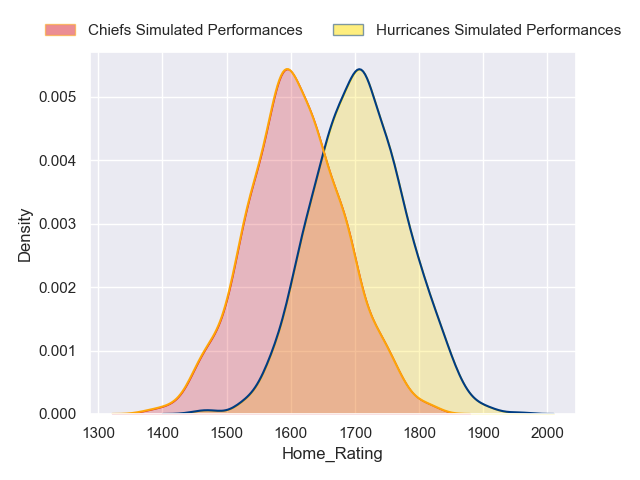
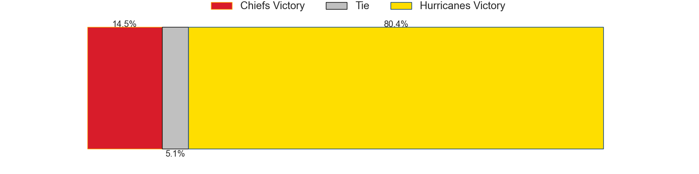
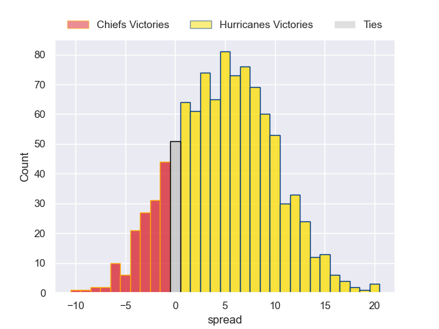

---  
title: "Super Rugby Pacific 2024 Status"  
date: 2024-06-10 6:00:00 -0500  
categories: model review projection  
layout: article  
aside:  
    toc: true  
---
# Current Team Rankings

# Standings

## Current Standings

| Club                     |   Played |   Wins |   Point Differential |   Losing Bonus Points |   Try Bonus Points |   Competition Points |
|:-------------------------|---------:|-------:|---------------------:|----------------------:|-------------------:|---------------------:|
| Hurricanes               |       15 |     13 |                  226 |                     1 |                  8 |                   61 |
| Brumbies                 |       16 |     14 |                  122 |                     0 |                nan |                   61 |
| Blues                    |       15 |     13 |                  286 |                     1 |                  7 |                   60 |
| Chiefs                   |       15 |     10 |                  197 |                     2 |                  6 |                   48 |
| Queensland Reds          |       15 |      8 |                   82 |                     4 |                  4 |                   40 |
| Highlanders              |       15 |      6 |                 -113 |                     2 |                  2 |                   28 |
| Fijian Drua              |       15 |      6 |                 -133 |                     1 |                  1 |                   26 |
| Melbourne Rebels         |       15 |      5 |                 -174 |                     2 |                  4 |                   26 |
| Crusaders                |       15 |      4 |                  -13 |                     7 |                nan |                   25 |
| Moana Pasifika           |       15 |      5 |                 -205 |                     2 |                nan |                   22 |
| Western Force            |       14 |      4 |                 -132 |                     3 |                  1 |                   20 |
| New South Wales Waratahs |       15 |      2 |                 -143 |                     5 |                nan |                   13 |

## Projected Remaining Table

| Club       |   Matches Remaining |   Wins |   Point Differential |   Losing Bonus Points |   Try Bonus Points |   Competition Points |
|:-----------|--------------------:|-------:|---------------------:|----------------------:|-------------------:|---------------------:|
| Blues      |                   1 |    1   |              9.67497 |                   0   |                0.4 |                  4.3 |
| Hurricanes |                   1 |    0.8 |              4.92978 |                   0.2 |                0.1 |                  3.6 |
| Chiefs     |                   1 |    0.2 |             -4.92978 |                   0.5 |                0   |                  1.2 |
| Brumbies   |                   1 |    0   |             -9.67497 |                   0.3 |                0   |                  0.4 |

## Projected Total Table

| Club                     |   Total Matches |   Wins |   Point Differential |   Losing Bonus Points |   Try Bonus Points |   Competition Points |
|:-------------------------|----------------:|-------:|---------------------:|----------------------:|-------------------:|---------------------:|
| Hurricanes               |              16 |   13.8 |              230.93  |                   1.2 |                8.1 |                 64.6 |
| Blues                    |              16 |   14   |              295.675 |                   1   |                7.4 |                 64.3 |
| Brumbies                 |              17 |   14   |              112.325 |                   0.3 |                0   |                 61.4 |
| Chiefs                   |              16 |   10.2 |              192.07  |                   2.5 |                6   |                 49.2 |
| Queensland Reds          |              15 |    8   |               82     |                   4   |                4   |                 40   |
| Highlanders              |              15 |    6   |             -113     |                   2   |                2   |                 28   |
| Fijian Drua              |              15 |    6   |             -133     |                   1   |                1   |                 26   |
| Melbourne Rebels         |              15 |    5   |             -174     |                   2   |                4   |                 26   |
| Crusaders                |              15 |    4   |              -13     |                   7   |                0   |                 25   |
| Moana Pasifika           |              15 |    5   |             -205     |                   2   |                0   |                 22   |
| Western Force            |              14 |    4   |             -132     |                   3   |                1   |                 20   |
| New South Wales Waratahs |              15 |    2   |             -143     |                   5   |                0   |                 13   |

# Completed Match Review

| Model | Percent Correct Predictions | Spread Error |
| ------ | ------ | ------ |
| Club Level | 74.4% | 13.1 |
| Player Level: Lineup | 77.8% | 13.3 |
| Player Level: Minutes | 78.9% | 13.4 |

# Future Predictions

## Week 17

### Blues V Brumbies on 2024/06/14

Average Margin: Blues by 9.7

Average Scoreline: 33-23

### Hurricanes V Chiefs on 2024/06/15

Average Margin: Hurricanes by 4.9

Average Scoreline: 28-23

