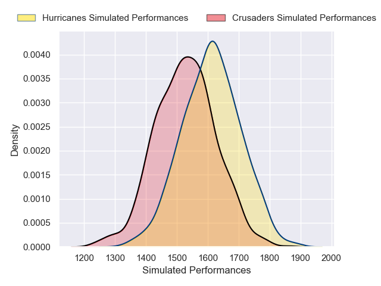
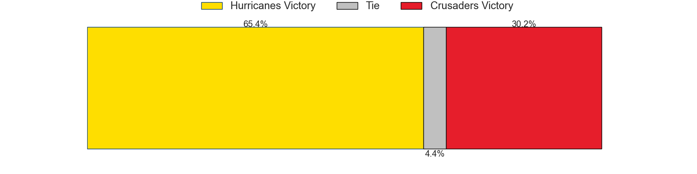
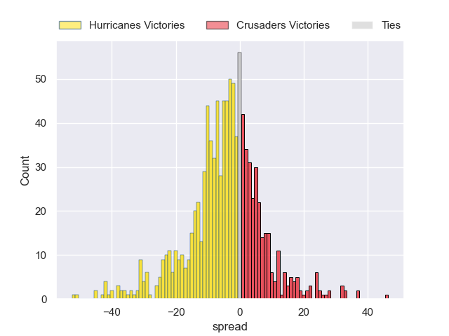
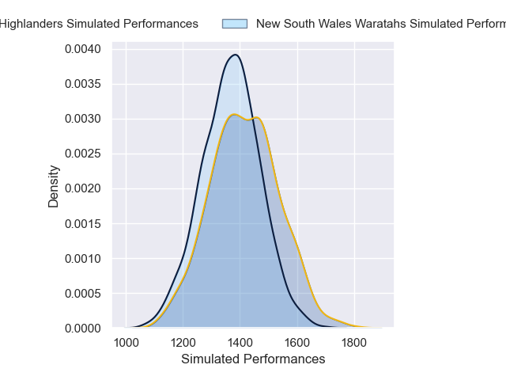
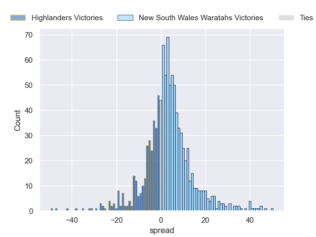
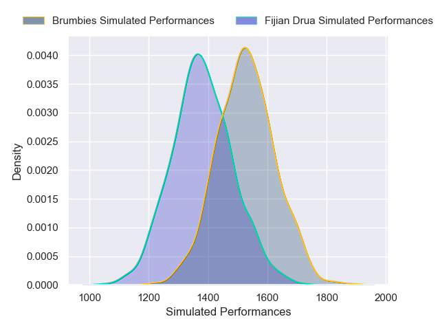
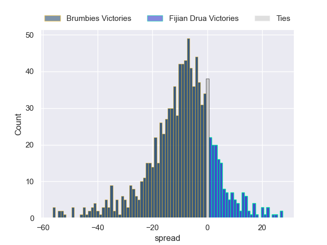
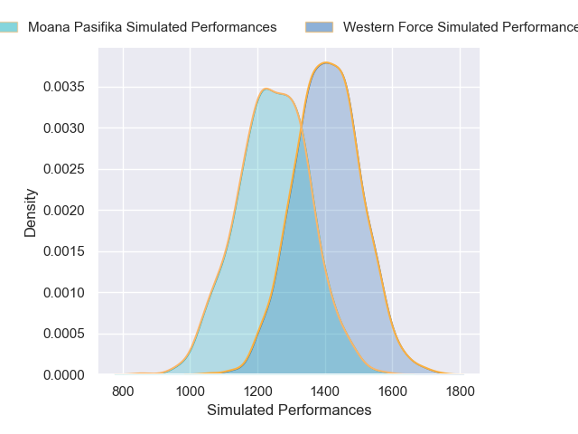
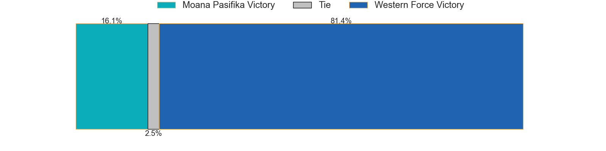
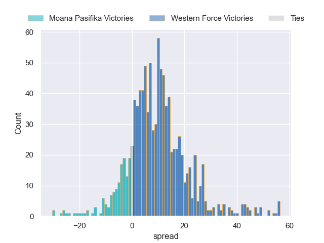

---  
title: "Super Rugby Pacific 2024 Status"  
date: 2024-12-23 6:00:00 -0500  
categories: model review projection  
layout: article  
aside:  
    toc: true  
---
# Current Team Rankings

# Standings

## Current Standings

| Club                     |   Played |   Wins |   Point Differential |   Losing Bonus Points |   Try Bonus Points |   Competition Points |
|:-------------------------|---------:|-------:|---------------------:|----------------------:|-------------------:|---------------------:|
| Blues                    |       17 |     15 |                  331 |                     1 |                  9 |                   70 |
| Hurricanes               |       16 |     13 |                  215 |                     1 |                  8 |                   61 |
| Brumbies                 |       16 |     13 |                  101 |                     0 |                  5 |                   57 |
| Chiefs                   |       17 |     11 |                  177 |                     2 |                  6 |                   52 |
| Queensland Reds          |       15 |      8 |                   82 |                     4 |                  4 |                   40 |
| Highlanders              |       15 |      6 |                 -113 |                     2 |                  2 |                   28 |
| Fijian Drua              |       15 |      6 |                 -133 |                     1 |                  1 |                   26 |
| Melbourne Rebels         |       15 |      5 |                 -174 |                     2 |                  4 |                   26 |
| Crusaders                |       14 |      4 |                   -6 |                     6 |                  2 |                   24 |
| Western Force            |       14 |      4 |                 -132 |                     3 |                  1 |                   20 |
| Moana Pasifika           |       14 |      4 |                 -220 |                     2 |                  0 |                   18 |
| New South Wales Waratahs |       14 |      2 |                 -128 |                     5 |                  0 |                   13 |

## Projected Remaining Table

| Club                     |   Matches Remaining |   Wins |   Point Differential |   Losing Bonus Points |   Try Bonus Points |   Competition Points |
|:-------------------------|--------------------:|-------:|---------------------:|----------------------:|-------------------:|---------------------:|
| Brumbies                 |                  14 |   11.4 |            152.615   |                   1.4 |                6.4 |                 53.6 |
| Blues                    |                  14 |   11.5 |            150.28    |                   1.5 |                5   |                 52.7 |
| Chiefs                   |                  14 |   10   |             93.1925  |                   2.2 |                3.9 |                 46   |
| Hurricanes               |                  14 |    9.8 |             88.7256  |                   2.3 |                4.5 |                 45.9 |
| Queensland Reds          |                  14 |    6.7 |             -5.03355 |                   3.4 |                1.5 |                 31.8 |
| Crusaders                |                  14 |    6.5 |            -12.9711  |                   3.3 |                2   |                 31.2 |
| Highlanders              |                  14 |    5.8 |            -41.9593  |                   3.5 |                1.5 |                 28   |
| Fijian Drua              |                  14 |    5.2 |            -56.0276  |                   3.7 |                1.1 |                 25.5 |
| New South Wales Waratahs |                  14 |    4.1 |            -93.3557  |                   3.6 |                0.8 |                 21   |
| Western Force            |                  14 |    3.8 |           -108.14    |                   3.3 |                0.6 |                 19   |
| Moana Pasifika           |                  14 |    2.2 |           -167.325   |                   2.8 |                0.5 |                 12   |

## Projected Total Table

| Club                     |   Total Matches |   Wins |   Point Differential |   Losing Bonus Points |   Try Bonus Points |   Competition Points |
|:-------------------------|----------------:|-------:|---------------------:|----------------------:|-------------------:|---------------------:|
| Blues                    |              31 |   26.5 |             481.28   |                   2.5 |               14   |                122.7 |
| Brumbies                 |              30 |   24.4 |             253.615  |                   1.4 |               11.4 |                110.6 |
| Hurricanes               |              30 |   22.8 |             303.726  |                   3.3 |               12.5 |                106.9 |
| Chiefs                   |              31 |   21   |             270.193  |                   4.2 |                9.9 |                 98   |
| Queensland Reds          |              29 |   14.7 |              76.9664 |                   7.4 |                5.5 |                 71.8 |
| Highlanders              |              29 |   11.8 |            -154.959  |                   5.5 |                3.5 |                 56   |
| Crusaders                |              28 |   10.5 |             -18.9711 |                   9.3 |                4   |                 55.2 |
| Fijian Drua              |              29 |   11.2 |            -189.028  |                   4.7 |                2.1 |                 51.5 |
| Western Force            |              28 |    7.8 |            -240.14   |                   6.3 |                1.6 |                 39   |
| New South Wales Waratahs |              28 |    6.1 |            -221.356  |                   8.6 |                0.8 |                 34   |
| Moana Pasifika           |              28 |    6.2 |            -387.325  |                   4.8 |                0.5 |                 30   |
| Melbourne Rebels         |              15 |    5   |            -174      |                   2   |                4   |                 26   |

# Completed Match Review

| Model | Percent Correct Predictions | Spread Error |
| ------ | ------ | ------ |
| Club Level | 74.7% | 13.2 |
| Player Level: Lineup | 73.6% | 12.8 |
| Player Level: Minutes | 71.4% | 13.0 |

# Future Predictions

## Week 18

### Crusaders V Hurricanes on 2025/02/14

Average Margin: Hurricanes by 2.9

Average Scoreline: 30-27

### New South Wales Waratahs V Highlanders on 2025/02/14

Average Margin: Highlanders by 0.4

Average Scoreline: 24-23

### Blues V Chiefs on 2025/02/15

Average Margin: Blues by 8.5

Average Scoreline: 25-17

### Fijian Drua V Brumbies on 2025/02/15

Average Margin: Brumbies by 10.7

Average Scoreline: 37-26

### Western Force V Moana Pasifika on 2025/02/15

Average Margin: Western Force by 6.9

Average Scoreline: 26-19

## Week 19

### Queensland Reds V Moana Pasifika on 2025/02/21

Average Margin: Queensland Reds by 13.0

Average Scoreline: 28-15

### Chiefs V Crusaders on 2025/02/21

Average Margin: Chiefs by 9.7

Average Scoreline: 28-18

### Highlanders V Blues on 2025/02/22

Average Margin: Blues by 10.0

Average Scoreline: 34-24

### Hurricanes V Fijian Drua on 2025/02/22

Average Margin: Hurricanes by 13.9

Average Scoreline: 36-22

### Brumbies V Western Force on 2025/02/22

Average Margin: Brumbies by 20.3

Average Scoreline: 35-14

## Week 20

### New South Wales Waratahs V Fijian Drua on 2025/02/28

Average Margin: New South Wales Waratahs by 0.4

Average Scoreline: 21-21

### Moana Pasifika V Highlanders on 2025/02/28

Average Margin: Highlanders by 4.4

Average Scoreline: 33-28

### Chiefs V Brumbies on 2025/03/01

Average Margin: Chiefs by 1.0

Average Scoreline: 26-25

### Western Force V Queensland Reds on 2025/03/01

Average Margin: Queensland Reds by 3.0

Average Scoreline: 26-23

### Hurricanes V Blues on 2025/03/01

Average Margin: Blues by 1.7

Average Scoreline: 25-24

## Week 21

### Blues V Brumbies on 2025/03/07

Average Margin: Blues by 4.6

Average Scoreline: 25-21

### Fijian Drua V Chiefs on 2025/03/08

Average Margin: Chiefs by 7.3

Average Scoreline: 28-20

### New South Wales Waratahs V Western Force on 2025/03/08

Average Margin: New South Wales Waratahs by 4.5

Average Scoreline: 26-22

### Moana Pasifika V Hurricanes on 2025/03/08

Average Margin: Hurricanes by 12.5

Average Scoreline: 31-19

### Crusaders V Queensland Reds on 2025/03/09

Average Margin: Crusaders by 5.4

Average Scoreline: 25-20

## Week 22

### Highlanders V Hurricanes on 2025/03/14

Average Margin: Hurricanes by 5.0

Average Scoreline: 31-26

### Brumbies V Fijian Drua on 2025/03/14

Average Margin: Brumbies by 16.7

Average Scoreline: 33-17

### Queensland Reds V New South Wales Waratahs on 2025/03/15

Average Margin: Queensland Reds by 9.3

Average Scoreline: 29-19

### Chiefs V Blues on 2025/03/15

Average Margin: Blues by 0.4

Average Scoreline: 25-24

### Crusaders V Western Force on 2025/03/15

Average Margin: Crusaders by 12.1

Average Scoreline: 30-18

## Week 23

### Moana Pasifika V Chiefs on 2025/03/21

Average Margin: Chiefs by 12.8

Average Scoreline: 30-17

### Blues V Crusaders on 2025/03/22

Average Margin: Blues by 13.4

Average Scoreline: 30-17

### Highlanders V Queensland Reds on 2025/03/22

Average Margin: Highlanders by 2.1

Average Scoreline: 26-24

### New South Wales Waratahs V Brumbies on 2025/03/22

Average Margin: Brumbies by 11.8

Average Scoreline: 36-24

### Western Force V Fijian Drua on 2025/03/23

Average Margin: Fijian Drua by 0.1

Average Scoreline: 23-23

## Week 24

### Brumbies V Highlanders on 2025/03/28

Average Margin: Brumbies by 14.9

Average Scoreline: 31-16

### Hurricanes V New South Wales Waratahs on 2025/03/28

Average Margin: Hurricanes by 15.9

Average Scoreline: 37-21

### Crusaders V Moana Pasifika on 2025/03/29

Average Margin: Crusaders by 13.9

Average Scoreline: 30-16

### Queensland Reds V Western Force on 2025/03/29

Average Margin: Queensland Reds by 10.7

Average Scoreline: 30-19

## Week 25

### Chiefs V Queensland Reds on 2025/04/04

Average Margin: Chiefs by 10.4

Average Scoreline: 31-20

### Moana Pasifika V New South Wales Waratahs on 2025/04/05

Average Margin: New South Wales Waratahs by 0.2

Average Scoreline: 24-24

### Fijian Drua V Crusaders on 2025/04/05

Average Margin: Crusaders by 1.4

Average Scoreline: 29-27

### Western Force V Highlanders on 2025/04/05

Average Margin: Highlanders by 1.1

Average Scoreline: 25-24

### Blues V Hurricanes on 2025/04/05

Average Margin: Blues by 8.7

Average Scoreline: 28-19

## Week 26

### New South Wales Waratahs V Chiefs on 2025/04/11

Average Margin: Chiefs by 9.3

Average Scoreline: 32-23

### Hurricanes V Crusaders on 2025/04/11

Average Margin: Hurricanes by 9.6

Average Scoreline: 31-22

### Highlanders V Fijian Drua on 2025/04/12

Average Margin: Highlanders by 4.9

Average Scoreline: 27-22

### Blues V Moana Pasifika on 2025/04/12

Average Margin: Blues by 23.1

Average Scoreline: 38-14

### Queensland Reds V Brumbies on 2025/04/12

Average Margin: Brumbies by 6.9

Average Scoreline: 32-25

## Week 27

### Crusaders V Blues on 2025/04/18

Average Margin: Blues by 6.0

Average Scoreline: 31-25

### Chiefs V Highlanders on 2025/04/19

Average Margin: Chiefs by 12.6

Average Scoreline: 32-19

### Western Force V Hurricanes on 2025/04/19

Average Margin: Hurricanes by 9.9

Average Scoreline: 33-24

### Moana Pasifika V Brumbies on 2025/04/19

Average Margin: Brumbies by 14.9

Average Scoreline: 36-21

### Fijian Drua V New South Wales Waratahs on 2025/04/19

Average Margin: Fijian Drua by 7.1

Average Scoreline: 29-22

## Week 28

### Chiefs V Western Force on 2025/04/25

Average Margin: Chiefs by 16.6

Average Scoreline: 34-18

### Queensland Reds V Blues on 2025/04/25

Average Margin: Blues by 8.5

Average Scoreline: 33-25

### Moana Pasifika V Fijian Drua on 2025/04/26

Average Margin: Fijian Drua by 2.5

Average Scoreline: 21-19

### Brumbies V Hurricanes on 2025/04/26

Average Margin: Brumbies by 7.3

Average Scoreline: 25-18

### Highlanders V Crusaders on 2025/04/26

Average Margin: Highlanders by 1.2

Average Scoreline: 25-23

## Week 29

### Blues V Western Force on 2025/05/02

Average Margin: Blues by 19.9

Average Scoreline: 33-14

### Fijian Drua V Queensland Reds on 2025/05/03

Average Margin: Fijian Drua by 0.8

Average Scoreline: 29-28

### Brumbies V New South Wales Waratahs on 2025/05/03

Average Margin: Brumbies by 17.4

Average Scoreline: 32-15

### Hurricanes V Chiefs on 2025/05/03

Average Margin: Hurricanes by 3.3

Average Scoreline: 28-25

### Highlanders V Moana Pasifika on 2025/05/04

Average Margin: Highlanders by 10.6

Average Scoreline: 28-18

## Week 30

### New South Wales Waratahs V Queensland Reds on 2025/05/09

Average Margin: Queensland Reds by 2.0

Average Scoreline: 27-25

### Fijian Drua V Blues on 2025/05/09

Average Margin: Blues by 10.7

Average Scoreline: 37-27

### Crusaders V Chiefs on 2025/05/10

Average Margin: Chiefs by 1.6

Average Scoreline: 26-25

### Western Force V Brumbies on 2025/05/10

Average Margin: Brumbies by 12.4

Average Scoreline: 36-24

## Week 31

### Hurricanes V Highlanders on 2025/05/16

Average Margin: Hurricanes by 11.6

Average Scoreline: 35-24

### New South Wales Waratahs V Crusaders on 2025/05/16

Average Margin: Crusaders by 3.4

Average Scoreline: 30-27

### Moana Pasifika V Blues on 2025/05/17

Average Margin: Blues by 15.2

Average Scoreline: 37-22

### Fijian Drua V Western Force on 2025/05/17

Average Margin: Fijian Drua by 6.8

Average Scoreline: 29-22

### Brumbies V Queensland Reds on 2025/05/17

Average Margin: Brumbies by 12.9

Average Scoreline: 31-18

## Week 32

### Queensland Reds V Hurricanes on 2025/05/23

Average Margin: Hurricanes by 3.2

Average Scoreline: 31-28

### Crusaders V Highlanders on 2025/05/23

Average Margin: Crusaders by 7.2

Average Scoreline: 30-23

### Chiefs V Moana Pasifika on 2025/05/24

Average Margin: Chiefs by 18.6

Average Scoreline: 38-19

### Western Force V New South Wales Waratahs on 2025/05/24

Average Margin: Western Force by 2.3

Average Scoreline: 26-24

## Week 33

### Brumbies V Crusaders on 2025/05/30

Average Margin: Brumbies by 12.0

Average Scoreline: 32-20

### Highlanders V Chiefs on 2025/05/30

Average Margin: Chiefs by 5.5

Average Scoreline: 30-25

### Blues V New South Wales Waratahs on 2025/05/31

Average Margin: Blues by 19.7

Average Scoreline: 34-15

### Hurricanes V Moana Pasifika on 2025/05/31

Average Margin: Hurricanes by 18.6

Average Scoreline: 39-20

### Queensland Reds V Fijian Drua on 2025/05/31

Average Margin: Queensland Reds by 7.1

Average Scoreline: 31-24

