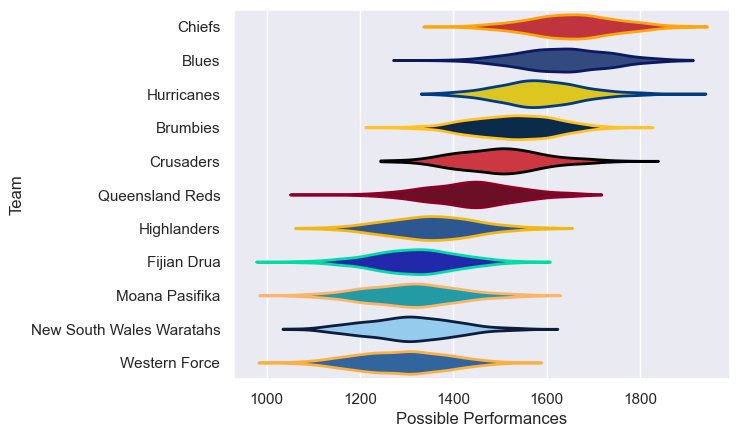

---  
title: "Super Rugby Pacific 2025 Status"  
date: 2025-07-28 6:00:00 -0500  
categories: model review projection  
layout: article  
aside:  
    toc: true  
---
# Current Team Rankings

# Standings

## Current Standings

| Club                     |   Played |   Wins |   Point Differential |   Losing Bonus Points |   Try Bonus Points |   Competition Points |
|:-------------------------|---------:|-------:|---------------------:|----------------------:|-------------------:|---------------------:|
| Crusaders                |       17 |     14 |                  131 |                     0 |                 11 |                   67 |
| Chiefs                   |       17 |     12 |                  246 |                     4 |                 10 |                   62 |
| Brumbies                 |       16 |     10 |                   74 |                     4 |                 12 |                   56 |
| Hurricanes               |       15 |      8 |                   99 |                     4 |                  8 |                   46 |
| Queensland Reds          |       15 |      8 |                   34 |                     2 |                 10 |                   44 |
| Blues                    |       16 |      7 |                   41 |                     5 |                  6 |                   39 |
| Moana Pasifika           |       14 |      6 |                 -139 |                     2 |                  9 |                   35 |
| New South Wales Waratahs |       14 |      6 |                 -134 |                     1 |                  6 |                   31 |
| Western Force            |       14 |      4 |                 -114 |                     3 |                  5 |                   26 |
| Highlanders              |       14 |      3 |                  -90 |                     7 |                  5 |                   24 |
| Fijian Drua              |       14 |      4 |                 -148 |                     3 |                  5 |                   24 |

# Completed Match Review

| Model | Percent Correct Predictions | Spread Error |
| ------ | ------ | ------ |
| Club Level | 66.3% | 12.7 |
| Player Level: Lineup | nan% | nan |
| Player Level: Minutes | nan% | nan |

