---  
title: "Super Rugby Pacific 2025 Status"  
date: 2025-04-10 6:00:00 -0500  
categories: model review projection  
layout: article  
aside:  
    toc: true  
---
# Current Team Rankings

# Standings

## Current Standings

| Club                     |   Played |   Wins |   Point Differential |   Losing Bonus Points |   Try Bonus Points |   Competition Points |
|:-------------------------|---------:|-------:|---------------------:|----------------------:|-------------------:|---------------------:|
| Crusaders                |        8 |      6 |                   75 |                     1 |                nan |                   28 |
| New South Wales Waratahs |        8 |      6 |                   -3 |                     0 |                nan |                   25 |
| Queensland Reds          |        8 |      5 |                   23 |                     1 |                nan |                   24 |
| Brumbies                 |        8 |      5 |                   33 |                     2 |                nan |                   23 |
| Western Force            |        8 |      5 |                    6 |                     1 |                  2 |                   23 |
| Hurricanes               |        7 |      5 |                   49 |                     1 |                nan |                   22 |
| Chiefs                   |        8 |      5 |                    5 |                     0 |                nan |                   21 |
| Highlanders              |        8 |      2 |                  -74 |                     4 |                nan |                   12 |
| Fijian Drua              |        8 |      2 |                   -1 |                     3 |                nan |                   11 |
| Moana Pasifika           |        8 |      1 |                  -43 |                     4 |                nan |                    9 |
| Blues                    |        7 |      1 |                  -70 |                     1 |                nan |                    5 |

## Projected Remaining Table

| Club                     |   Matches Remaining |   Wins |   Point Differential |   Losing Bonus Points |   Try Bonus Points |   Competition Points |
|:-------------------------|--------------------:|-------:|---------------------:|----------------------:|-------------------:|---------------------:|
| Hurricanes               |                   7 |    5   |             44.3048  |                   1.2 |                2.3 |                 23.4 |
| Crusaders                |                   7 |    5   |             47.053   |                   1.2 |                1.9 |                 23.1 |
| Brumbies                 |                   7 |    5   |             37.1793  |                   1.3 |                1.5 |                 22.7 |
| Chiefs                   |                   7 |    4.5 |             31.2164  |                   1.2 |                1.7 |                 20.8 |
| Blues                    |                   7 |    4   |             13.2017  |                   1.5 |                1.5 |                 19   |
| Fijian Drua              |                   7 |    3.7 |              1.89608 |                   1.9 |                0.6 |                 17.1 |
| Queensland Reds          |                   7 |    3.5 |              1.70153 |                   1.9 |                0.9 |                 16.9 |
| New South Wales Waratahs |                   7 |    2.3 |            -31.5824  |                   2.2 |                0.5 |                 11.7 |
| Highlanders              |                   7 |    1.9 |            -54.2737  |                   1.5 |                0.3 |                  9.3 |
| Western Force            |                   6 |    1.7 |            -33.1186  |                   1.9 |                0.4 |                  8.8 |
| Moana Pasifika           |                   7 |    1.6 |            -57.5782  |                   1.8 |                0.3 |                  8.4 |

## Projected Total Table

| Club                     |   Total Matches |   Wins |   Point Differential |   Losing Bonus Points |   Try Bonus Points |   Competition Points |
|:-------------------------|----------------:|-------:|---------------------:|----------------------:|-------------------:|---------------------:|
| Crusaders                |              15 |   11   |           122.053    |                   2.2 |                1.9 |                 51.1 |
| Brumbies                 |              15 |   10   |            70.1793   |                   3.3 |                1.5 |                 45.7 |
| Hurricanes               |              14 |   10   |            93.3048   |                   2.2 |                2.3 |                 45.4 |
| Chiefs                   |              15 |    9.5 |            36.2164   |                   1.2 |                1.7 |                 41.8 |
| Queensland Reds          |              15 |    8.5 |            24.7015   |                   2.9 |                0.9 |                 40.9 |
| New South Wales Waratahs |              15 |    8.3 |           -34.5824   |                   2.2 |                0.5 |                 36.7 |
| Western Force            |              14 |    6.7 |           -27.1186   |                   2.9 |                2.4 |                 31.8 |
| Fijian Drua              |              15 |    5.7 |             0.896076 |                   4.9 |                0.6 |                 28.1 |
| Blues                    |              14 |    5   |           -56.7983   |                   2.5 |                1.5 |                 24   |
| Highlanders              |              15 |    3.9 |          -128.274    |                   5.5 |                0.3 |                 21.3 |
| Moana Pasifika           |              15 |    2.6 |          -100.578    |                   5.8 |                0.3 |                 17.4 |

# Completed Match Review

| Model | Percent Correct Predictions | Spread Error |
| ------ | ------ | ------ |
| Club Level | 62.8% | 13.7 |
| Player Level: Lineup | 66.7% | 15.2 |
| Player Level: Minutes | 66.7% | 16.1 |

# Future Predictions

## Week 9

### Hurricanes V Crusaders on 2025/04/11

Average Margin: Hurricanes by 2.6

Average Scoreline: 33-30

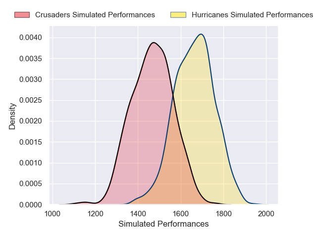

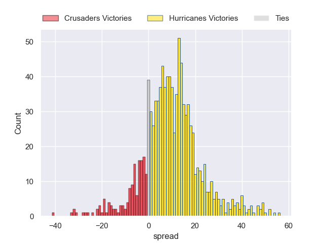

### New South Wales Waratahs V Chiefs on 2025/04/11

Average Margin: Chiefs by 2.3

Average Scoreline: 31-29

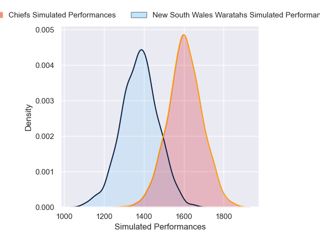

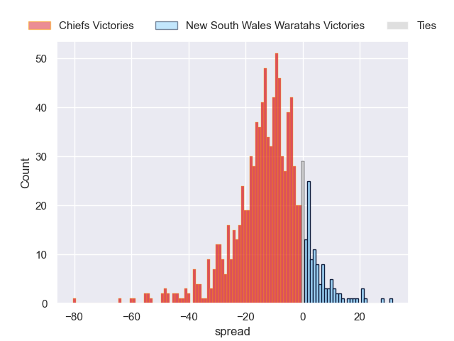

### Highlanders V Fijian Drua on 2025/04/12

Average Margin: Highlanders by 0.3

Average Scoreline: 26-26

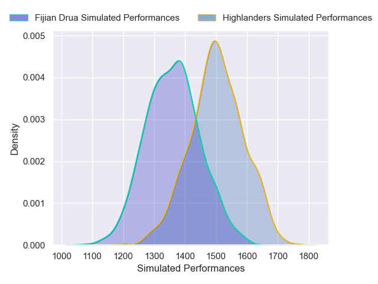

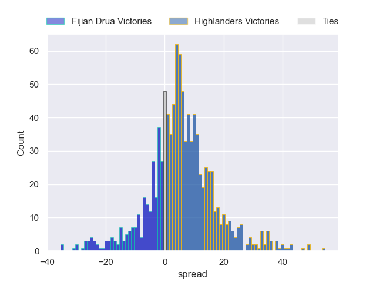

### Queensland Reds V Brumbies on 2025/04/12

Average Margin: Brumbies by 0.8

Average Scoreline: 33-32

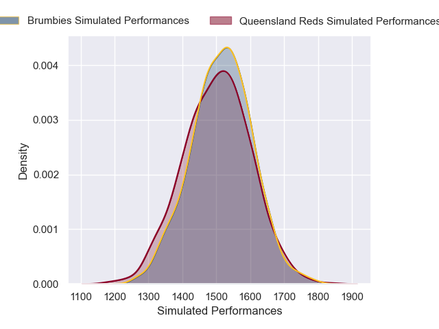

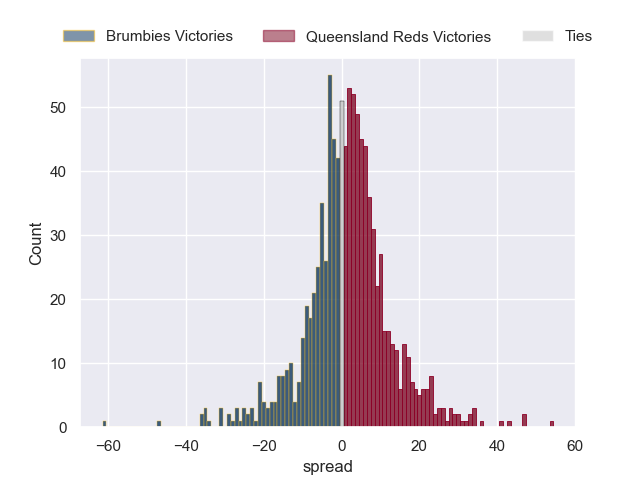

### Blues V Moana Pasifika on 2025/04/12

Average Margin: Blues by 11.4

Average Scoreline: 36-25

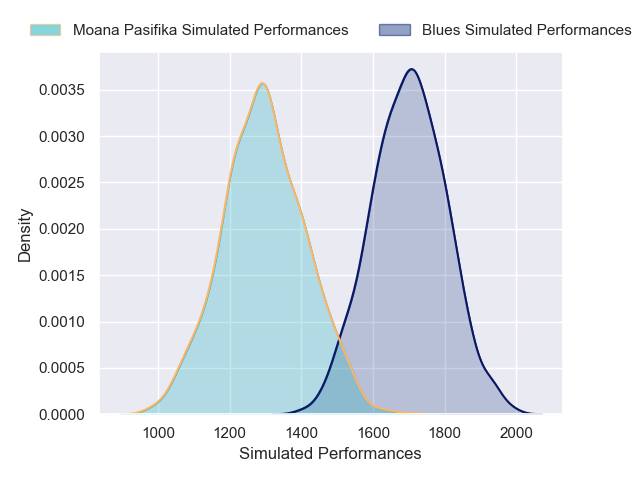

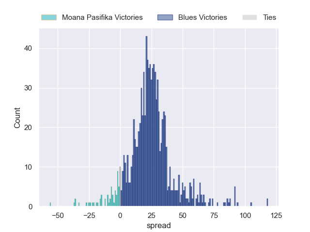

## Week 10

### Crusaders V Blues on 2025/04/18

Average Margin: Crusaders by 11.0

Average Scoreline: 33-22

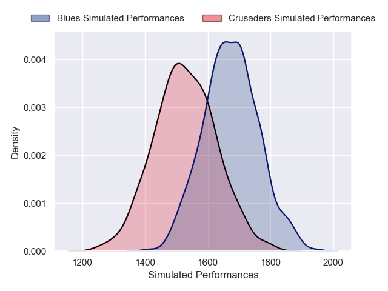

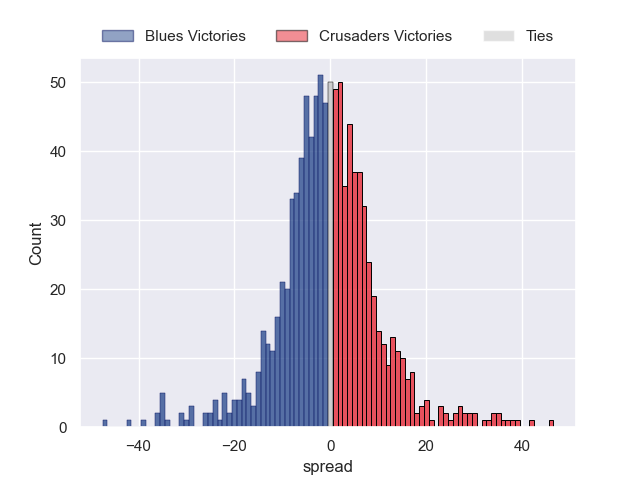

### Moana Pasifika V Brumbies on 2025/04/19

Average Margin: Brumbies by 8.5

Average Scoreline: 35-26

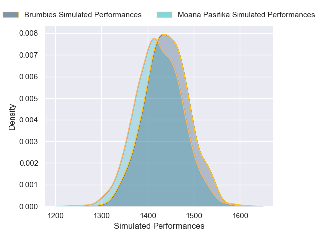

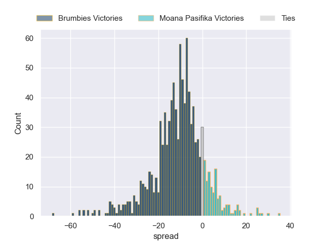

### Chiefs V Highlanders on 2025/04/19

Average Margin: Chiefs by 13.0

Average Scoreline: 34-21

### Western Force V Hurricanes on 2025/04/19

Average Margin: Hurricanes by 6.1

Average Scoreline: 43-37

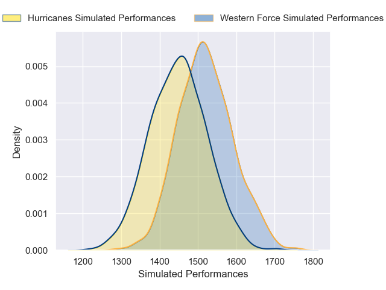
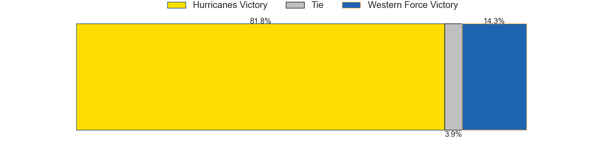
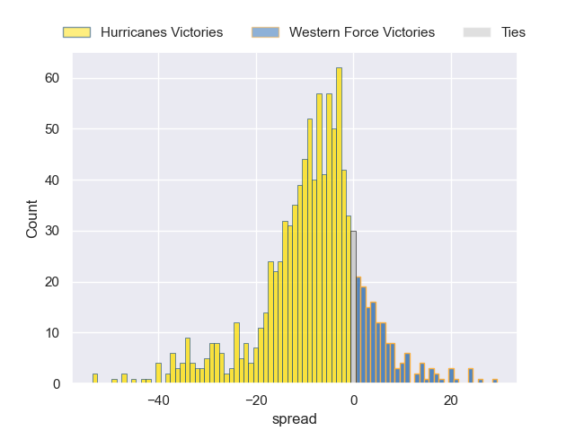

### Fijian Drua V New South Wales Waratahs on 2025/04/19

Average Margin: Fijian Drua by 3.3

Average Scoreline: 29-26

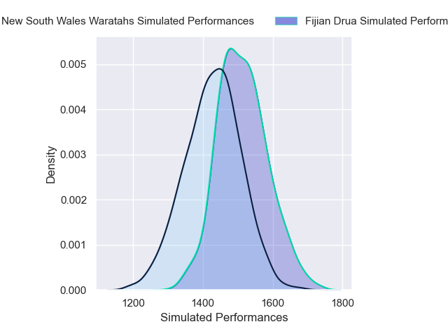
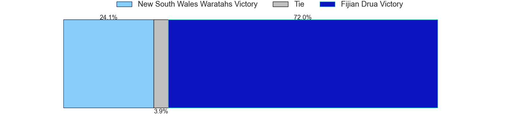
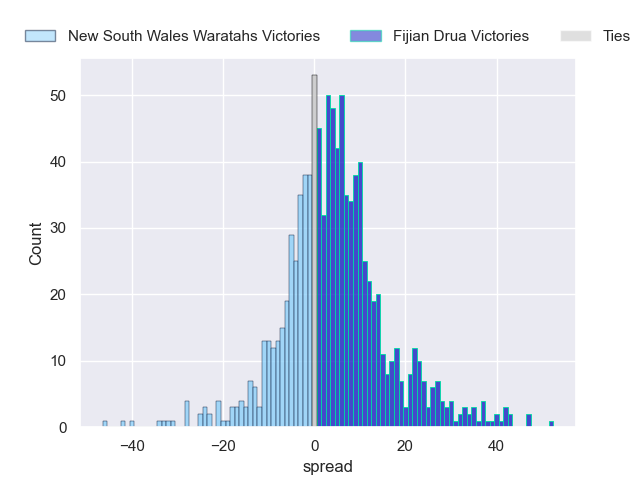

## Week 11

### Queensland Reds V Blues on 2025/04/25

Average Margin: Queensland Reds by 4.9

Average Scoreline: 29-24

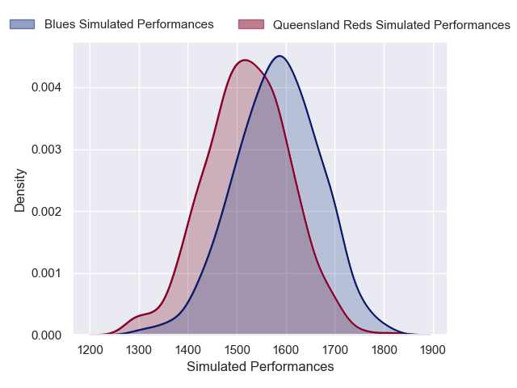

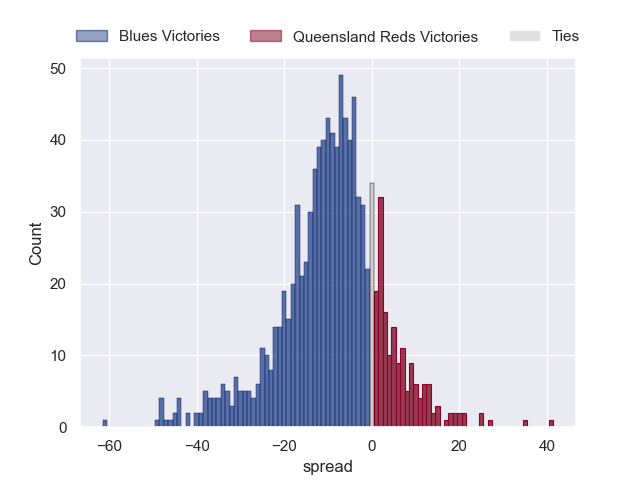

### Chiefs V Western Force on 2025/04/25

Average Margin: Chiefs by 11.1

Average Scoreline: 30-18

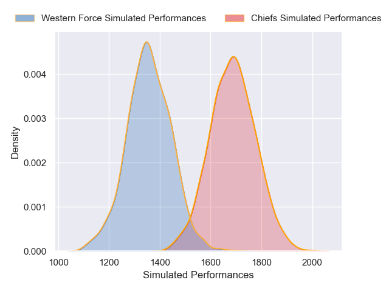

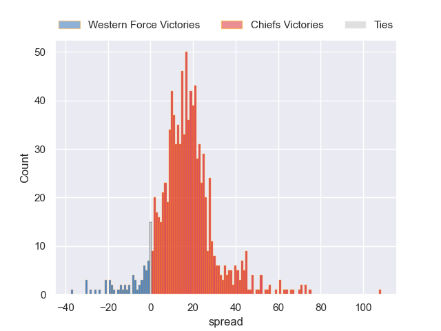

### Highlanders V Crusaders on 2025/04/26

Average Margin: Crusaders by 10.6

Average Scoreline: 46-35

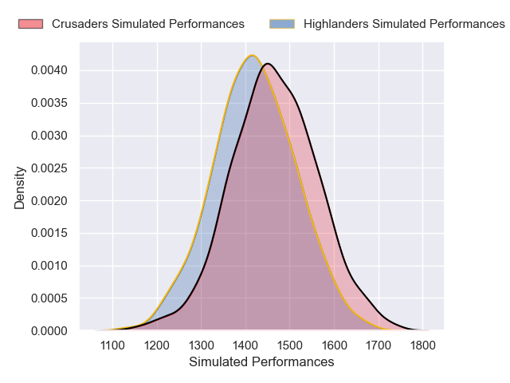

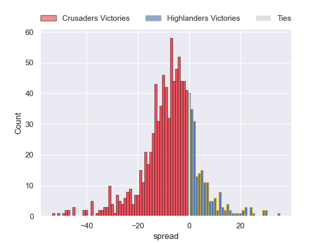

### Brumbies V Hurricanes on 2025/04/26

Average Margin: Brumbies by 2.5

Average Scoreline: 33-31

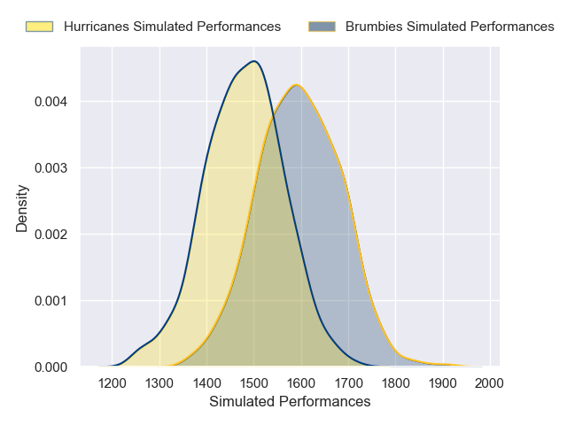

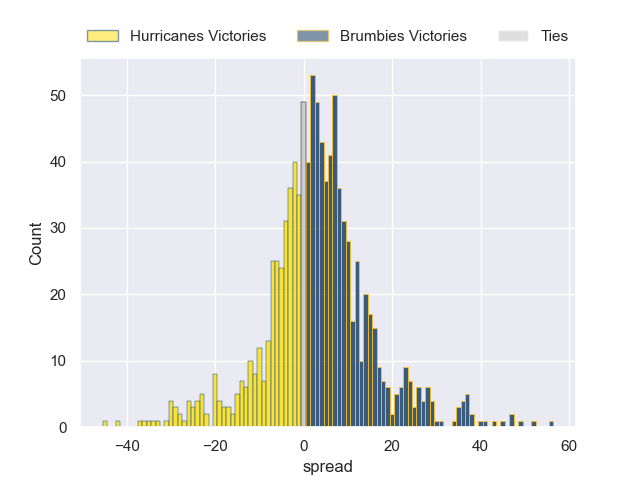

### Moana Pasifika V Fijian Drua on 2025/04/26

Average Margin: Fijian Drua by 0.5

Average Scoreline: 40-40

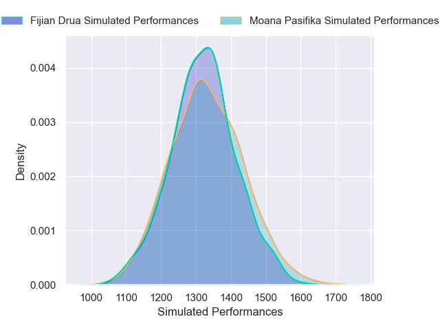

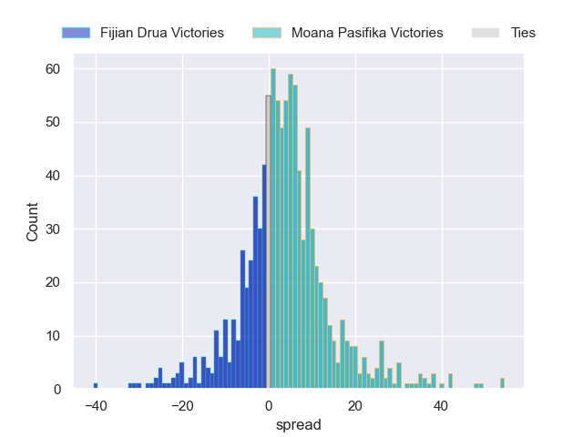

## Week 12

### Blues V Western Force on 2025/05/02

Average Margin: Blues by 8.3

Average Scoreline: 30-22

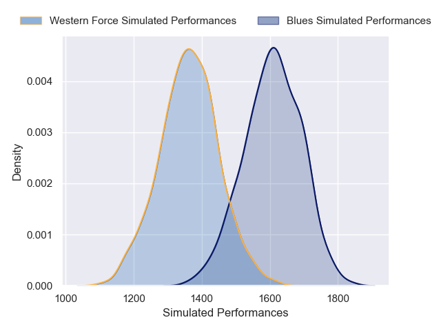

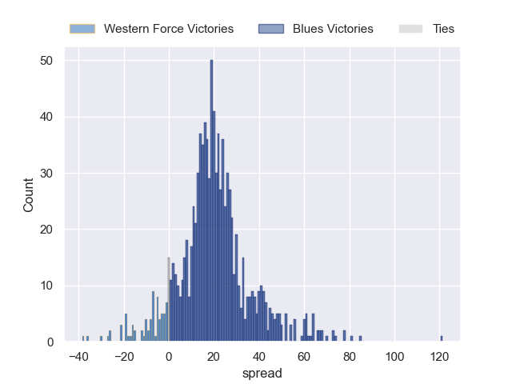

### Brumbies V New South Wales Waratahs on 2025/05/03

Average Margin: Brumbies by 10.5

Average Scoreline: 33-23

### Hurricanes V Chiefs on 2025/05/03

Average Margin: Hurricanes by 6.6

Average Scoreline: 30-23

### Fijian Drua V Queensland Reds on 2025/05/03

Average Margin: Queensland Reds by 0.2

Average Scoreline: 24-24

### Highlanders V Moana Pasifika on 2025/05/04

Average Margin: Highlanders by 4.8

Average Scoreline: 26-21

## Week 13

### New South Wales Waratahs V Queensland Reds on 2025/05/09

Average Margin: New South Wales Waratahs by 0.3

Average Scoreline: 30-30

### Fijian Drua V Blues on 2025/05/09

Average Margin: Fijian Drua by 0.9

Average Scoreline: 28-27

### Crusaders V Chiefs on 2025/05/10

Average Margin: Crusaders by 7.6

Average Scoreline: 30-22

### Western Force V Brumbies on 2025/05/10

Average Margin: Brumbies by 5.1

Average Scoreline: 34-29

## Week 14

### Hurricanes V Highlanders on 2025/05/16

Average Margin: Hurricanes by 14.5

Average Scoreline: 34-20

### New South Wales Waratahs V Crusaders on 2025/05/16

Average Margin: Crusaders by 6.5

Average Scoreline: 37-31

### Brumbies V Queensland Reds on 2025/05/17

Average Margin: Brumbies by 8.0

Average Scoreline: 31-23

### Moana Pasifika V Blues on 2025/05/17

Average Margin: Blues by 3.5

Average Scoreline: 31-27

### Fijian Drua V Western Force on 2025/05/17

Average Margin: Fijian Drua by 4.7

Average Scoreline: 27-22

## Week 15

### Crusaders V Highlanders on 2025/05/23

Average Margin: Crusaders by 15.6

Average Scoreline: 35-19

### Queensland Reds V Hurricanes on 2025/05/23

Average Margin: Hurricanes by 1.4

Average Scoreline: 32-30

### Western Force V New South Wales Waratahs on 2025/05/24

Average Margin: Western Force by 2.2

Average Scoreline: 26-23

### Chiefs V Moana Pasifika on 2025/05/24

Average Margin: Chiefs by 13.3

Average Scoreline: 37-24

## Week 16

### Brumbies V Crusaders on 2025/05/30

Average Margin: Brumbies by 1.7

Average Scoreline: 28-27

### Highlanders V Chiefs on 2025/05/30

Average Margin: Chiefs by 5.6

Average Scoreline: 32-26

### Hurricanes V Moana Pasifika on 2025/05/31

Average Margin: Hurricanes by 15.5

Average Scoreline: 36-20

### Blues V New South Wales Waratahs on 2025/05/31

Average Margin: Blues by 7.0

Average Scoreline: 30-23

### Queensland Reds V Fijian Drua on 2025/05/31

Average Margin: Queensland Reds by 7.1

Average Scoreline: 31-24

