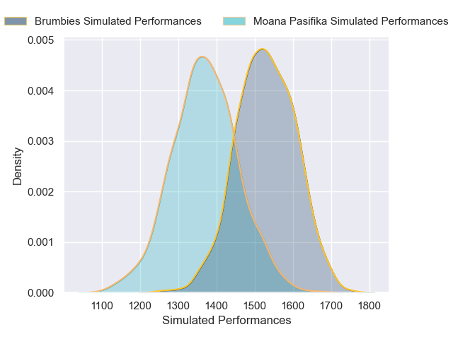
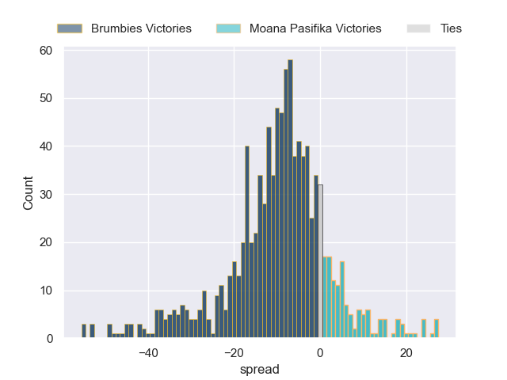

---  
title: "Super Rugby Pacific 2025 Status"  
date: 2025-04-14 6:00:00 -0500  
categories: model review projection  
layout: article  
aside:  
    toc: true  
---
# Current Team Rankings

# Standings

## Current Standings

| Club                     |   Played |   Wins |   Point Differential |   Losing Bonus Points |   Try Bonus Points |   Competition Points |
|:-------------------------|---------:|-------:|---------------------:|----------------------:|-------------------:|---------------------:|
| Crusaders                |        8 |      6 |                   66 |                     1 |                nan |                   28 |
| Chiefs                   |        8 |      6 |                   63 |                     2 |                nan |                   27 |
| Brumbies                 |        8 |      5 |                   33 |                     2 |                  1 |                   23 |
| Queensland Reds          |        8 |      4 |                   14 |                     2 |                nan |                   21 |
| New South Wales Waratahs |        8 |      5 |                  -46 |                     0 |                  1 |                   21 |
| Hurricanes               |        8 |      4 |                   24 |                     2 |                  1 |                   19 |
| Western Force            |        8 |      4 |                  -17 |                     1 |                  2 |                   19 |
| Highlanders              |        8 |      3 |                  -16 |                     4 |                  1 |                   17 |
| Blues                    |        8 |      3 |                  -29 |                     1 |                  2 |                   15 |
| Fijian Drua              |        8 |      3 |                  -35 |                     3 |                nan |                   15 |
| Moana Pasifika           |        8 |      1 |                  -57 |                     3 |                  1 |                    8 |

## Projected Remaining Table

| Club                     |   Matches Remaining |   Wins |   Point Differential |   Losing Bonus Points |   Try Bonus Points |   Competition Points |
|:-------------------------|--------------------:|-------:|---------------------:|----------------------:|-------------------:|---------------------:|
| Brumbies                 |                   6 |    4.7 |             47.4408  |                   0.8 |                1.7 |                 21.5 |
| Chiefs                   |                   6 |    4.5 |             55.3479  |                   0.8 |                2   |                 20.9 |
| Blues                    |                   6 |    4.1 |             35.2049  |                   1   |                2.5 |                 20.1 |
| Crusaders                |                   6 |    4.3 |             35.9682  |                   1   |                1.5 |                 19.6 |
| Hurricanes               |                   6 |    3.8 |             25.1066  |                   1.3 |                1.6 |                 18   |
| Fijian Drua              |                   6 |    3.5 |             11.7437  |                   1.4 |                0.8 |                 16.1 |
| Queensland Reds          |                   6 |    2.7 |             -6.81635 |                   1.7 |                0.7 |                 13.4 |
| Highlanders              |                   6 |    1.5 |            -46.2206  |                   1.3 |                0.3 |                  7.6 |
| Western Force            |                   6 |    1.4 |            -48.8018  |                   1.5 |                0.2 |                  7.4 |
| New South Wales Waratahs |                   6 |    1.3 |            -47.3502  |                   1.7 |                0.3 |                  7.3 |
| Moana Pasifika           |                   6 |    1.1 |            -61.6232  |                   1.4 |                0.2 |                  5.9 |

## Projected Total Table

| Club                     |   Total Matches |   Wins |   Point Differential |   Losing Bonus Points |   Try Bonus Points |   Competition Points |
|:-------------------------|----------------:|-------:|---------------------:|----------------------:|-------------------:|---------------------:|
| Chiefs                   |              14 |   10.5 |            118.348   |                   2.8 |                2   |                 47.9 |
| Crusaders                |              14 |   10.3 |            101.968   |                   2   |                1.5 |                 47.6 |
| Brumbies                 |              14 |    9.7 |             80.4408  |                   2.8 |                2.7 |                 44.5 |
| Hurricanes               |              14 |    7.8 |             49.1066  |                   3.3 |                2.6 |                 37   |
| Blues                    |              14 |    7.1 |              6.20494 |                   2   |                4.5 |                 35.1 |
| Queensland Reds          |              14 |    6.7 |              7.18365 |                   3.7 |                0.7 |                 34.4 |
| Fijian Drua              |              14 |    6.5 |            -23.2563  |                   4.4 |                0.8 |                 31.1 |
| New South Wales Waratahs |              14 |    6.3 |            -93.3502  |                   1.7 |                1.3 |                 28.3 |
| Western Force            |              14 |    5.4 |            -65.8018  |                   2.5 |                2.2 |                 26.4 |
| Highlanders              |              14 |    4.5 |            -62.2206  |                   5.3 |                1.3 |                 24.6 |
| Moana Pasifika           |              14 |    2.1 |           -118.623   |                   4.4 |                1.2 |                 13.9 |

# Completed Match Review

| Model | Percent Correct Predictions | Spread Error |
| ------ | ------ | ------ |
| Club Level | 61.4% | 11.6 |
| Player Level: Lineup | 80.0% | 5.9 |
| Player Level: Minutes | 80.0% | 6.9 |

# Future Predictions

## Week 9

### Crusaders V Blues on 2025/04/18

Average Margin: Crusaders by 5.9

Average Scoreline: 27-21

### Moana Pasifika V Brumbies on 2025/04/18

Average Margin: Brumbies by 9.9

Average Scoreline: 34-24

### Chiefs V Highlanders on 2025/04/19

Average Margin: Chiefs by 14.4

Average Scoreline: 31-17

### Western Force V Hurricanes on 2025/04/19

Average Margin: Hurricanes by 6.1

Average Scoreline: 32-26

### Fijian Drua V New South Wales Waratahs on 2025/04/19

Average Margin: Fijian Drua by 7.9

Average Scoreline: 24-16

## Week 10

### Chiefs V Western Force on 2025/04/25

Average Margin: Chiefs by 16.6

Average Scoreline: 33-16

### Queensland Reds V Blues on 2025/04/25

Average Margin: Blues by 2.0

Average Scoreline: 35-33

### Brumbies V Hurricanes on 2025/04/26

Average Margin: Brumbies by 5.5

Average Scoreline: 27-22

### Moana Pasifika V Fijian Drua on 2025/04/26

Average Margin: Fijian Drua by 2.0

Average Scoreline: 36-34

### Highlanders V Crusaders on 2025/04/26

Average Margin: Crusaders by 7.6

Average Scoreline: 36-29

## Week 11

### Blues V Western Force on 2025/05/02

Average Margin: Blues by 13.5

Average Scoreline: 32-19

### Fijian Drua V Queensland Reds on 2025/05/03

Average Margin: Fijian Drua by 2.4

Average Scoreline: 27-24

### Hurricanes V Chiefs on 2025/05/03

Average Margin: Chiefs by 0.9

Average Scoreline: 28-27

### Brumbies V New South Wales Waratahs on 2025/05/03

Average Margin: Brumbies by 13.2

Average Scoreline: 31-17

### Highlanders V Moana Pasifika on 2025/05/04

Average Margin: Highlanders by 8.0

Average Scoreline: 32-24

## Week 12

### New South Wales Waratahs V Queensland Reds on 2025/05/09

Average Margin: Queensland Reds by 1.3

Average Scoreline: 28-27

### Fijian Drua V Blues on 2025/05/09

Average Margin: Blues by 3.1

Average Scoreline: 29-26

### Crusaders V Chiefs on 2025/05/10

Average Margin: Crusaders by 2.1

Average Scoreline: 25-23

### Western Force V Brumbies on 2025/05/10

Average Margin: Brumbies by 7.7

Average Scoreline: 35-27

## Week 13

### New South Wales Waratahs V Crusaders on 2025/05/16

Average Margin: Crusaders by 8.7

Average Scoreline: 38-29

### Hurricanes V Highlanders on 2025/05/16

Average Margin: Hurricanes by 10.8

Average Scoreline: 33-22

### Brumbies V Queensland Reds on 2025/05/17

Average Margin: Brumbies by 9.3

Average Scoreline: 28-18

### Fijian Drua V Western Force on 2025/05/17

Average Margin: Fijian Drua by 8.0

Average Scoreline: 25-17

### Moana Pasifika V Blues on 2025/05/17

Average Margin: Blues by 9.2

Average Scoreline: 40-30

## Week 14

### Crusaders V Highlanders on 2025/05/23

Average Margin: Crusaders by 13.6

Average Scoreline: 32-18

### Queensland Reds V Hurricanes on 2025/05/23

Average Margin: Queensland Reds by 0.1

Average Scoreline: 32-31

### Chiefs V Moana Pasifika on 2025/05/24

Average Margin: Chiefs by 17.7

Average Scoreline: 37-20

### Western Force V New South Wales Waratahs on 2025/05/24

Average Margin: Western Force by 3.1

Average Scoreline: 25-22

## Week 15

### Highlanders V Chiefs on 2025/05/30

Average Margin: Chiefs by 7.8

Average Scoreline: 38-31

### Brumbies V Crusaders on 2025/05/30

Average Margin: Brumbies by 1.9

Average Scoreline: 26-24

### Blues V New South Wales Waratahs on 2025/05/31

Average Margin: Blues by 13.3

Average Scoreline: 33-19

### Queensland Reds V Fijian Drua on 2025/05/31

Average Margin: Queensland Reds by 5.4

Average Scoreline: 31-26

### Hurricanes V Moana Pasifika on 2025/05/31

Average Margin: Hurricanes by 14.8

Average Scoreline: 39-24

