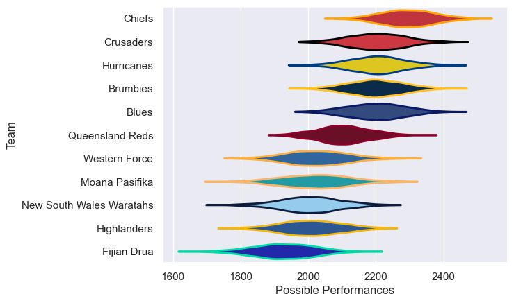

---  
title: "Super Rugby Pacific 2025 Status"  
date: 2025-06-20 6:00:00 -0500  
categories: model review projection  
layout: article  
aside:  
    toc: true  
---
# Current Team Rankings

# Standings

## Current Standings

| Club                     |   Played |   Wins |   Point Differential |   Losing Bonus Points |   Try Bonus Points |   Competition Points |
|:-------------------------|---------:|-------:|---------------------:|----------------------:|-------------------:|---------------------:|
| Crusaders                |       16 |     13 |                  127 |                     0 |                 10 |                   62 |
| Chiefs                   |       16 |     12 |                  250 |                     3 |                  9 |                   60 |
| Brumbies                 |       16 |     10 |                   74 |                     4 |                 12 |                   56 |
| Hurricanes               |       15 |      8 |                   99 |                     4 |                  8 |                   46 |
| Queensland Reds          |       15 |      8 |                   34 |                     2 |                 10 |                   44 |
| Blues                    |       16 |      7 |                   41 |                     5 |                  6 |                   39 |
| Moana Pasifika           |       14 |      6 |                 -139 |                     2 |                  9 |                   35 |
| New South Wales Waratahs |       14 |      6 |                 -134 |                     1 |                  6 |                   31 |
| Western Force            |       14 |      4 |                 -114 |                     3 |                  5 |                   26 |
| Highlanders              |       14 |      3 |                  -90 |                     7 |                  5 |                   24 |
| Fijian Drua              |       14 |      4 |                 -148 |                     3 |                  5 |                   24 |

## Projected Remaining Table

| Club      |   To Play |   Projected Wins |   Projected Differential |   Projected Losing Bonus Points | Projected Try Bonus Points   |   Projected Competition Points |
|:----------|----------:|-----------------:|-------------------------:|--------------------------------:|:-----------------------------|-------------------------------:|
| Crusaders |         1 |            0.494 |                    0.442 |                           0.28  |                              |                          2.364 |
| Chiefs    |         1 |            0.452 |                   -0.442 |                           0.294 |                              |                          2.21  |

## Projected Total Table

| Club                     |   Played |   Wins |   Point Differential |   Losing Bonus Points |   Try Bonus Points |   Competition Points |
|:-------------------------|---------:|-------:|---------------------:|----------------------:|-------------------:|---------------------:|
| Crusaders                |       17 | 13.494 |              127.442 |                 0.28  |                 10 |               64.364 |
| Chiefs                   |       17 | 12.452 |              249.558 |                 3.294 |                  9 |               62.21  |
| Brumbies                 |       16 | 10     |               74     |                 4     |                 12 |               56     |
| Hurricanes               |       15 |  8     |               99     |                 4     |                  8 |               46     |
| Queensland Reds          |       15 |  8     |               34     |                 2     |                 10 |               44     |
| Blues                    |       16 |  7     |               41     |                 5     |                  6 |               39     |
| Moana Pasifika           |       14 |  6     |             -139     |                 2     |                  9 |               35     |
| New South Wales Waratahs |       14 |  6     |             -134     |                 1     |                  6 |               31     |
| Western Force            |       14 |  4     |             -114     |                 3     |                  5 |               26     |
| Highlanders              |       14 |  3     |              -90     |                 7     |                  5 |               24     |
| Fijian Drua              |       14 |  4     |             -148     |                 3     |                  5 |               24     |

# Completed Match Review

| Model | Percent Correct Predictions | Spread Error |
| ------ | ------ | ------ |
| Club Level | 67.5% | 12.9 |
| Player Level: Lineup | nan% | nan |
| Player Level: Minutes | nan% | nan |

# Future Predictions

## Week 17

### Crusaders V Chiefs on 2025/06/21

Average Margin: Crusaders by 0.4

