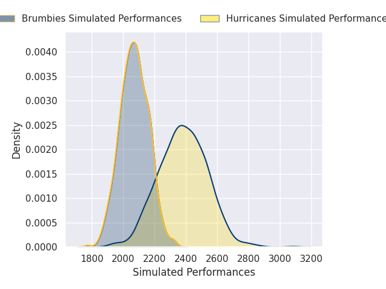
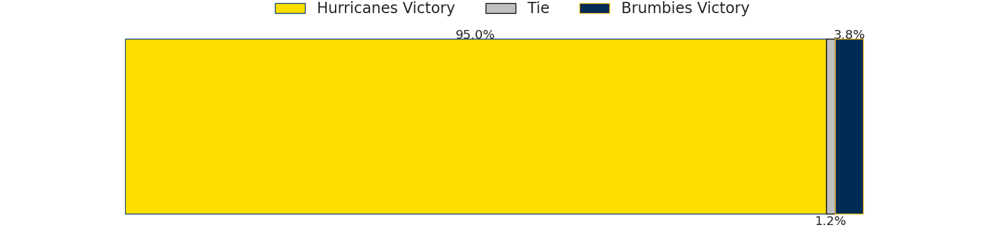
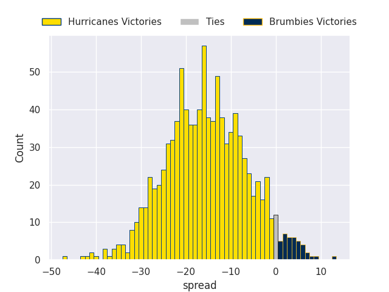

# Team Rankings

# Standings

## Current Standings

| Club                     |   Played |   Wins |   Point Differential |   Losing Bonus Points |   Try Bonus Points |   Competition Points |
|:-------------------------|---------:|-------:|---------------------:|----------------------:|-------------------:|---------------------:|
| Hurricanes               |       14 |     11 |                  264 |                     2 |                 11 |                   57 |
| Chiefs                   |       14 |     11 |                  190 |                     1 |                 10 |                   55 |
| Crusaders                |       14 |      8 |                  100 |                     4 |                 12 |                   48 |
| Blues                    |       14 |      8 |                   44 |                     2 |                 11 |                   45 |
| Brumbies                 |       14 |      7 |                   29 |                     4 |                  9 |                   41 |
| Queensland Reds          |       14 |      8 |                  -22 |                     2 |                  7 |                   41 |
| Western Force            |       14 |      7 |                  -25 |                     1 |                  7 |                   36 |
| New South Wales Waratahs |       14 |      5 |                  -49 |                     4 |                  5 |                   29 |
| Highlanders              |       14 |      5 |                  -97 |                     3 |                  6 |                   29 |
| Fijian Drua              |       14 |      5 |                 -143 |                     1 |                  8 |                   29 |
| Moana Pasifika           |       14 |      2 |                 -291 |                     1 |                  2 |                   11 |

## Projected Remaining Table

| Club            |   To Play |   Projected Wins |   Projected Differential |   Projected Losing Bonus Points | Projected Try Bonus Points   |   Projected Competition Points |
|:----------------|----------:|-----------------:|-------------------------:|--------------------------------:|:-----------------------------|-------------------------------:|
| Chiefs          |         1 |            0.953 |                   15.299 |                           0.036 |                              |                          3.868 |
| Hurricanes      |         1 |            0.95  |                   15.507 |                           0.035 |                              |                          3.859 |
| Crusaders       |         1 |            0.878 |                   10.642 |                           0.081 |                              |                          3.629 |
| Blues           |         1 |            0.104 |                  -10.642 |                           0.236 |                              |                          0.688 |
| Brumbies        |         1 |            0.038 |                  -15.507 |                           0.137 |                              |                          0.313 |
| Queensland Reds |         1 |            0.037 |                  -15.299 |                           0.139 |                              |                          0.307 |

## Projected Total Table

| Club                     |   Played |   Wins |   Point Differential |   Losing Bonus Points |   Try Bonus Points |   Competition Points |
|:-------------------------|---------:|-------:|---------------------:|----------------------:|-------------------:|---------------------:|
| Hurricanes               |       15 | 11.95  |              279.507 |                 2.035 |                 11 |               60.859 |
| Chiefs                   |       15 | 11.953 |              205.299 |                 1.036 |                 10 |               58.868 |
| Crusaders                |       15 |  8.878 |              110.642 |                 4.081 |                 12 |               51.629 |
| Blues                    |       15 |  8.104 |               33.358 |                 2.236 |                 11 |               45.688 |
| Brumbies                 |       15 |  7.038 |               13.493 |                 4.137 |                  9 |               41.313 |
| Queensland Reds          |       15 |  8.037 |              -37.299 |                 2.139 |                  7 |               41.307 |
| Western Force            |       14 |  7     |              -25     |                 1     |                  7 |               36     |
| New South Wales Waratahs |       14 |  5     |              -49     |                 4     |                  5 |               29     |
| Highlanders              |       14 |  5     |              -97     |                 3     |                  6 |               29     |
| Fijian Drua              |       14 |  5     |             -143     |                 1     |                  8 |               29     |
| Moana Pasifika           |       14 |  2     |             -291     |                 1     |                  2 |               11     |

# Completed Match Review

| Model | Percent Correct Predictions | Spread Error |
| ------ | ------ | ------ |
| Club Level | 75.0% | 12.6 |
| Player Level: Lineup | nan% | nan |
| Player Level: Minutes | nan% | nan |

# Future Predictions

## Week 15

### Hurricanes V Brumbies on 2026/06/05

Average Margin: Hurricanes by 15.5

### Chiefs V Queensland Reds on 2026/06/06

Average Margin: Chiefs by 15.3

### Crusaders V Blues on 2026/06/06

Average Margin: Crusaders by 10.6

