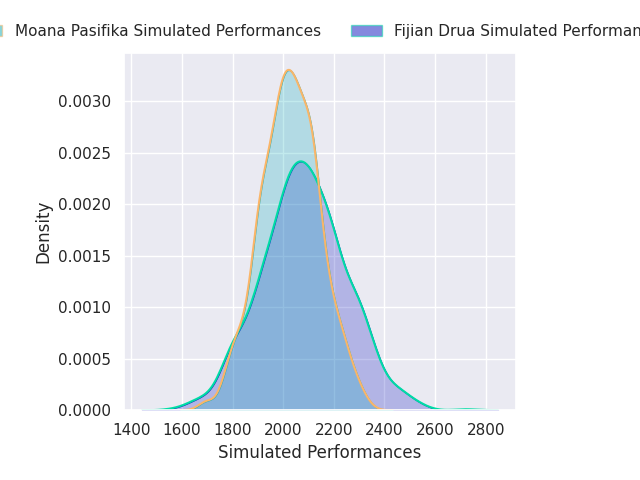
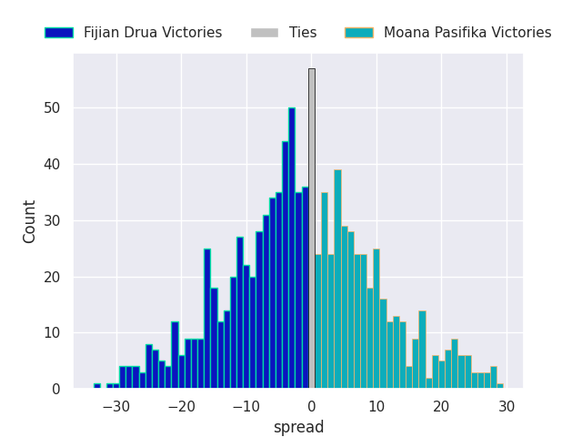
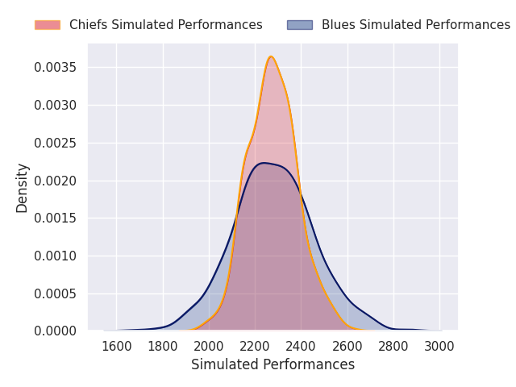
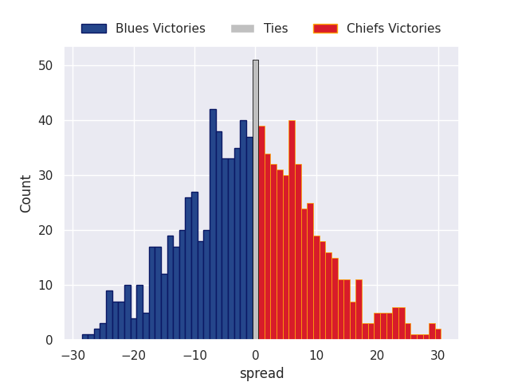
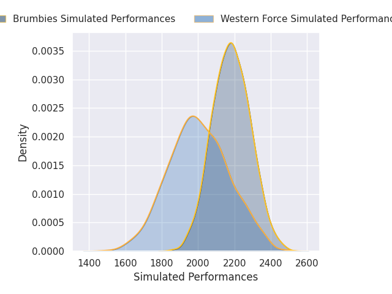
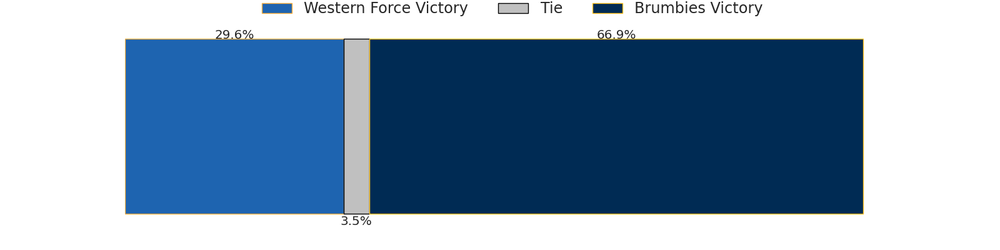
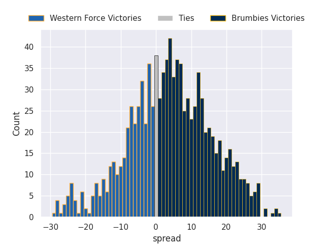

# Team Rankings

# Standings

## Current Standings

| Club                     |   Played |   Wins |   Point Differential |   Losing Bonus Points |   Try Bonus Points |   Competition Points |
|:-------------------------|---------:|-------:|---------------------:|----------------------:|-------------------:|---------------------:|
| New South Wales Waratahs |        1 |      1 |                   24 |                     0 |                  1 |                    5 |
| Highlanders              |        1 |      1 |                    2 |                     0 |                    |                    4 |
| Crusaders                |        1 |      0 |                   -2 |                     1 |                    |                    1 |
| Queensland Reds          |        1 |      0 |                  -24 |                     0 |                    |                    0 |

## Projected Remaining Table

| Club                     |   To Play |   Projected Wins |   Projected Differential |   Projected Losing Bonus Points | Projected Try Bonus Points   |   Projected Competition Points |
|:-------------------------|----------:|-----------------:|-------------------------:|--------------------------------:|:-----------------------------|-------------------------------:|
| Chiefs                   |        14 |            8.239 |                   49.94  |                           2.709 |                              |                         36.919 |
| Brumbies                 |        14 |            7.482 |                   25.563 |                           2.904 |                              |                         34.122 |
| Blues                    |        14 |            7.378 |                   24.413 |                           2.98  |                              |                         33.696 |
| Hurricanes               |        14 |            7.363 |                   20.497 |                           2.931 |                              |                         33.607 |
| Crusaders                |        13 |            7.161 |                   29.002 |                           2.661 |                              |                         32.497 |
| Moana Pasifika           |        14 |            6.161 |                  -18.605 |                           3.092 |                              |                         28.998 |
| Fijian Drua              |        14 |            5.676 |                  -37.196 |                           3.099 |                              |                         26.921 |
| New South Wales Waratahs |        13 |            5.683 |                  -15.961 |                           2.992 |                              |                         26.802 |
| Queensland Reds          |        13 |            5.664 |                  -17.369 |                           3.009 |                              |                         26.777 |
| Highlanders              |        13 |            5.612 |                  -18.064 |                           2.948 |                              |                         26.57  |
| Western Force            |        14 |            5.303 |                  -42.22  |                           3.291 |                              |                         25.707 |

## Projected Total Table

| Club                     |   Played |   Wins |   Point Differential |   Losing Bonus Points |   Try Bonus Points |   Competition Points |
|:-------------------------|---------:|-------:|---------------------:|----------------------:|-------------------:|---------------------:|
| Chiefs                   |       14 |  8.239 |               49.94  |                 2.709 |                    |               36.919 |
| Brumbies                 |       14 |  7.482 |               25.563 |                 2.904 |                    |               34.122 |
| Blues                    |       14 |  7.378 |               24.413 |                 2.98  |                    |               33.696 |
| Hurricanes               |       14 |  7.363 |               20.497 |                 2.931 |                    |               33.607 |
| Crusaders                |       14 |  7.161 |               27.002 |                 3.661 |                    |               33.497 |
| New South Wales Waratahs |       14 |  6.683 |                8.039 |                 2.992 |                  1 |               31.802 |
| Highlanders              |       14 |  6.612 |              -16.064 |                 2.948 |                    |               30.57  |
| Moana Pasifika           |       14 |  6.161 |              -18.605 |                 3.092 |                    |               28.998 |
| Fijian Drua              |       14 |  5.676 |              -37.196 |                 3.099 |                    |               26.921 |
| Queensland Reds          |       14 |  5.664 |              -41.369 |                 3.009 |                    |               26.777 |
| Western Force            |       14 |  5.303 |              -42.22  |                 3.291 |                    |               25.707 |

# Completed Match Review

| Model | Percent Correct Predictions | Spread Error |
| ------ | ------ | ------ |
| Club Level | 55.8% | 10.6 |
| Player Level: Lineup | nan% | nan |
| Player Level: Minutes | nan% | nan |

# Future Predictions

## Week 2

### Fijian Drua V Moana Pasifika on 2026/02/13

Average Margin: Fijian Drua by 1.4

### Blues V Chiefs on 2026/02/14

Average Margin: Blues by 0.4

### Western Force V Brumbies on 2026/02/14

Average Margin: Brumbies by 4.4

## Week 3

### Hurricanes V Moana Pasifika on 2026/02/20

Average Margin: Hurricanes by 6.1

### New South Wales Waratahs V Fijian Drua on 2026/02/20

Average Margin: New South Wales Waratahs by 5.7

### Western Force V Blues on 2026/02/21

Average Margin: Blues by 5.9

### Crusaders V Brumbies on 2026/02/21

Average Margin: Crusaders by 2.9

### Highlanders V Chiefs on 2026/02/21

Average Margin: Chiefs by 4.0

## Week 4

### Moana Pasifika V Western Force on 2026/02/27

Average Margin: Moana Pasifika by 5.0

### Queensland Reds V Highlanders on 2026/02/27

Average Margin: Queensland Reds by 1.8

### Fijian Drua V Hurricanes on 2026/02/28

Average Margin: Hurricanes by 3.5

### Chiefs V Crusaders on 2026/02/28

Average Margin: Chiefs by 4.1

### Brumbies V Blues on 2026/02/28

Average Margin: Brumbies by 1.7

## Week 5

### New South Wales Waratahs V Hurricanes on 2026/03/06

Average Margin: Hurricanes by 1.2

### Chiefs V Moana Pasifika on 2026/03/06

Average Margin: Chiefs by 7.9

### Blues V Crusaders on 2026/03/07

Average Margin: Blues by 1.9

### Brumbies V Queensland Reds on 2026/03/07

Average Margin: Brumbies by 6.5

### Highlanders V Western Force on 2026/03/07

Average Margin: Highlanders by 3.9

## Week 6

### Hurricanes V Western Force on 2026/03/13

Average Margin: Hurricanes by 6.5

### Crusaders V Highlanders on 2026/03/14

Average Margin: Crusaders by 6.0

### Queensland Reds V New South Wales Waratahs on 2026/03/14

Average Margin: Queensland Reds by 1.8

### Fijian Drua V Brumbies on 2026/03/14

Average Margin: Brumbies by 1.8

### Blues V Moana Pasifika on 2026/03/15

Average Margin: Blues by 7.2

## Week 7

### Brumbies V Chiefs on 2026/03/20

Average Margin: Brumbies by 0.5

### Highlanders V Hurricanes on 2026/03/20

Average Margin: Hurricanes by 0.3

### Fijian Drua V Queensland Reds on 2026/03/21

Average Margin: Fijian Drua by 2.6

### Moana Pasifika V Crusaders on 2026/03/21

Average Margin: Crusaders by 1.8

### New South Wales Waratahs V Blues on 2026/03/21

Average Margin: Blues by 1.7

## Week 8

### Moana Pasifika V Highlanders on 2026/03/27

Average Margin: Moana Pasifika by 1.6

### Brumbies V New South Wales Waratahs on 2026/03/27

Average Margin: Brumbies by 6.5

### Blues V Fijian Drua on 2026/03/28

Average Margin: Blues by 7.4

### Western Force V Chiefs on 2026/03/28

Average Margin: Chiefs by 6.1

### Hurricanes V Queensland Reds on 2026/03/28

Average Margin: Hurricanes by 6.3

## Week 9

### Crusaders V Fijian Drua on 2026/04/03

Average Margin: Crusaders by 8.3

### Chiefs V New South Wales Waratahs on 2026/04/03

Average Margin: Chiefs by 6.3

### Queensland Reds V Western Force on 2026/04/04

Average Margin: Queensland Reds by 3.2

## Week 10

### Highlanders V Brumbies on 2026/04/10

Average Margin: Highlanders by 1.2

### Hurricanes V Blues on 2026/04/11

Average Margin: Hurricanes by 1.6

### Queensland Reds V Crusaders on 2026/04/11

Average Margin: Crusaders by 2.2

### Fijian Drua V Western Force on 2026/04/11

Average Margin: Fijian Drua by 2.1

### Moana Pasifika V Chiefs on 2026/04/11

Average Margin: Chiefs by 1.1

## Week 11

### New South Wales Waratahs V Moana Pasifika on 2026/04/17

Average Margin: New South Wales Waratahs by 2.3

### Blues V Highlanders on 2026/04/17

Average Margin: Blues by 4.1

### Brumbies V Fijian Drua on 2026/04/18

Average Margin: Brumbies by 6.2

### Chiefs V Hurricanes on 2026/04/18

Average Margin: Chiefs by 5.1

### Western Force V Crusaders on 2026/04/18

Average Margin: Crusaders by 2.3

## Week 12

### Crusaders V New South Wales Waratahs on 2026/04/24

Average Margin: Crusaders by 5.7

### Hurricanes V Brumbies on 2026/04/25

Average Margin: Hurricanes by 2.7

### Blues V Queensland Reds on 2026/04/25

Average Margin: Blues by 4.9

### Chiefs V Fijian Drua on 2026/04/26

Average Margin: Chiefs by 9.1

### Highlanders V Moana Pasifika on 2026/04/26

Average Margin: Highlanders by 2.7

## Week 13

### New South Wales Waratahs V Western Force on 2026/05/01

Average Margin: New South Wales Waratahs by 3.5

### Hurricanes V Crusaders on 2026/05/01

Average Margin: Hurricanes by 2.0

### Fijian Drua V Highlanders on 2026/05/02

Average Margin: Fijian Drua by 1.9

### Moana Pasifika V Blues on 2026/05/02

Average Margin: Moana Pasifika by 2.3

### Queensland Reds V Brumbies on 2026/05/02

Average Margin: Queensland Reds by 0.8

## Week 14

### Crusaders V Blues on 2026/05/08

Average Margin: Crusaders by 2.5

### Queensland Reds V Chiefs on 2026/05/08

Average Margin: Chiefs by 0.9

### Highlanders V New South Wales Waratahs on 2026/05/09

Average Margin: Highlanders by 2.0

### Brumbies V Western Force on 2026/05/09

Average Margin: Brumbies by 4.1

### Moana Pasifika V Hurricanes on 2026/05/09

Average Margin: Moana Pasifika by 2.1

## Week 15

### Chiefs V Highlanders on 2026/05/15

Average Margin: Chiefs by 5.0

### Western Force V Queensland Reds on 2026/05/16

Average Margin: Western Force by 1.1

### Blues V Hurricanes on 2026/05/16

Average Margin: Blues by 2.1

### Fijian Drua V New South Wales Waratahs on 2026/05/16

Average Margin: Fijian Drua by 2.8

## Week 16

### New South Wales Waratahs V Brumbies on 2026/05/22

Average Margin: New South Wales Waratahs by 1.6

### Crusaders V Chiefs on 2026/05/22

Average Margin: Crusaders by 1.8

### Hurricanes V Highlanders on 2026/05/23

Average Margin: Hurricanes by 3.2

### Western Force V Fijian Drua on 2026/05/23

Average Margin: Western Force by 2.7

### Moana Pasifika V Queensland Reds on 2026/05/23

Average Margin: Moana Pasifika by 3.7

## Week 17

### Queensland Reds V Fijian Drua on 2026/05/29

Average Margin: Queensland Reds by 3.3

### Crusaders V Hurricanes on 2026/05/29

Average Margin: Crusaders by 3.4

### Chiefs V Blues on 2026/05/30

Average Margin: Chiefs by 3.1

### Brumbies V Moana Pasifika on 2026/05/30

Average Margin: Brumbies by 3.0

### Western Force V New South Wales Waratahs on 2026/05/30

Average Margin: Western Force by 1.0

