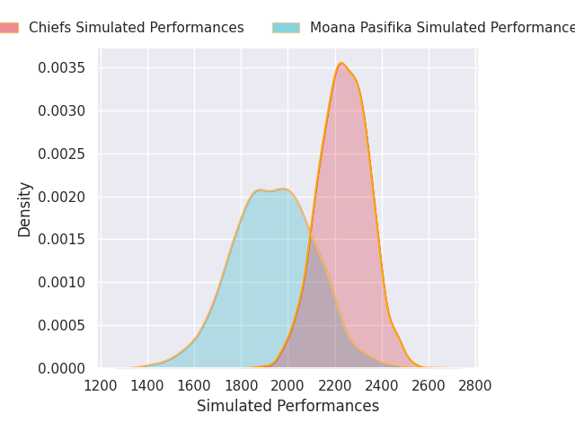
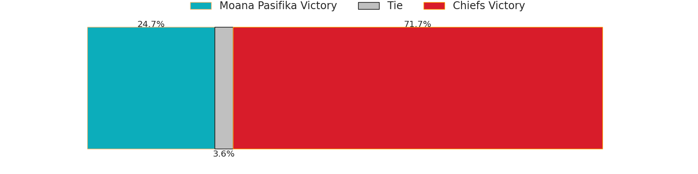
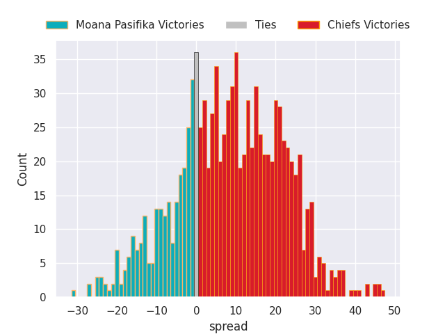

# Team Rankings

# Standings

## Current Standings

| Club                     |   Played |   Wins |   Point Differential |   Losing Bonus Points |   Try Bonus Points |   Competition Points |
|:-------------------------|---------:|-------:|---------------------:|----------------------:|-------------------:|---------------------:|
| Blues                    |        7 |      5 |                   95 |                     2 |                  6 |                   28 |
| Hurricanes               |        6 |      5 |                  166 |                     1 |                  5 |                   26 |
| Brumbies                 |        7 |      4 |                   50 |                     2 |                  7 |                   25 |
| Chiefs                   |        6 |      4 |                   31 |                     0 |                  3 |                   19 |
| Queensland Reds          |        6 |      4 |                  -18 |                     0 |                  3 |                   19 |
| Crusaders                |        6 |      3 |                    6 |                     1 |                  4 |                   17 |
| Highlanders              |        7 |      3 |                  -44 |                     1 |                  2 |                   15 |
| New South Wales Waratahs |        6 |      3 |                  -15 |                     0 |                  2 |                   14 |
| Fijian Drua              |        6 |      2 |                  -57 |                     0 |                  2 |                   10 |
| Western Force            |        6 |      1 |                  -52 |                     0 |                  3 |                    7 |
| Moana Pasifika           |        7 |      1 |                 -162 |                     0 |                  2 |                    6 |

## Projected Remaining Table

| Club                     |   To Play |   Projected Wins |   Projected Differential |   Projected Losing Bonus Points | Projected Try Bonus Points   |   Projected Competition Points |
|:-------------------------|----------:|-----------------:|-------------------------:|--------------------------------:|:-----------------------------|-------------------------------:|
| Hurricanes               |         8 |            4.742 |                   28.851 |                           1.538 |                              |                         21.196 |
| Chiefs                   |         8 |            4.695 |                   32.804 |                           1.546 |                              |                         21.054 |
| Queensland Reds          |         8 |            4.24  |                   11.389 |                           1.67  |                              |                         19.332 |
| Crusaders                |         8 |            4.235 |                   13.434 |                           1.644 |                              |                         19.262 |
| Blues                    |         7 |            3.941 |                   19.431 |                           1.403 |                              |                         17.809 |
| Brumbies                 |         7 |            3.734 |                   13.915 |                           1.37  |                              |                         16.93  |
| New South Wales Waratahs |         8 |            3.451 |                  -12.296 |                           1.777 |                              |                         16.307 |
| Western Force            |         8 |            3.252 |                  -16.529 |                           1.941 |                              |                         15.595 |
| Fijian Drua              |         8 |            3.068 |                  -29.075 |                           1.701 |                              |                         14.579 |
| Highlanders              |         7 |            2.914 |                  -14.556 |                           1.483 |                              |                         13.793 |
| Moana Pasifika           |         7 |            1.933 |                  -47.368 |                           1.467 |                              |                          9.683 |

## Projected Total Table

| Club                     |   Played |   Wins |   Point Differential |   Losing Bonus Points |   Try Bonus Points |   Competition Points |
|:-------------------------|---------:|-------:|---------------------:|----------------------:|-------------------:|---------------------:|
| Hurricanes               |       14 |  9.742 |              194.851 |                 2.538 |                  5 |               47.196 |
| Blues                    |       14 |  8.941 |              114.431 |                 3.403 |                  6 |               45.809 |
| Brumbies                 |       14 |  7.734 |               63.915 |                 3.37  |                  7 |               41.93  |
| Chiefs                   |       14 |  8.695 |               63.804 |                 1.546 |                  3 |               40.054 |
| Queensland Reds          |       14 |  8.24  |               -6.611 |                 1.67  |                  3 |               38.332 |
| Crusaders                |       14 |  7.235 |               19.434 |                 2.644 |                  4 |               36.262 |
| New South Wales Waratahs |       14 |  6.451 |              -27.296 |                 1.777 |                  2 |               30.307 |
| Highlanders              |       14 |  5.914 |              -58.556 |                 2.483 |                  2 |               28.793 |
| Fijian Drua              |       14 |  5.068 |              -86.075 |                 1.701 |                  2 |               24.579 |
| Western Force            |       14 |  4.252 |              -68.529 |                 1.941 |                  3 |               22.595 |
| Moana Pasifika           |       14 |  2.933 |             -209.368 |                 1.467 |                  2 |               15.683 |

# Completed Match Review

| Model | Percent Correct Predictions | Spread Error |
| ------ | ------ | ------ |
| Club Level | 58.4% | 12.6 |
| Player Level: Lineup | nan% | nan |
| Player Level: Minutes | nan% | nan |

# Future Predictions

## Week 8

### Chiefs V New South Wales Waratahs on 2026/04/03

Average Margin: Chiefs by 7.9

### Crusaders V Fijian Drua on 2026/04/03

Average Margin: Crusaders by 8.7

### Queensland Reds V Western Force on 2026/04/04

Average Margin: Queensland Reds by 6.3

## Week 9

### Moana Pasifika V Chiefs on 2026/04/10

Average Margin: Chiefs by 8.6

### Highlanders V Brumbies on 2026/04/10

Average Margin: Highlanders by 0.2

### Queensland Reds V Crusaders on 2026/04/11

Average Margin: Crusaders by 0.4

### Fijian Drua V Western Force on 2026/04/11

Average Margin: Fijian Drua by 2.0

### Hurricanes V Blues on 2026/04/11

Average Margin: Hurricanes by 2.7

## Week 10

### Blues V Highlanders on 2026/04/17

Average Margin: Blues by 8.7

### New South Wales Waratahs V Moana Pasifika on 2026/04/17

Average Margin: New South Wales Waratahs by 6.9

### Brumbies V Fijian Drua on 2026/04/18

Average Margin: Brumbies by 8.2

### Chiefs V Hurricanes on 2026/04/18

Average Margin: Chiefs by 0.6

### Western Force V Crusaders on 2026/04/18

Average Margin: Crusaders by 3.4

## Week 11

### Crusaders V New South Wales Waratahs on 2026/04/24

Average Margin: Crusaders by 6.8

### Hurricanes V Brumbies on 2026/04/25

Average Margin: Hurricanes by 6.5

### Blues V Queensland Reds on 2026/04/25

Average Margin: Blues by 6.2

### Highlanders V Moana Pasifika on 2026/04/25

Average Margin: Highlanders by 7.1

### Chiefs V Fijian Drua on 2026/04/26

Average Margin: Chiefs by 10.7

## Week 12

### New South Wales Waratahs V Western Force on 2026/05/01

Average Margin: New South Wales Waratahs by 3.3

### Hurricanes V Crusaders on 2026/05/01

Average Margin: Hurricanes by 5.5

### Moana Pasifika V Blues on 2026/05/02

Average Margin: Blues by 6.3

### Queensland Reds V Brumbies on 2026/05/02

Average Margin: Queensland Reds by 1.7

### Fijian Drua V Highlanders on 2026/05/02

Average Margin: Fijian Drua by 2.3

## Week 13

### Crusaders V Blues on 2026/05/08

Average Margin: Crusaders by 0.1

### Queensland Reds V Chiefs on 2026/05/08

Average Margin: Queensland Reds by 0.2

### Moana Pasifika V Hurricanes on 2026/05/09

Average Margin: Hurricanes by 6.8

### Highlanders V New South Wales Waratahs on 2026/05/09

Average Margin: Highlanders by 2.9

### Brumbies V Western Force on 2026/05/09

Average Margin: Brumbies by 5.1

## Week 14

### Chiefs V Highlanders on 2026/05/15

Average Margin: Chiefs by 5.4

### Fijian Drua V New South Wales Waratahs on 2026/05/16

Average Margin: Fijian Drua by 2.8

### Blues V Hurricanes on 2026/05/16

Average Margin: Blues by 1.4

### Western Force V Queensland Reds on 2026/05/16

Average Margin: Queensland Reds by 0.7

## Week 15

### New South Wales Waratahs V Brumbies on 2026/05/22

Average Margin: Brumbies by 0.4

### Crusaders V Chiefs on 2026/05/22

Average Margin: Crusaders by 0.7

### Western Force V Fijian Drua on 2026/05/23

Average Margin: Western Force by 2.6

### Hurricanes V Highlanders on 2026/05/23

Average Margin: Hurricanes by 8.4

### Moana Pasifika V Queensland Reds on 2026/05/23

Average Margin: Queensland Reds by 3.0

## Week 16

### Crusaders V Hurricanes on 2026/05/29

Average Margin: Hurricanes by 1.1

### Queensland Reds V Fijian Drua on 2026/05/29

Average Margin: Queensland Reds by 5.9

### Chiefs V Blues on 2026/05/30

Average Margin: Chiefs by 0.4

### Western Force V New South Wales Waratahs on 2026/05/30

Average Margin: Western Force by 1.7

### Brumbies V Moana Pasifika on 2026/05/30

Average Margin: Brumbies by 8.5

