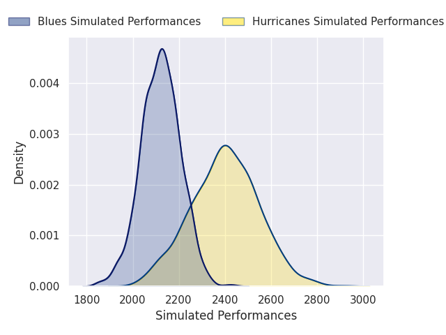
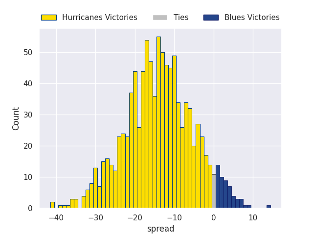

# Team Rankings

# Standings

## Current Standings

| Club                     |   Played |   Wins |   Point Differential |   Losing Bonus Points |   Try Bonus Points |   Competition Points |
|:-------------------------|---------:|-------:|---------------------:|----------------------:|-------------------:|---------------------:|
| Chiefs                   |       16 |     13 |                  249 |                     1 |                 12 |                   65 |
| Hurricanes               |       15 |     12 |                  318 |                     2 |                 12 |                   62 |
| Crusaders                |       16 |      9 |                   84 |                     4 |                 13 |                   53 |
| Blues                    |       15 |      8 |                   23 |                     2 |                 12 |                   46 |
| Brumbies                 |       15 |      7 |                  -25 |                     4 |                  9 |                   41 |
| Queensland Reds          |       15 |      8 |                  -44 |                     2 |                  7 |                   41 |
| Western Force            |       14 |      7 |                  -25 |                     1 |                  7 |                   36 |
| New South Wales Waratahs |       14 |      5 |                  -49 |                     4 |                  5 |                   29 |
| Highlanders              |       14 |      5 |                  -97 |                     3 |                  6 |                   29 |
| Fijian Drua              |       14 |      5 |                 -143 |                     1 |                  8 |                   29 |
| Moana Pasifika           |       14 |      2 |                 -291 |                     1 |                  2 |                   11 |

## Projected Remaining Table

| Club       |   To Play |   Projected Wins |   Projected Differential |   Projected Losing Bonus Points | Projected Try Bonus Points   |   Projected Competition Points |
|:-----------|----------:|-----------------:|-------------------------:|--------------------------------:|:-----------------------------|-------------------------------:|
| Hurricanes |         1 |            0.936 |                     13.9 |                           0.05  |                              |                          3.816 |
| Blues      |         1 |            0.053 |                    -13.9 |                           0.167 |                              |                          0.401 |

## Projected Total Table

| Club                     |   Played |   Wins |   Point Differential |   Losing Bonus Points |   Try Bonus Points |   Competition Points |
|:-------------------------|---------:|-------:|---------------------:|----------------------:|-------------------:|---------------------:|
| Hurricanes               |       16 | 12.936 |                331.9 |                 2.05  |                 12 |               65.816 |
| Chiefs                   |       16 | 13     |                249   |                 1     |                 12 |               65     |
| Crusaders                |       16 |  9     |                 84   |                 4     |                 13 |               53     |
| Blues                    |       16 |  8.053 |                  9.1 |                 2.167 |                 12 |               46.401 |
| Brumbies                 |       15 |  7     |                -25   |                 4     |                  9 |               41     |
| Queensland Reds          |       15 |  8     |                -44   |                 2     |                  7 |               41     |
| Western Force            |       14 |  7     |                -25   |                 1     |                  7 |               36     |
| New South Wales Waratahs |       14 |  5     |                -49   |                 4     |                  5 |               29     |
| Highlanders              |       14 |  5     |                -97   |                 3     |                  6 |               29     |
| Fijian Drua              |       14 |  5     |               -143   |                 1     |                  8 |               29     |
| Moana Pasifika           |       14 |  2     |               -291   |                 1     |                  2 |               11     |

# Completed Match Review

| Model | Percent Correct Predictions | Spread Error |
| ------ | ------ | ------ |
| Club Level | 75.6% | 13.2 |
| Player Level: Lineup | nan% | nan |
| Player Level: Minutes | nan% | nan |

# Future Predictions

## Week 17

### Hurricanes V Blues on 2026/06/13

Average Margin: Hurricanes by 13.9

