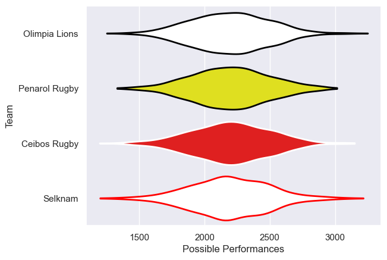

---  
title: "Superliga Americana de Rugby 2020 Status"  
date: 2025-07-28 6:00:00 -0500  
categories: model review projection  
layout: article  
aside:  
    toc: true  
---
# Current Team Rankings

# Standings

## Current Standings

| Club          |   Played |   Wins |   Point Differential |   Losing Bonus Points | Try Bonus Points   |   Competition Points |
|:--------------|---------:|-------:|---------------------:|----------------------:|:-------------------|---------------------:|
| Ceibos Rugby  |        2 |      2 |                   56 |                     0 |                    |                    8 |
| Selknam       |        2 |      1 |                  -14 |                     0 |                    |                    4 |
| Penarol Rugby |        1 |      0 |                   -2 |                     1 |                    |                    1 |
| Olimpia Lions |        1 |      0 |                  -40 |                     0 |                    |                    0 |

# Completed Match Review

| Model | Percent Correct Predictions | Spread Error |
| ------ | ------ | ------ |
| Club Level | 33.3% | 21.8 |
| Player Level: Lineup | nan% | nan |
| Player Level: Minutes | nan% | nan |

