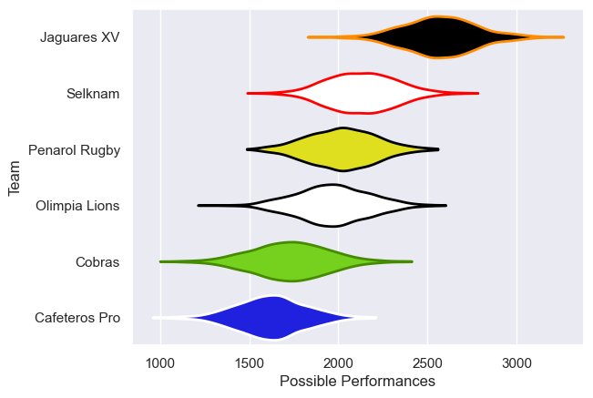

---  
title: "Superliga Americana de Rugby 2021 Status"  
date: 2025-07-28 6:00:00 -0500  
categories: model review projection  
layout: article  
aside:  
    toc: true  
---
# Current Team Rankings

# Standings

## Current Standings

| Club          |   Played |   Wins |   Point Differential |   Losing Bonus Points |   Try Bonus Points |   Competition Points |
|:--------------|---------:|-------:|---------------------:|----------------------:|-------------------:|---------------------:|
| Jaguares XV   |       11 |     11 |                  434 |                     0 |                  1 |                   45 |
| Penarol Rugby |       12 |      8 |                   64 |                     0 |                    |                   32 |
| Selknam       |       11 |      5 |                    5 |                     4 |                    |                   24 |
| Olimpia Lions |       11 |      5 |                  -83 |                     0 |                    |                   20 |
| Cobras        |        9 |      3 |                 -158 |                     1 |                    |                   13 |
| Cafeteros Pro |       10 |      0 |                 -262 |                     2 |                    |                    2 |

# Completed Match Review

| Model | Percent Correct Predictions | Spread Error |
| ------ | ------ | ------ |
| Club Level | 62.5% | 25.1 |
| Player Level: Lineup | nan% | nan |
| Player Level: Minutes | nan% | nan |

