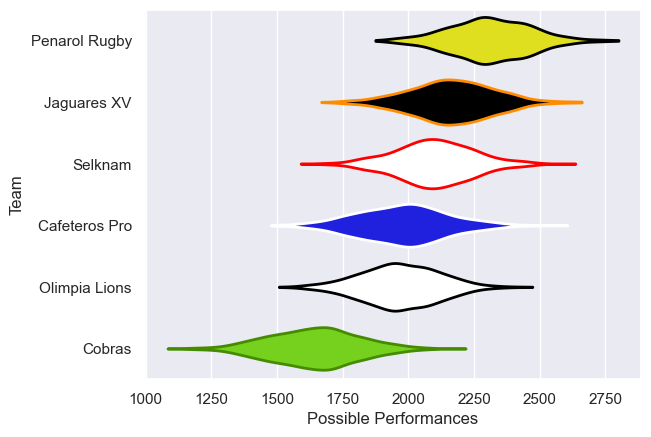

---  
title: "Superliga Americana de Rugby 2022 Status"  
date: 2025-07-28 6:00:00 -0500  
categories: model review projection  
layout: article  
aside:  
    toc: true  
---
# Current Team Rankings

# Standings

## Current Standings

| Club          |   Played |   Wins |   Point Differential |   Losing Bonus Points |   Try Bonus Points |   Competition Points |
|:--------------|---------:|-------:|---------------------:|----------------------:|-------------------:|---------------------:|
| Penarol Rugby |       12 |     10 |                  217 |                     2 |                  7 |                   49 |
| Selknam       |       12 |      9 |                  144 |                     1 |                  4 |                   41 |
| Jaguares XV   |       11 |      6 |                  106 |                     2 |                  5 |                   31 |
| Cafeteros Pro |       11 |      4 |                 -148 |                     1 |                  2 |                   19 |
| Olimpia Lions |       10 |      3 |                  -84 |                     2 |                  2 |                   16 |
| Cobras        |       10 |      1 |                 -235 |                     1 |                  1 |                    6 |

# Completed Match Review

| Model | Percent Correct Predictions | Spread Error |
| ------ | ------ | ------ |
| Club Level | 72.7% | 16.4 |
| Player Level: Lineup | nan% | nan |
| Player Level: Minutes | nan% | nan |

