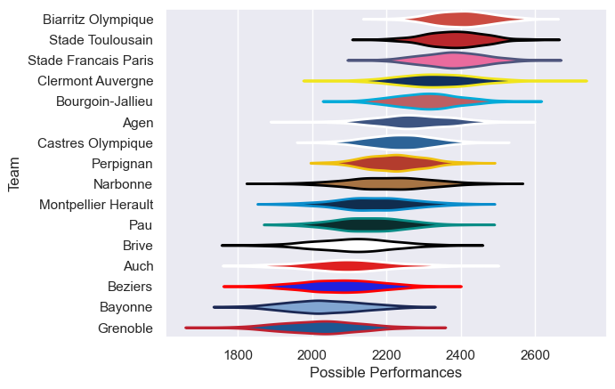

---  
title: "Top 14 04/05"  
date: 2025-07-29 6:00:00 -0500  
categories: model review projection  
layout: article  
aside:  
    toc: true  
---
# Current Team Rankings

# Standings

## Current Standings

| Club                 |   Played |   Wins |   Point Differential |   Losing Bonus Points | Try Bonus Points   |   Competition Points |
|:---------------------|---------:|-------:|---------------------:|----------------------:|:-------------------|---------------------:|
| Stade Francais Paris |       30 |     21 |                  245 |                     2 |                    |                   90 |
| Bourgoin-Jallieu     |       30 |     20 |                  207 |                     2 |                    |                   86 |
| Biarritz Olympique   |       30 |     20 |                  350 |                     4 |                    |                   84 |
| Stade Toulousain     |       30 |     19 |                  301 |                     6 |                    |                   82 |
| Perpignan            |       30 |     18 |                  105 |                     3 |                    |                   77 |
| Castres Olympique    |       30 |     17 |                   26 |                     3 |                    |                   77 |
| Agen                 |       30 |     16 |                  106 |                     5 |                    |                   71 |
| Clermont Auvergne    |       30 |     16 |                   98 |                     2 |                    |                   70 |
| Brive                |       30 |     14 |                  -77 |                     3 |                    |                   61 |
| Narbonne             |       30 |     13 |                 -167 |                     5 |                    |                   61 |
| Bayonne              |       30 |     12 |                 -176 |                     2 |                    |                   56 |
| Montpellier Herault  |       30 |     12 |                 -137 |                     6 |                    |                   54 |
| Pau                  |       30 |     10 |                 -110 |                     7 |                    |                   51 |
| Auch                 |       30 |      7 |                 -233 |                     9 |                    |                   37 |
| Grenoble             |       30 |      7 |                 -262 |                     5 |                    |                   37 |
| Beziers              |       30 |      6 |                 -276 |                     5 |                    |                   35 |

# Completed Match Review

| Model | Percent Correct Predictions | Spread Error |
| ------ | ------ | ------ |
| Club Level | 71.2% | 11.2 |
| Player Level: Lineup | nan% | nan |
| Player Level: Minutes | nan% | nan |

