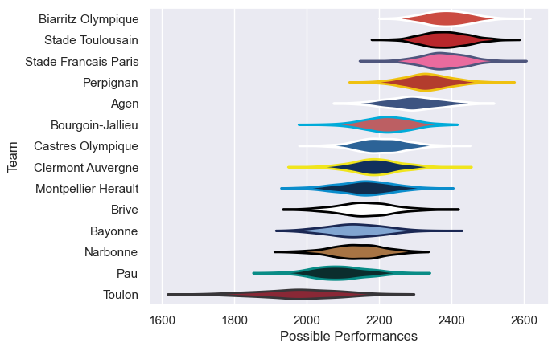

---  
title: "Top 14 05/06 Status"  
date: 2025-07-28 6:00:00 -0500  
categories: model review projection  
layout: article  
aside:  
    toc: true  
---
# Current Team Rankings

# Standings

## Current Standings

| Club                 |   Played |   Wins |   Point Differential |   Losing Bonus Points |   Try Bonus Points |   Competition Points |
|:---------------------|---------:|-------:|---------------------:|----------------------:|-------------------:|---------------------:|
| Biarritz Olympique   |       28 |     21 |                  374 |                     6 |                  1 |                   91 |
| Stade Toulousain     |       28 |     20 |                  262 |                     4 |                    |                   84 |
| Stade Francais Paris |       27 |     19 |                  193 |                     4 |                    |                   80 |
| Perpignan            |       27 |     18 |                  270 |                     4 |                    |                   76 |
| Agen                 |       26 |     15 |                  115 |                     3 |                    |                   63 |
| Castres Olympique    |       26 |     13 |                  126 |                     8 |                    |                   60 |
| Bourgoin-Jallieu     |       26 |     14 |                   75 |                     4 |                    |                   60 |
| Clermont Auvergne    |       26 |     14 |                    8 |                     2 |                    |                   58 |
| Brive                |       26 |     10 |                 -122 |                     7 |                    |                   49 |
| Narbonne             |       26 |     11 |                 -242 |                     2 |                    |                   46 |
| Montpellier Herault  |       26 |      9 |                  -85 |                     5 |                    |                   41 |
| Bayonne              |       26 |      8 |                 -155 |                     5 |                    |                   39 |
| Pau                  |       26 |      9 |                 -314 |                     3 |                    |                   39 |
| Toulon               |       26 |      3 |                 -505 |                     7 |                    |                   19 |

# Completed Match Review

| Model | Percent Correct Predictions | Spread Error |
| ------ | ------ | ------ |
| Club Level | 80.5% | 11.2 |
| Player Level: Lineup | nan% | nan |
| Player Level: Minutes | nan% | nan |

