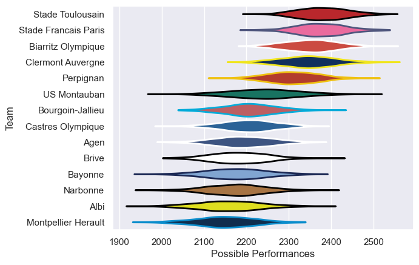

---  
title: "Top 14 06/07"  
date: 2025-07-29 6:00:00 -0500  
categories: model review projection  
layout: article  
aside:  
    toc: true  
---
# Current Team Rankings

# Standings

## Current Standings

| Club                 |   Played |   Wins |   Point Differential |   Losing Bonus Points | Try Bonus Points   |   Competition Points |
|:---------------------|---------:|-------:|---------------------:|----------------------:|:-------------------|---------------------:|
| Stade Francais Paris |       28 |     21 |                  251 |                     3 |                    |                   89 |
| Clermont Auvergne    |       28 |     19 |                  318 |                     5 |                    |                   81 |
| Stade Toulousain     |       27 |     18 |                  214 |                     4 |                    |                   80 |
| Biarritz Olympique   |       27 |     16 |                  152 |                     5 |                    |                   71 |
| Perpignan            |       26 |     16 |                   95 |                     4 |                    |                   70 |
| Bourgoin-Jallieu     |       26 |     11 |                   59 |                     7 |                    |                   53 |
| US Montauban         |       26 |     10 |                  -18 |                     9 |                    |                   53 |
| Brive                |       26 |     10 |                  -97 |                     7 |                    |                   49 |
| Albi                 |       26 |     11 |                 -179 |                     3 |                    |                   49 |
| Bayonne              |       26 |     11 |                 -195 |                     2 |                    |                   48 |
| Castres Olympique    |       26 |      9 |                  -45 |                     8 |                    |                   46 |
| Montpellier Herault  |       26 |      9 |                 -154 |                     7 |                    |                   45 |
| Agen                 |       26 |      9 |                 -138 |                     5 |                    |                   43 |
| Narbonne             |       26 |      8 |                 -263 |                     5 |                    |                   37 |

# Completed Match Review

| Model | Percent Correct Predictions | Spread Error |
| ------ | ------ | ------ |
| Club Level | 77.8% | 9.9 |
| Player Level: Lineup | nan% | nan |
| Player Level: Minutes | nan% | nan |

