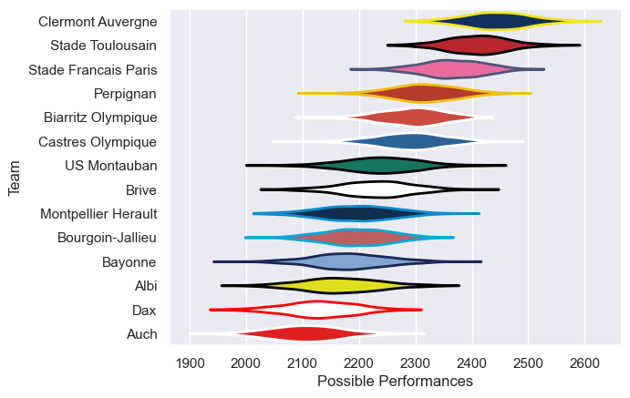

---  
title: "Top 14 07/08"  
date: 2025-07-29 6:00:00 -0500  
categories: model review projection  
layout: article  
aside:  
    toc: true  
---
# Current Team Rankings

# Standings

## Current Standings

| Club                 |   Played |   Wins |   Point Differential |   Losing Bonus Points | Try Bonus Points   |   Competition Points |
|:---------------------|---------:|-------:|---------------------:|----------------------:|:-------------------|---------------------:|
| Clermont Auvergne    |       28 |     21 |                  401 |                     6 |                    |                   90 |
| Stade Toulousain     |       28 |     21 |                  353 |                     4 |                    |                   88 |
| Stade Francais Paris |       27 |     18 |                  180 |                     3 |                    |                   75 |
| Perpignan            |       27 |     17 |                  125 |                     3 |                    |                   75 |
| Biarritz Olympique   |       26 |     13 |                   46 |                     9 |                    |                   63 |
| Castres Olympique    |       26 |     15 |                   40 |                     3 |                    |                   63 |
| US Montauban         |       26 |     13 |                  -26 |                     9 |                    |                   61 |
| Montpellier Herault  |       26 |     14 |                  -64 |                     4 |                    |                   60 |
| Bayonne              |       26 |     11 |                  -76 |                     6 |                    |                   52 |
| Bourgoin-Jallieu     |       26 |     10 |                  -73 |                     6 |                    |                   50 |
| Brive                |       26 |     10 |                  -89 |                     9 |                    |                   49 |
| Albi                 |       26 |      9 |                 -134 |                     8 |                    |                   46 |
| Dax                  |       26 |      6 |                 -331 |                     8 |                    |                   34 |
| Auch                 |       26 |      3 |                 -352 |                     7 |                    |                   19 |

# Completed Match Review

| Model | Percent Correct Predictions | Spread Error |
| ------ | ------ | ------ |
| Club Level | 76.2% | 10.4 |
| Player Level: Lineup | nan% | nan |
| Player Level: Minutes | nan% | nan |

