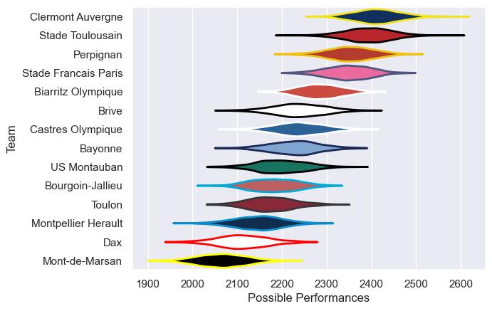

---  
title: "Top 14 08/09 Status"  
date: 2025-07-28 6:00:00 -0500  
categories: model review projection  
layout: article  
aside:  
    toc: true  
---
# Current Team Rankings

# Standings

## Current Standings

| Club                 |   Played |   Wins |   Point Differential |   Losing Bonus Points |   Try Bonus Points |   Competition Points |
|:---------------------|---------:|-------:|---------------------:|----------------------:|-------------------:|---------------------:|
| Perpignan            |       28 |     22 |                  254 |                     2 |                  7 |                   99 |
| Stade Toulousain     |       27 |     21 |                  260 |                     2 |                  5 |                   91 |
| Clermont Auvergne    |       28 |     17 |                  386 |                     8 |                  8 |                   86 |
| Stade Francais Paris |       27 |     16 |                  188 |                     6 |                  6 |                   78 |
| Biarritz Olympique   |       26 |     15 |                  118 |                     6 |                  4 |                   70 |
| Bayonne              |       26 |     14 |                   -6 |                     4 |                  3 |                   67 |
| Brive                |       26 |     13 |                    0 |                     4 |                  2 |                   66 |
| US Montauban         |       26 |     10 |                  -90 |                     5 |                  2 |                   51 |
| Toulon               |       26 |      9 |                  -79 |                     8 |                  2 |                   50 |
| Montpellier Herault  |       26 |     11 |                 -160 |                     3 |                  2 |                   49 |
| Bourgoin-Jallieu     |       26 |      8 |                 -148 |                     9 |                  1 |                   46 |
| Castres Olympique    |       26 |      7 |                  -64 |                     9 |                  1 |                   44 |
| Dax                  |       26 |      7 |                 -254 |                     7 |                    |                   37 |
| Mont-de-Marsan       |       26 |      5 |                 -405 |                     7 |                    |                   29 |

# Completed Match Review

| Model | Percent Correct Predictions | Spread Error |
| ------ | ------ | ------ |
| Club Level | 69.2% | 10.2 |
| Player Level: Lineup | nan% | nan |
| Player Level: Minutes | nan% | nan |

