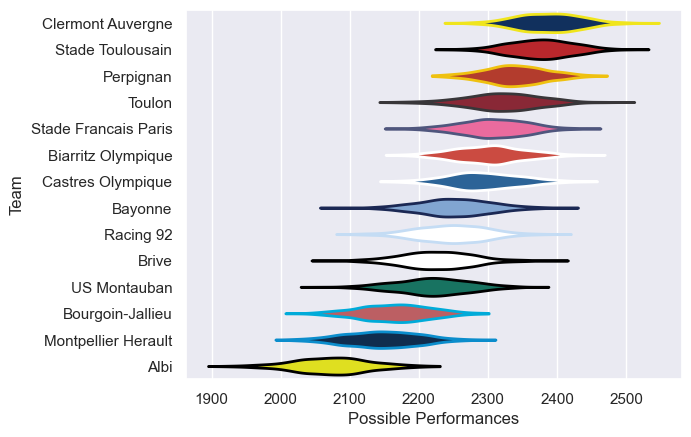

---  
title: "Top 14 09/10"  
date: 2025-07-29 6:00:00 -0500  
categories: model review projection  
layout: article  
aside:  
    toc: true  
---
# Current Team Rankings

# Standings

## Current Standings

| Club                 |   Played |   Wins |   Point Differential |   Losing Bonus Points |   Try Bonus Points |   Competition Points |
|:---------------------|---------:|-------:|---------------------:|----------------------:|-------------------:|---------------------:|
| Clermont Auvergne    |       29 |     18 |                  253 |                     4 |                  9 |                   91 |
| Toulon               |       27 |     18 |                   79 |                     4 |                  4 |                   82 |
| Perpignan            |       28 |     18 |                  165 |                     4 |                  5 |                   81 |
| Stade Toulousain     |       28 |     16 |                  180 |                     8 |                  5 |                   79 |
| Castres Olympique    |       27 |     14 |                  121 |                     5 |                  3 |                   70 |
| Racing 92            |       27 |     14 |                  -16 |                     7 |                    |                   65 |
| Stade Francais Paris |       26 |     10 |                   28 |                     5 |                  6 |                   59 |
| Biarritz Olympique   |       26 |     12 |                   29 |                     7 |                  3 |                   58 |
| Montpellier Herault  |       26 |     13 |                 -121 |                     2 |                  2 |                   56 |
| Brive                |       26 |     11 |                  -54 |                     5 |                  1 |                   54 |
| Bourgoin-Jallieu     |       26 |     11 |                 -182 |                     4 |                    |                   50 |
| US Montauban         |       26 |     10 |                 -103 |                     5 |                    |                   49 |
| Bayonne              |       26 |      9 |                    0 |                     8 |                  4 |                   48 |
| Albi                 |       26 |      4 |                 -379 |                     8 |                    |                   24 |

# Completed Match Review

| Model | Percent Correct Predictions | Spread Error |
| ------ | ------ | ------ |
| Club Level | 67.9% | 9.5 |
| Player Level: Lineup | nan% | nan |
| Player Level: Minutes | nan% | nan |

