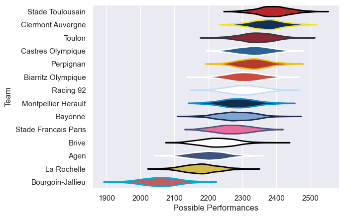

---  
title: "Top 14 10/11"  
date: 2025-07-29 6:00:00 -0500  
categories: model review projection  
layout: article  
aside:  
    toc: true  
---
# Current Team Rankings

# Standings

## Current Standings

| Club                 |   Played |   Wins |   Point Differential |   Losing Bonus Points |   Try Bonus Points |   Competition Points |
|:---------------------|---------:|-------:|---------------------:|----------------------:|-------------------:|---------------------:|
| Stade Toulousain     |       28 |     19 |                  207 |                     5 |                  7 |                   90 |
| Montpellier Herault  |       29 |     17 |                  104 |                     4 |                  6 |                   80 |
| Castres Olympique    |       27 |     16 |                  129 |                     8 |                  5 |                   79 |
| Racing 92            |       27 |     16 |                  124 |                     6 |                  4 |                   78 |
| Biarritz Olympique   |       27 |     15 |                   66 |                     6 |                  6 |                   74 |
| Clermont Auvergne    |       28 |     16 |                  142 |                     4 |                  4 |                   72 |
| Toulon               |       26 |     15 |                   90 |                     6 |                  5 |                   71 |
| Bayonne              |       26 |     16 |                   61 |                     5 |                  1 |                   70 |
| Perpignan            |       26 |     13 |                   -5 |                     3 |                  2 |                   63 |
| Agen                 |       26 |     11 |                 -143 |                     3 |                  2 |                   51 |
| Stade Francais Paris |       26 |     10 |                  -52 |                     5 |                  3 |                   50 |
| Brive                |       26 |      8 |                  -83 |                     7 |                  2 |                   45 |
| La Rochelle          |       26 |      6 |                 -197 |                     6 |                  1 |                   33 |
| Bourgoin-Jallieu     |       26 |      2 |                 -443 |                     3 |                  1 |                   12 |

# Completed Match Review

| Model | Percent Correct Predictions | Spread Error |
| ------ | ------ | ------ |
| Club Level | 74.3% | 9.5 |
| Player Level: Lineup | nan% | nan |
| Player Level: Minutes | nan% | nan |

