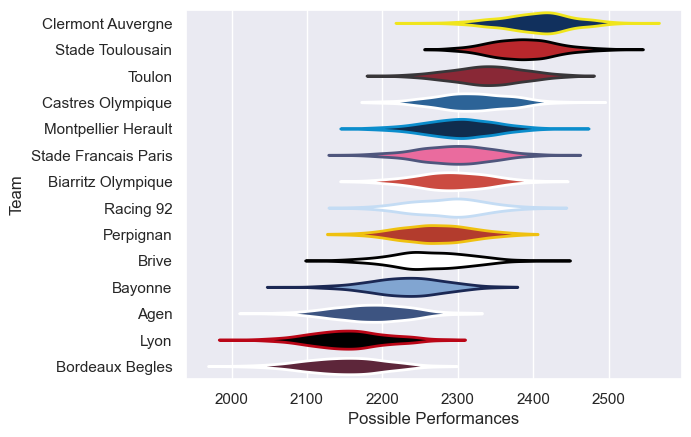

---  
title: "Top 14 11/12 Status"  
date: 2025-07-28 6:00:00 -0500  
categories: model review projection  
layout: article  
aside:  
    toc: true  
---
# Current Team Rankings

# Standings

## Current Standings

| Club                 |   Played |   Wins |   Point Differential |   Losing Bonus Points |   Try Bonus Points |   Competition Points |
|:---------------------|---------:|-------:|---------------------:|----------------------:|-------------------:|---------------------:|
| Stade Toulousain     |       28 |     21 |                  196 |                     3 |                  4 |                   93 |
| Clermont Auvergne    |       27 |     19 |                  277 |                     3 |                  5 |                   88 |
| Toulon               |       29 |     16 |                  189 |                     3 |                  4 |                   81 |
| Castres Olympique    |       28 |     15 |                   70 |                     2 |                  3 |                   73 |
| Montpellier Herault  |       27 |     14 |                   80 |                     5 |                  5 |                   68 |
| Racing 92            |       27 |     13 |                   27 |                     7 |                  4 |                   65 |
| Stade Francais Paris |       26 |     11 |                  -20 |                     4 |                  6 |                   58 |
| Bordeaux Begles      |       26 |     12 |                 -126 |                     3 |                  4 |                   55 |
| Biarritz Olympique   |       26 |     10 |                  -94 |                     7 |                  2 |                   53 |
| Agen                 |       26 |     12 |                  -94 |                     1 |                    |                   51 |
| Perpignan            |       26 |      9 |                  -63 |                     7 |                  3 |                   50 |
| Bayonne              |       26 |      9 |                 -140 |                     5 |                    |                   47 |
| Brive                |       26 |      7 |                  -80 |                    10 |                  1 |                   41 |
| Lyon                 |       26 |      5 |                 -222 |                     5 |                    |                   31 |

# Completed Match Review

| Model | Percent Correct Predictions | Spread Error |
| ------ | ------ | ------ |
| Club Level | 70.6% | 9.7 |
| Player Level: Lineup | nan% | nan |
| Player Level: Minutes | nan% | nan |

