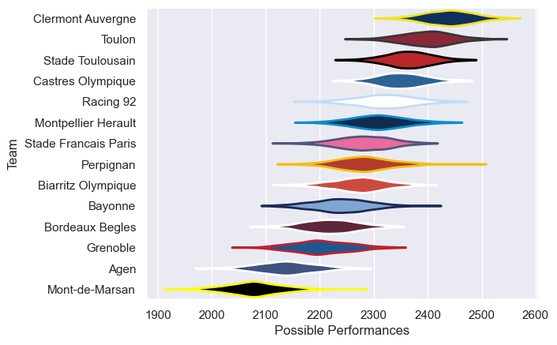

---  
title: "Top 14 12/13 Status"  
date: 2025-07-28 6:00:00 -0500  
categories: model review projection  
layout: article  
aside:  
    toc: true  
---
# Current Team Rankings

# Standings

## Current Standings

| Club                 |   Played |   Wins |   Point Differential |   Losing Bonus Points | Try Bonus Points   |   Competition Points |
|:---------------------|---------:|-------:|---------------------:|----------------------:|:-------------------|---------------------:|
| Clermont Auvergne    |       27 |     19 |                  345 |                     5 |                    |                   83 |
| Toulon               |       27 |     19 |                  338 |                     5 |                    |                   83 |
| Castres Olympique    |       30 |     17 |                  139 |                     6 |                    |                   82 |
| Stade Toulousain     |       28 |     18 |                  200 |                     4 |                    |                   76 |
| Racing 92            |       27 |     16 |                   67 |                     7 |                    |                   71 |
| Montpellier Herault  |       27 |     16 |                   37 |                     4 |                    |                   68 |
| Perpignan            |       26 |     13 |                  -14 |                     7 |                    |                   59 |
| Bayonne              |       26 |     12 |                 -142 |                     6 |                    |                   56 |
| Biarritz Olympique   |       26 |     12 |                  -35 |                     5 |                    |                   55 |
| Grenoble             |       26 |     12 |                 -126 |                     5 |                    |                   53 |
| Stade Francais Paris |       26 |     12 |                 -113 |                     2 |                    |                   52 |
| Bordeaux Begles      |       26 |      8 |                  -23 |                     9 |                    |                   43 |
| Agen                 |       26 |      6 |                 -286 |                     7 |                    |                   31 |
| Mont-de-Marsan       |       26 |      2 |                 -387 |                     7 |                    |                   15 |

# Completed Match Review

| Model | Percent Correct Predictions | Spread Error |
| ------ | ------ | ------ |
| Club Level | 78.6% | 10.2 |
| Player Level: Lineup | nan% | nan |
| Player Level: Minutes | nan% | nan |

