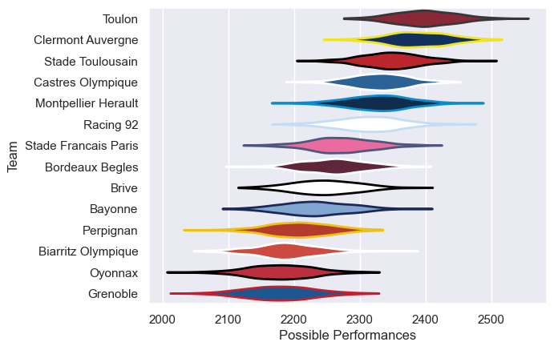

---  
title: "Top 14 13/14"  
date: 2025-07-29 6:00:00 -0500  
categories: model review projection  
layout: article  
aside:  
    toc: true  
---
# Current Team Rankings

# Standings

## Current Standings

| Club                 |   Played |   Wins |   Point Differential |   Losing Bonus Points | Try Bonus Points   |   Competition Points |
|:---------------------|---------:|-------:|---------------------:|----------------------:|:-------------------|---------------------:|
| Toulon               |       28 |     18 |                  212 |                     6 |                    |                   80 |
| Racing 92            |       28 |     16 |                    6 |                     4 |                    |                   72 |
| Montpellier Herault  |       27 |     15 |                  142 |                     8 |                    |                   70 |
| Clermont Auvergne    |       27 |     15 |                  153 |                     6 |                    |                   68 |
| Castres Olympique    |       29 |     15 |                   80 |                     4 |                    |                   68 |
| Stade Toulousain     |       27 |     13 |                  101 |                     7 |                    |                   63 |
| Stade Francais Paris |       26 |     14 |                   33 |                     4 |                    |                   62 |
| Bordeaux Begles      |       26 |     13 |                   56 |                     7 |                    |                   59 |
| Brive                |       26 |     11 |                   -3 |                     9 |                    |                   57 |
| Bayonne              |       26 |     11 |                 -125 |                     7 |                    |                   53 |
| Grenoble             |       26 |     11 |                 -160 |                     4 |                    |                   52 |
| Oyonnax              |       26 |     11 |                 -106 |                     4 |                    |                   50 |
| Perpignan            |       26 |     10 |                 -107 |                     7 |                    |                   49 |
| Biarritz Olympique   |       26 |      5 |                 -282 |                     8 |                    |                   30 |

# Completed Match Review

| Model | Percent Correct Predictions | Spread Error |
| ------ | ------ | ------ |
| Club Level | 74.3% | 9.6 |
| Player Level: Lineup | nan% | nan |
| Player Level: Minutes | nan% | nan |

