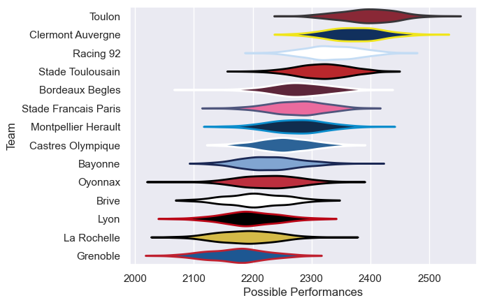

---  
title: "Top 14 14/15 Status"  
date: 2025-07-28 6:00:00 -0500  
categories: model review projection  
layout: article  
aside:  
    toc: true  
---
# Current Team Rankings

# Standings

## Current Standings

| Club                 |   Played |   Wins |   Point Differential |   Losing Bonus Points |   Try Bonus Points |   Competition Points |
|:---------------------|---------:|-------:|---------------------:|----------------------:|-------------------:|---------------------:|
| Clermont Auvergne    |       29 |     17 |                  170 |                     4 |                  6 |                   84 |
| Stade Toulousain     |       28 |     17 |                   66 |                     6 |                  5 |                   79 |
| Stade Francais Paris |       28 |     17 |                   55 |                     2 |                  7 |                   79 |
| Toulon               |       27 |     16 |                  198 |                     6 |                  8 |                   78 |
| Racing 92            |       27 |     13 |                   31 |                     5 |                  5 |                   68 |
| Oyonnax              |       27 |     14 |                    6 |                     5 |                  3 |                   64 |
| Bordeaux Begles      |       26 |     12 |                  123 |                     9 |                  4 |                   61 |
| Montpellier Herault  |       26 |     11 |                   21 |                     8 |                  2 |                   58 |
| Brive                |       26 |     12 |                 -117 |                     3 |                  4 |                   55 |
| La Rochelle          |       26 |     10 |                 -139 |                     2 |                  3 |                   55 |
| Castres Olympique    |       26 |     11 |                 -118 |                     5 |                  4 |                   53 |
| Bayonne              |       26 |     10 |                  -26 |                     7 |                  3 |                   52 |
| Grenoble             |       26 |     11 |                 -109 |                     6 |                  2 |                   52 |
| Lyon                 |       26 |      8 |                 -161 |                     7 |                    |                   41 |

# Completed Match Review

| Model | Percent Correct Predictions | Spread Error |
| ------ | ------ | ------ |
| Club Level | 72.7% | 10.4 |
| Player Level: Lineup | nan% | nan |
| Player Level: Minutes | nan% | nan |

