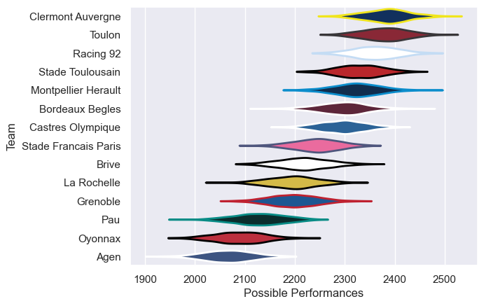

---  
title: "Top 14 15/16 Status"  
date: 2025-07-28 6:00:00 -0500  
categories: model review projection  
layout: article  
aside:  
    toc: true  
---
# Current Team Rankings

# Standings

## Current Standings

| Club                 |   Played |   Wins |   Point Differential |   Losing Bonus Points |   Try Bonus Points |   Competition Points |
|:---------------------|---------:|-------:|---------------------:|----------------------:|-------------------:|---------------------:|
| Racing 92            |       30 |     20 |                   98 |                     3 |                  6 |                   95 |
| Clermont Auvergne    |       27 |     18 |                  303 |                     6 |                  7 |                   87 |
| Toulon               |       27 |     17 |                  327 |                     7 |                 10 |                   85 |
| Montpellier Herault  |       28 |     19 |                  164 |                     2 |                  6 |                   84 |
| Stade Toulousain     |       27 |     16 |                  282 |                     6 |                  7 |                   81 |
| Castres Olympique    |       27 |     15 |                  135 |                     5 |                  6 |                   71 |
| Bordeaux Begles      |       26 |     14 |                   49 |                     5 |                  3 |                   68 |
| Brive                |       26 |     13 |                   -5 |                     4 |                  3 |                   61 |
| La Rochelle          |       26 |     11 |                 -103 |                     6 |                  3 |                   53 |
| Grenoble             |       26 |     10 |                 -174 |                     5 |                  4 |                   49 |
| Stade Francais Paris |       26 |      9 |                  -88 |                     7 |                  3 |                   46 |
| Pau                  |       26 |     10 |                 -255 |                     3 |                    |                   45 |
| Agen                 |       26 |      5 |                 -315 |                     8 |                  4 |                   32 |
| Oyonnax              |       26 |      5 |                 -418 |                     3 |                  1 |                   24 |

# Completed Match Review

| Model | Percent Correct Predictions | Spread Error |
| ------ | ------ | ------ |
| Club Level | 71.1% | 11.8 |
| Player Level: Lineup | nan% | nan |
| Player Level: Minutes | nan% | nan |

