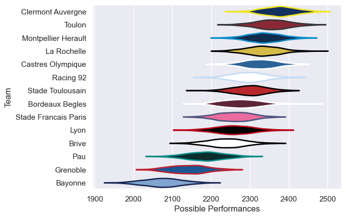

---  
title: "Top 14 16/17 Status"  
date: 2025-07-28 6:00:00 -0500  
categories: model review projection  
layout: article  
aside:  
    toc: true  
---
# Current Team Rankings

# Standings

## Current Standings

| Club                 |   Played |   Wins |   Point Differential |   Losing Bonus Points |   Try Bonus Points |   Competition Points |
|:---------------------|---------:|-------:|---------------------:|----------------------:|-------------------:|---------------------:|
| Clermont Auvergne    |       29 |     16 |                  244 |                     5 |                  9 |                   88 |
| La Rochelle          |       27 |     17 |                  206 |                     6 |                  5 |                   85 |
| Toulon               |       28 |     16 |                  170 |                     5 |                  5 |                   78 |
| Montpellier Herault  |       27 |     16 |                  177 |                     5 |                  6 |                   75 |
| Racing 92            |       28 |     15 |                  -27 |                     4 |                  5 |                   71 |
| Castres Olympique    |       27 |     13 |                  154 |                     7 |                  6 |                   67 |
| Stade Francais Paris |       26 |     12 |                    5 |                     5 |                  5 |                   60 |
| Brive                |       26 |     13 |                  -57 |                     4 |                  2 |                   60 |
| Pau                  |       26 |     12 |                  -97 |                     5 |                  4 |                   59 |
| Lyon                 |       26 |     11 |                  -59 |                     5 |                  5 |                   58 |
| Bordeaux Begles      |       26 |     11 |                  -12 |                     7 |                  4 |                   57 |
| Stade Toulousain     |       26 |     11 |                  -24 |                     8 |                  4 |                   56 |
| Grenoble             |       26 |      7 |                 -241 |                     6 |                  5 |                   41 |
| Bayonne              |       26 |      6 |                 -439 |                     0 |                  1 |                   31 |

# Completed Match Review

| Model | Percent Correct Predictions | Spread Error |
| ------ | ------ | ------ |
| Club Level | 73.8% | 10.4 |
| Player Level: Lineup | nan% | nan |
| Player Level: Minutes | nan% | nan |

