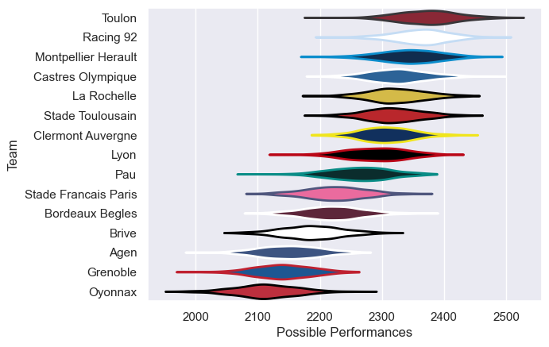

---  
title: "Top 14 17/18 Status"  
date: 2025-07-28 6:00:00 -0500  
categories: model review projection  
layout: article  
aside:  
    toc: true  
---
# Current Team Rankings

# Standings

## Current Standings

| Club                 |   Played |   Wins |   Point Differential |   Losing Bonus Points |   Try Bonus Points |   Competition Points |
|:---------------------|---------:|-------:|---------------------:|----------------------:|-------------------:|---------------------:|
| Montpellier Herault  |       28 |     18 |                  203 |                     1 |                 15 |                   88 |
| Castres Olympique    |       29 |     18 |                   47 |                     6 |                  7 |                   85 |
| Racing 92            |       27 |     18 |                  139 |                     5 |                  6 |                   83 |
| Toulon               |       27 |     14 |                  259 |                     8 |                 13 |                   79 |
| Stade Toulousain     |       27 |     16 |                  112 |                     5 |                  8 |                   79 |
| La Rochelle          |       26 |     14 |                  155 |                     6 |                  9 |                   73 |
| Lyon                 |       28 |     15 |                  122 |                     3 |                  8 |                   73 |
| Pau                  |       26 |     15 |                    6 |                     5 |                  5 |                   70 |
| Clermont Auvergne    |       26 |     11 |                  -58 |                     7 |                  5 |                   58 |
| Bordeaux Begles      |       26 |     10 |                  -66 |                     6 |                  3 |                   51 |
| Agen                 |       26 |     10 |                 -220 |                     5 |                  5 |                   50 |
| Stade Francais Paris |       26 |      9 |                 -200 |                     6 |                  5 |                   47 |
| Oyonnax              |       27 |      7 |                 -283 |                     4 |                  5 |                   43 |
| Brive                |       26 |      7 |                 -241 |                     5 |                  3 |                   38 |
| Grenoble             |        1 |      1 |                   25 |                     0 |                  1 |                    5 |

# Completed Match Review

| Model | Percent Correct Predictions | Spread Error |
| ------ | ------ | ------ |
| Club Level | 70.7% | 11.7 |
| Player Level: Lineup | nan% | nan |
| Player Level: Minutes | nan% | nan |

