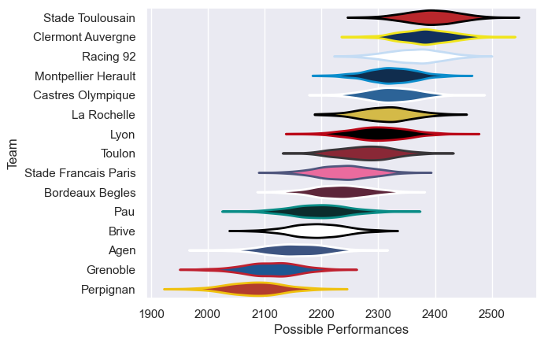

---  
title: "Top 14 18/19"  
date: 2025-07-29 6:00:00 -0500  
categories: model review projection  
layout: article  
aside:  
    toc: true  
---
# Current Team Rankings

# Standings

## Current Standings

| Club                 |   Played |   Wins |   Point Differential |   Losing Bonus Points |   Try Bonus Points |   Competition Points |
|:---------------------|---------:|-------:|---------------------:|----------------------:|-------------------:|---------------------:|
| Stade Toulousain     |       28 |     23 |                  332 |                     1 |                 14 |                  111 |
| Clermont Auvergne    |       28 |     17 |                  307 |                     6 |                 12 |                   92 |
| Lyon                 |       28 |     18 |                  143 |                     1 |                  8 |                   83 |
| La Rochelle          |       28 |     17 |                   95 |                     2 |                  9 |                   79 |
| Racing 92            |       27 |     15 |                  181 |                     6 |                 10 |                   78 |
| Montpellier Herault  |       27 |     14 |                  108 |                     7 |                  8 |                   73 |
| Castres Olympique    |       26 |     15 |                    9 |                     5 |                  3 |                   68 |
| Stade Francais Paris |       26 |     14 |                    4 |                     4 |                  4 |                   64 |
| Bordeaux Begles      |       26 |     12 |                  -93 |                     4 |                  5 |                   59 |
| Toulon               |       26 |     12 |                   30 |                     3 |                  7 |                   58 |
| Pau                  |       26 |      9 |                 -262 |                     5 |                  2 |                   43 |
| Agen                 |       26 |      8 |                 -223 |                     6 |                    |                   40 |
| Grenoble             |       27 |      5 |                 -249 |                     9 |                  1 |                   34 |
| Perpignan            |       26 |      2 |                 -388 |                     7 |                  2 |                   17 |
| Brive                |        1 |      1 |                    6 |                     0 |                  1 |                    5 |

# Completed Match Review

| Model | Percent Correct Predictions | Spread Error |
| ------ | ------ | ------ |
| Club Level | 69.7% | 12.0 |
| Player Level: Lineup | nan% | nan |
| Player Level: Minutes | nan% | nan |

