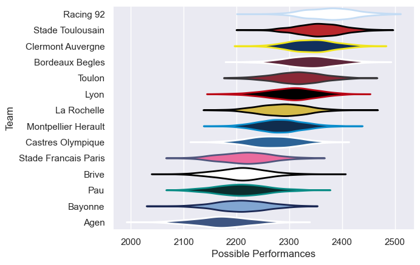

---  
title: "Top 14 19/20"  
date: 2025-07-29 6:00:00 -0500  
categories: model review projection  
layout: article  
aside:  
    toc: true  
---
# Current Team Rankings

# Standings

## Current Standings

| Club                 |   Played |   Wins |   Point Differential |   Losing Bonus Points |   Try Bonus Points |   Competition Points |
|:---------------------|---------:|-------:|---------------------:|----------------------:|-------------------:|---------------------:|
| Bordeaux Begles      |       26 |     13 |                  158 |                     1 |                  3 |                   76 |
| Lyon                 |       26 |     12 |                  159 |                     0 |                  2 |                   68 |
| Racing 92            |       26 |      9 |                  125 |                     5 |                  4 |                   65 |
| Toulon               |       26 |      9 |                   62 |                     2 |                  2 |                   62 |
| Clermont Auvergne    |       26 |     10 |                    8 |                     1 |                  1 |                   60 |
| La Rochelle          |       26 |      9 |                   -7 |                     3 |                  3 |                   60 |
| Stade Toulousain     |       26 |      8 |                   37 |                     2 |                  3 |                   57 |
| Montpellier Herault  |       26 |      6 |                   14 |                     6 |                  3 |                   57 |
| Bayonne              |       26 |      7 |                  -82 |                     5 |                  1 |                   54 |
| Castres Olympique    |       26 |      7 |                  -68 |                     2 |                  3 |                   51 |
| Brive                |       26 |      7 |                  -75 |                     3 |                    |                   51 |
| Pau                  |       26 |      6 |                  -80 |                     5 |                    |                   47 |
| Agen                 |       26 |      5 |                  -91 |                     5 |                    |                   45 |
| Stade Francais Paris |       26 |      5 |                 -160 |                     3 |                    |                   43 |

# Completed Match Review

| Model | Percent Correct Predictions | Spread Error |
| ------ | ------ | ------ |
| Club Level | 48.9% | 10.0 |
| Player Level: Lineup | nan% | nan |
| Player Level: Minutes | nan% | nan |

