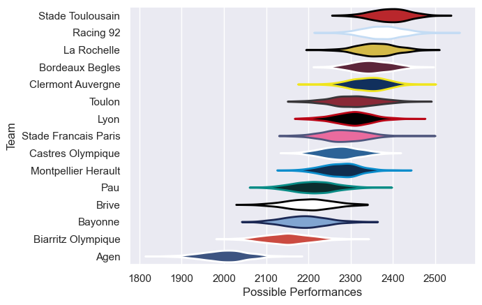

---  
title: "Top 14 20/21 Status"  
date: 2025-07-28 6:00:00 -0500  
categories: model review projection  
layout: article  
aside:  
    toc: true  
---
# Current Team Rankings

# Standings

## Current Standings

| Club                 |   Played |   Wins |   Point Differential |   Losing Bonus Points |   Try Bonus Points |   Competition Points |
|:---------------------|---------:|-------:|---------------------:|----------------------:|-------------------:|---------------------:|
| Stade Toulousain     |       28 |     19 |                  223 |                     3 |                  9 |                   90 |
| La Rochelle          |       28 |     18 |                  277 |                     5 |                 10 |                   87 |
| Racing 92            |       28 |     18 |                  184 |                     7 |                  8 |                   87 |
| Bordeaux Begles      |       28 |     16 |                  200 |                     5 |                  8 |                   79 |
| Clermont Auvergne    |       27 |     15 |                  202 |                     5 |                  9 |                   76 |
| Stade Francais Paris |       27 |     15 |                   62 |                     6 |                  7 |                   73 |
| Castres Olympique    |       26 |     15 |                  -51 |                     5 |                  5 |                   72 |
| Lyon                 |       26 |     14 |                  110 |                     4 |                  4 |                   66 |
| Toulon               |       26 |     14 |                   34 |                     4 |                  4 |                   64 |
| Montpellier Herault  |       26 |     10 |                  -36 |                     9 |                  5 |                   54 |
| Pau                  |       26 |      9 |                  -64 |                    10 |                  5 |                   53 |
| Brive                |       26 |     11 |                 -126 |                     5 |                  1 |                   50 |
| Bayonne              |       27 |     10 |                 -231 |                     5 |                  1 |                   48 |
| Biarritz Olympique   |        1 |      0 |                    0 |                     0 |                    |                    2 |
| Agen                 |       26 |      0 |                 -784 |                     2 |                    |                    2 |

# Completed Match Review

| Model | Percent Correct Predictions | Spread Error |
| ------ | ------ | ------ |
| Club Level | 69.1% | 12.1 |
| Player Level: Lineup | nan% | nan |
| Player Level: Minutes | nan% | nan |

