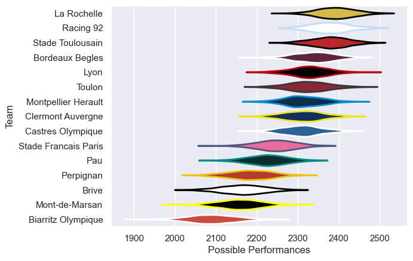

---  
title: "Top 14 21/22 Status"  
date: 2025-07-28 6:00:00 -0500  
categories: model review projection  
layout: article  
aside:  
    toc: true  
---
# Current Team Rankings

# Standings

## Current Standings

| Club                 |   Played |   Wins |   Point Differential |   Losing Bonus Points |   Try Bonus Points |   Competition Points |
|:---------------------|---------:|-------:|---------------------:|----------------------:|-------------------:|---------------------:|
| Montpellier Herault  |       28 |     17 |                  144 |                     6 |                  5 |                   83 |
| Bordeaux Begles      |       28 |     16 |                  137 |                     7 |                  8 |                   81 |
| Castres Olympique    |       28 |     18 |                   23 |                     2 |                  5 |                   81 |
| Stade Toulousain     |       28 |     16 |                  205 |                     9 |                  7 |                   80 |
| La Rochelle          |       27 |     15 |                  169 |                     8 |                  9 |                   77 |
| Racing 92            |       27 |     16 |                   73 |                     2 |                  6 |                   72 |
| Toulon               |       26 |     13 |                   68 |                     6 |                  7 |                   69 |
| Clermont Auvergne    |       26 |     14 |                   92 |                     5 |                  7 |                   68 |
| Lyon                 |       26 |     13 |                   79 |                     7 |                  8 |                   67 |
| Pau                  |       26 |     11 |                  -96 |                     5 |                  3 |                   54 |
| Stade Francais Paris |       26 |     11 |                 -107 |                     6 |                  3 |                   53 |
| Perpignan            |       27 |     10 |                 -148 |                     5 |                  3 |                   48 |
| Brive                |       26 |      9 |                 -178 |                     5 |                  2 |                   45 |
| Biarritz Olympique   |       26 |      5 |                 -436 |                     4 |                  1 |                   25 |
| Mont-de-Marsan       |        1 |      0 |                  -25 |                     0 |                    |                    0 |

# Completed Match Review

| Model | Percent Correct Predictions | Spread Error |
| ------ | ------ | ------ |
| Club Level | 74.5% | 10.7 |
| Player Level: Lineup | nan% | nan |
| Player Level: Minutes | nan% | nan |

