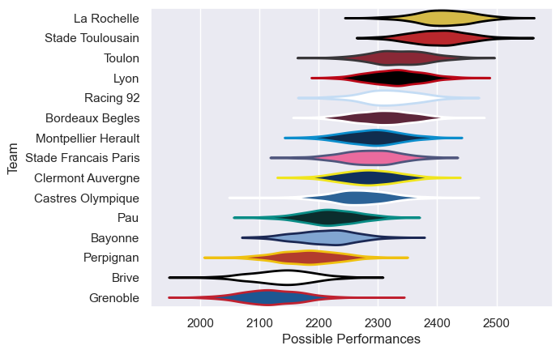

---  
title: "Top 14 22/23"  
date: 2025-07-29 6:00:00 -0500  
categories: model review projection  
layout: article  
aside:  
    toc: true  
---
# Current Team Rankings

# Standings

## Current Standings

| Club                 |   Played |   Wins |   Point Differential |   Losing Bonus Points |   Try Bonus Points |   Competition Points |
|:---------------------|---------:|-------:|---------------------:|----------------------:|-------------------:|---------------------:|
| Stade Toulousain     |       28 |     19 |                  238 |                     3 |                 11 |                   92 |
| La Rochelle          |       28 |     18 |                  202 |                     4 |                  8 |                   84 |
| Racing 92            |       28 |     15 |                   36 |                     5 |                  9 |                   76 |
| Lyon                 |       27 |     14 |                   55 |                     7 |                  9 |                   74 |
| Stade Francais Paris |       27 |     13 |                  123 |                     8 |                  6 |                   70 |
| Bordeaux Begles      |       28 |     14 |                   71 |                     6 |                  5 |                   69 |
| Toulon               |       26 |     14 |                   31 |                     3 |                  6 |                   65 |
| Clermont Auvergne    |       26 |     11 |                  -39 |                     7 |                  9 |                   62 |
| Montpellier Herault  |       26 |     11 |                    7 |                     8 |                  8 |                   60 |
| Bayonne              |       26 |     13 |                  -66 |                     3 |                  2 |                   59 |
| Castres Olympique    |       26 |     13 |                 -103 |                     4 |                  1 |                   59 |
| Pau                  |       26 |     10 |                  -43 |                     5 |                  7 |                   54 |
| Perpignan            |       27 |     11 |                 -207 |                     3 |                  5 |                   52 |
| Brive                |       26 |      7 |                 -291 |                     8 |                  1 |                   37 |
| Grenoble             |        1 |      0 |                  -14 |                     0 |                    |                    0 |

# Completed Match Review

| Model | Percent Correct Predictions | Spread Error |
| ------ | ------ | ------ |
| Club Level | 72.3% | 10.6 |
| Player Level: Lineup | nan% | nan |
| Player Level: Minutes | nan% | nan |

