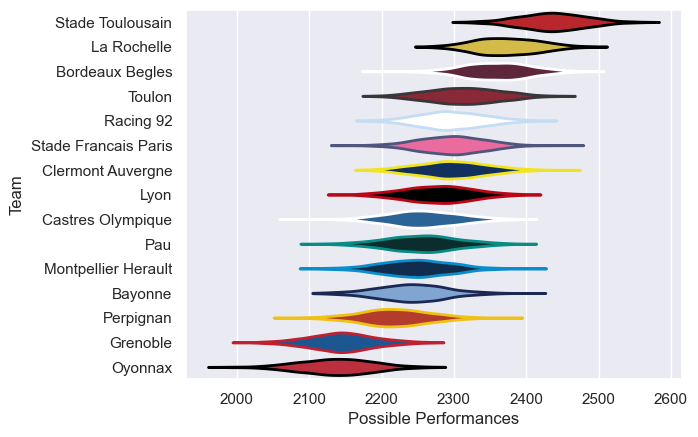

---  
title: "Top 14 23/24 Status"  
date: 2025-07-28 6:00:00 -0500  
categories: model review projection  
layout: article  
aside:  
    toc: true  
---
# Current Team Rankings

# Standings

## Current Standings

| Club                 |   Played |   Wins |   Point Differential |   Losing Bonus Points |   Try Bonus Points |   Competition Points |
|:---------------------|---------:|-------:|---------------------:|----------------------:|-------------------:|---------------------:|
| Stade Toulousain     |       28 |     18 |                  245 |                     3 |                 18 |                   95 |
| Bordeaux Begles      |       29 |     17 |                   79 |                     7 |                  9 |                   84 |
| Stade Francais Paris |       27 |     17 |                   26 |                     2 |                  4 |                   76 |
| Toulon               |       27 |     15 |                  180 |                     5 |                  9 |                   74 |
| La Rochelle          |       28 |     14 |                   88 |                     7 |                  7 |                   72 |
| Racing 92            |       27 |     13 |                   62 |                     7 |                  7 |                   66 |
| Clermont Auvergne    |       26 |     12 |                  -50 |                     3 |                 10 |                   65 |
| Pau                  |       26 |     13 |                   21 |                     5 |                  7 |                   64 |
| Castres Olympique    |       26 |     13 |                    1 |                     6 |                  6 |                   64 |
| Perpignan            |       26 |     13 |                  -67 |                     2 |                  8 |                   62 |
| Bayonne              |       26 |     11 |                  -97 |                     7 |                  8 |                   59 |
| Lyon                 |       26 |     12 |                 -124 |                     3 |                  7 |                   58 |
| Montpellier Herault  |       27 |     10 |                 -111 |                     9 |                  3 |                   52 |
| Oyonnax              |       26 |      7 |                 -251 |                     6 |                  4 |                   40 |
| Grenoble             |        1 |      0 |                   -2 |                     1 |                    |                    1 |

# Completed Match Review

| Model | Percent Correct Predictions | Spread Error |
| ------ | ------ | ------ |
| Club Level | 74.5% | 11.2 |
| Player Level: Lineup | nan% | nan |
| Player Level: Minutes | nan% | nan |

