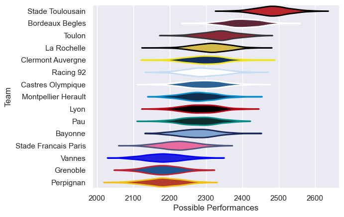

---  
title: "Top 14 24/25"  
date: 2025-07-29 6:00:00 -0500  
categories: model review projection  
layout: article  
aside:  
    toc: true  
---
# Current Team Rankings

# Standings

## Current Standings

| Club                 |   Played |   Wins |   Point Differential |   Losing Bonus Points |   Try Bonus Points |   Competition Points |
|:---------------------|---------:|-------:|---------------------:|----------------------:|-------------------:|---------------------:|
| Stade Toulousain     |       28 |     20 |                  442 |                     6 |                 15 |                  103 |
| Bordeaux Begles      |       28 |     18 |                  162 |                     6 |                 12 |                   90 |
| Toulon               |       28 |     16 |                   99 |                     6 |                 11 |                   81 |
| Bayonne              |       28 |     16 |                   -8 |                     5 |                  7 |                   78 |
| Castres Olympique    |       28 |     13 |                  -61 |                     6 |                  9 |                   73 |
| Clermont Auvergne    |       28 |     13 |                   30 |                     7 |                 11 |                   72 |
| Pau                  |       26 |     13 |                  -37 |                     5 |                 10 |                   67 |
| Racing 92            |       26 |     11 |                  -10 |                     8 |                  9 |                   65 |
| La Rochelle          |       26 |     13 |                  -18 |                     3 |                  7 |                   64 |
| Lyon                 |       26 |     10 |                  -47 |                     4 |                 10 |                   58 |
| Montpellier Herault  |       26 |     12 |                   14 |                     5 |                  4 |                   57 |
| Stade Francais Paris |       26 |     10 |                 -158 |                     5 |                  7 |                   52 |
| Perpignan            |       27 |     10 |                 -176 |                     4 |                  3 |                   51 |
| Vannes               |       26 |      7 |                 -230 |                     7 |                  8 |                   45 |
| Grenoble             |        1 |      0 |                   -2 |                     1 |                    |                    1 |

# Completed Match Review

| Model | Percent Correct Predictions | Spread Error |
| ------ | ------ | ------ |
| Club Level | 75.1% | 10.3 |
| Player Level: Lineup | nan% | nan |
| Player Level: Minutes | nan% | nan |

