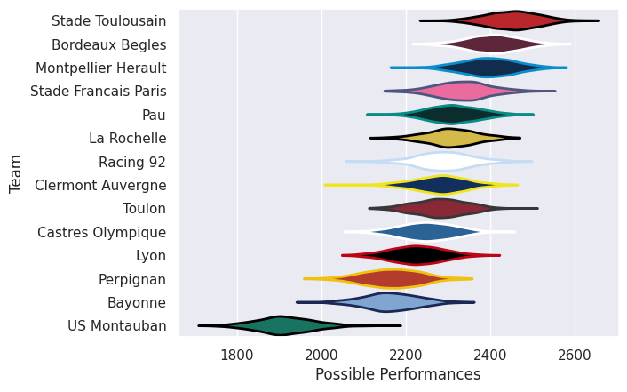

---  
title: "Top 14 25/26"  
date: 2025-08-15 6:00:00 -0500  
categories: model review projection  
layout: article  
aside:  
    toc: true  
---
# Team Rankings

# Standings

## Projected Remaining Table

| Club                 |   To Play |   Projected Wins |   Projected Differential |   Projected Losing Bonus Points | Projected Try Bonus Points   |   Projected Competition Points |
|:---------------------|----------:|-----------------:|-------------------------:|--------------------------------:|:-----------------------------|-------------------------------:|
| Stade Toulousain     |        26 |           16.19  |                  104.712 |                           5.002 |                              |                         72.072 |
| Bordeaux Begles      |        26 |           14.859 |                   65.862 |                           5.614 |                              |                         67.372 |
| Toulon               |        26 |           13.577 |                   33.98  |                           5.948 |                              |                         62.61  |
| La Rochelle          |        26 |           13.119 |                   19.76  |                           6.082 |                              |                         60.944 |
| Clermont Auvergne    |        26 |           12.647 |                   11.377 |                           6.427 |                              |                         59.367 |
| Bayonne              |        26 |           12.519 |                    2.928 |                           6.306 |                              |                         58.84  |
| Racing 92            |        26 |           12.396 |                    2.004 |                           6.59  |                              |                         58.638 |
| Pau                  |        26 |           12.293 |                   -2.429 |                           6.399 |                              |                         58.009 |
| Castres Olympique    |        26 |           12.167 |                   -9.502 |                           6.351 |                              |                         57.435 |
| Montpellier Herault  |        26 |           12.087 |                   -9.748 |                           6.28  |                              |                         57.044 |
| Lyon                 |        26 |           11.809 |                  -15.925 |                           6.416 |                              |                         56.098 |
| Stade Francais Paris |        26 |           10.939 |                  -36.842 |                           6.604 |                              |                         52.878 |
| Perpignan            |        26 |           10.685 |                  -49.872 |                           6.308 |                              |                         51.54  |
| US Montauban         |        26 |            8.285 |                 -116.305 |                           6.394 |                              |                         41.874 |

## Projected Total Table

| Club                 |   Played |   Wins |   Point Differential |   Losing Bonus Points | Try Bonus Points   |   Competition Points |
|:---------------------|---------:|-------:|---------------------:|----------------------:|:-------------------|---------------------:|
| Stade Toulousain     |       26 | 16.19  |              104.712 |                 5.002 |                    |               72.072 |
| Bordeaux Begles      |       26 | 14.859 |               65.862 |                 5.614 |                    |               67.372 |
| Toulon               |       26 | 13.577 |               33.98  |                 5.948 |                    |               62.61  |
| La Rochelle          |       26 | 13.119 |               19.76  |                 6.082 |                    |               60.944 |
| Clermont Auvergne    |       26 | 12.647 |               11.377 |                 6.427 |                    |               59.367 |
| Bayonne              |       26 | 12.519 |                2.928 |                 6.306 |                    |               58.84  |
| Racing 92            |       26 | 12.396 |                2.004 |                 6.59  |                    |               58.638 |
| Pau                  |       26 | 12.293 |               -2.429 |                 6.399 |                    |               58.009 |
| Castres Olympique    |       26 | 12.167 |               -9.502 |                 6.351 |                    |               57.435 |
| Montpellier Herault  |       26 | 12.087 |               -9.748 |                 6.28  |                    |               57.044 |
| Lyon                 |       26 | 11.809 |              -15.925 |                 6.416 |                    |               56.098 |
| Stade Francais Paris |       26 | 10.939 |              -36.842 |                 6.604 |                    |               52.878 |
| Perpignan            |       26 | 10.685 |              -49.872 |                 6.308 |                    |               51.54  |
| US Montauban         |       26 |  8.285 |             -116.305 |                 6.394 |                    |               41.874 |

# Future Predictions

## Week 1

### Clermont Auvergne V Stade Toulousain on 2025/09/05

Average Margin: Stade Toulousain by 1.0

### Castres Olympique V Pau on 2025/09/06

Average Margin: Castres Olympique by 3.1

### Lyon V Racing 92 on 2025/09/06

Average Margin: Lyon by 2.6

### Montpellier Herault V Toulon on 2025/09/06

Average Margin: Montpellier Herault by 2.2

### Bordeaux Begles V La Rochelle on 2025/09/06

Average Margin: Bordeaux Begles by 6.9

### Stade Francais Paris V US Montauban on 2025/09/06

Average Margin: Stade Francais Paris by 6.8

### Perpignan V Bayonne on 2025/09/06

Average Margin: Perpignan by 1.4

## Week 2

### Racing 92 V Bordeaux Begles on 2025/09/12

Average Margin: Racing 92 by 0.4

### Toulon V Castres Olympique on 2025/09/13

Average Margin: Toulon by 5.7

### Pau V Stade Francais Paris on 2025/09/13

Average Margin: Pau by 4.9

### Bayonne V Montpellier Herault on 2025/09/13

Average Margin: Bayonne by 3.6

### US Montauban V Lyon on 2025/09/13

Average Margin: Lyon by 1.0

### Stade Toulousain V Perpignan on 2025/09/13

Average Margin: Stade Toulousain by 11.0

### La Rochelle V Clermont Auvergne on 2025/09/13

Average Margin: La Rochelle by 4.4

## Week 3

### Toulon V La Rochelle on 2025/09/19

Average Margin: Toulon by 4.4

### Castres Olympique V Bayonne on 2025/09/20

Average Margin: Castres Olympique by 3.1

### Clermont Auvergne V Pau on 2025/09/20

Average Margin: Clermont Auvergne by 4.2

### Perpignan V Racing 92 on 2025/09/20

Average Margin: Perpignan by 0.7

### Bordeaux Begles V US Montauban on 2025/09/20

Average Margin: Bordeaux Begles by 12.8

### Montpellier Herault V Stade Toulousain on 2025/09/20

Average Margin: Stade Toulousain by 1.7

### Lyon V Stade Francais Paris on 2025/09/20

Average Margin: Lyon by 4.8

## Week 4

### Bayonne V Toulon on 2025/09/26

Average Margin: Bayonne by 2.3

### Racing 92 V Clermont Auvergne on 2025/09/27

Average Margin: Racing 92 by 2.6

### Pau V Lyon on 2025/09/27

Average Margin: Pau by 4.2

### Stade Francais Paris V Bordeaux Begles on 2025/09/27

Average Margin: Bordeaux Begles by 1.1

### La Rochelle V Perpignan on 2025/09/27

Average Margin: La Rochelle by 7.6

### Stade Toulousain V Castres Olympique on 2025/09/27

Average Margin: Stade Toulousain by 8.7

### US Montauban V Montpellier Herault on 2025/09/27

Average Margin: Montpellier Herault by 1.5

## Week 5

### Bordeaux Begles V Lyon on 2025/10/03

Average Margin: Bordeaux Begles by 7.1

### Clermont Auvergne V US Montauban on 2025/10/03

Average Margin: Clermont Auvergne by 9.5

### Bayonne V Stade Toulousain on 2025/10/03

Average Margin: Stade Toulousain by 0.6

### Toulon V Pau on 2025/10/03

Average Margin: Toulon by 5.8

### Castres Olympique V Racing 92 on 2025/10/03

Average Margin: Castres Olympique by 2.0

### Perpignan V Stade Francais Paris on 2025/10/03

Average Margin: Perpignan by 2.7

### Montpellier Herault V La Rochelle on 2025/10/03

Average Margin: Montpellier Herault by 2.9

## Week 6

### Pau V Bayonne on 2025/10/10

Average Margin: Pau by 3.9

### US Montauban V Castres Olympique on 2025/10/10

Average Margin: Castres Olympique by 1.1

### Racing 92 V Montpellier Herault on 2025/10/10

Average Margin: Racing 92 by 4.0

### Clermont Auvergne V Toulon on 2025/10/10

Average Margin: Clermont Auvergne by 2.7

### Stade Francais Paris V La Rochelle on 2025/10/10

Average Margin: Stade Francais Paris by 0.9

### Lyon V Perpignan on 2025/10/10

Average Margin: Lyon by 4.3

### Stade Toulousain V Bordeaux Begles on 2025/10/10

Average Margin: Stade Toulousain by 5.6

## Week 7

### Bayonne V Clermont Auvergne on 2025/10/17

Average Margin: Bayonne by 3.1

### Pau V Stade Toulousain on 2025/10/17

Average Margin: Stade Toulousain by 1.0

### Toulon V Racing 92 on 2025/10/17

Average Margin: Toulon by 4.5

### Castres Olympique V Stade Francais Paris on 2025/10/17

Average Margin: Castres Olympique by 4.5

### La Rochelle V US Montauban on 2025/10/17

Average Margin: La Rochelle by 9.3

### Perpignan V Bordeaux Begles on 2025/10/17

Average Margin: Bordeaux Begles by 0.8

### Montpellier Herault V Lyon on 2025/10/17

Average Margin: Montpellier Herault by 4.9

## Week 8

### Racing 92 V Pau on 2025/10/24

Average Margin: Racing 92 by 3.6

### Stade Toulousain V Toulon on 2025/10/24

Average Margin: Stade Toulousain by 6.6

### Clermont Auvergne V Castres Olympique on 2025/10/24

Average Margin: Clermont Auvergne by 4.1

### Stade Francais Paris V Montpellier Herault on 2025/10/24

Average Margin: Stade Francais Paris by 2.7

### Lyon V La Rochelle on 2025/10/24

Average Margin: Lyon by 1.9

### US Montauban V Perpignan on 2025/10/24

Average Margin: US Montauban by 0.6

### Bordeaux Begles V Bayonne on 2025/10/24

Average Margin: Bordeaux Begles by 6.4

## Week 9

### Stade Toulousain V Stade Francais Paris on 2025/10/31

Average Margin: Stade Toulousain by 9.8

### Castres Olympique V Bordeaux Begles on 2025/10/31

Average Margin: Castres Olympique by 0.7

### Pau V Perpignan on 2025/10/31

Average Margin: Pau by 5.3

### Toulon V Lyon on 2025/10/31

Average Margin: Toulon by 5.9

### Bayonne V US Montauban on 2025/10/31

Average Margin: Bayonne by 9.1

### Montpellier Herault V Clermont Auvergne on 2025/10/31

Average Margin: Montpellier Herault by 2.9

### La Rochelle V Racing 92 on 2025/10/31

Average Margin: La Rochelle by 3.9

## Week 10

### Perpignan V Montpellier Herault on 2025/11/21

Average Margin: Perpignan by 2.7

### Racing 92 V Bayonne on 2025/11/21

Average Margin: Racing 92 by 3.2

### La Rochelle V Castres Olympique on 2025/11/21

Average Margin: La Rochelle by 4.8

### Bordeaux Begles V Pau on 2025/11/21

Average Margin: Bordeaux Begles by 6.0

### Stade Francais Paris V Toulon on 2025/11/21

Average Margin: Stade Francais Paris by 1.0

### Lyon V Clermont Auvergne on 2025/11/21

Average Margin: Lyon by 2.6

### US Montauban V Stade Toulousain on 2025/11/21

Average Margin: Stade Toulousain by 5.0

## Week 11

### Bayonne V Lyon on 2025/11/28

Average Margin: Bayonne by 3.9

### Montpellier Herault V Bordeaux Begles on 2025/11/28

Average Margin: Montpellier Herault by 0.7

### Pau V La Rochelle on 2025/11/28

Average Margin: Pau by 2.3

### Castres Olympique V Perpignan on 2025/11/28

Average Margin: Castres Olympique by 4.5

### Clermont Auvergne V Stade Francais Paris on 2025/11/28

Average Margin: Clermont Auvergne by 5.6

### Stade Toulousain V Racing 92 on 2025/11/28

Average Margin: Stade Toulousain by 6.7

### Toulon V US Montauban on 2025/11/28

Average Margin: Toulon by 8.6

## Week 12

### US Montauban V Pau on 2025/12/19

Average Margin: Pau by 0.2

### Lyon V Stade Toulousain on 2025/12/19

Average Margin: Stade Toulousain by 0.6

### Bordeaux Begles V Toulon on 2025/12/19

Average Margin: Bordeaux Begles by 5.3

### Montpellier Herault V Castres Olympique on 2025/12/19

Average Margin: Montpellier Herault by 3.7

### La Rochelle V Bayonne on 2025/12/19

Average Margin: La Rochelle by 4.1

### Stade Francais Paris V Racing 92 on 2025/12/19

Average Margin: Stade Francais Paris by 1.2

### Perpignan V Clermont Auvergne on 2025/12/19

Average Margin: Perpignan by 2.0

## Week 13

### Castres Olympique V Lyon on 2025/12/26

Average Margin: Castres Olympique by 3.3

### Pau V Montpellier Herault on 2025/12/26

Average Margin: Pau by 3.6

### Stade Toulousain V La Rochelle on 2025/12/26

Average Margin: Stade Toulousain by 6.9

### Bayonne V Stade Francais Paris on 2025/12/26

Average Margin: Bayonne by 4.7

### Racing 92 V US Montauban on 2025/12/26

Average Margin: Racing 92 by 7.1

### Clermont Auvergne V Bordeaux Begles on 2025/12/26

Average Margin: Clermont Auvergne by 2.1

### Toulon V Perpignan on 2025/12/26

Average Margin: Toulon by 6.8

## Week 14

### Stade Francais Paris V Castres Olympique on 2026/01/02

Average Margin: Stade Francais Paris by 2.4

### Perpignan V Stade Toulousain on 2026/01/02

Average Margin: Stade Toulousain by 1.1

### Lyon V Pau on 2026/01/02

Average Margin: Lyon by 3.0

### La Rochelle V Toulon on 2026/01/02

Average Margin: La Rochelle by 3.6

### Montpellier Herault V Bayonne on 2026/01/02

Average Margin: Montpellier Herault by 3.1

### Bordeaux Begles V Racing 92 on 2026/01/02

Average Margin: Bordeaux Begles by 5.4

### US Montauban V Clermont Auvergne on 2026/01/02

Average Margin: Clermont Auvergne by 0.2

## Week 15

### Bordeaux Begles V Stade Francais Paris on 2026/01/23

Average Margin: Bordeaux Begles by 6.7

### Clermont Auvergne V La Rochelle on 2026/01/23

Average Margin: Clermont Auvergne by 3.6

### Perpignan V US Montauban on 2026/01/23

Average Margin: Perpignan by 6.2

### Toulon V Montpellier Herault on 2026/01/23

Average Margin: Toulon by 6.4

### Racing 92 V Lyon on 2026/01/23

Average Margin: Racing 92 by 3.9

### Bayonne V Castres Olympique on 2026/01/23

Average Margin: Bayonne by 4.1

### Stade Toulousain V Pau on 2026/01/23

Average Margin: Stade Toulousain by 6.9

## Week 16

### US Montauban V Bordeaux Begles on 2026/01/30

Average Margin: Bordeaux Begles by 2.3

### Stade Toulousain V Bayonne on 2026/01/30

Average Margin: Stade Toulousain by 7.2

### La Rochelle V Lyon on 2026/01/30

Average Margin: La Rochelle by 5.2

### Castres Olympique V Clermont Auvergne on 2026/01/30

Average Margin: Castres Olympique by 2.8

### Racing 92 V Perpignan on 2026/01/30

Average Margin: Racing 92 by 5.5

### Montpellier Herault V Stade Francais Paris on 2026/01/30

Average Margin: Montpellier Herault by 4.5

### Pau V Toulon on 2026/01/30

Average Margin: Pau by 2.5

## Week 17

### Stade Francais Paris V Stade Toulousain on 2026/02/13

Average Margin: Stade Toulousain by 0.6

### Toulon V Clermont Auvergne on 2026/02/13

Average Margin: Toulon by 4.6

### Lyon V US Montauban on 2026/02/13

Average Margin: Lyon by 7.0

### Bayonne V Racing 92 on 2026/02/13

Average Margin: Bayonne by 3.6

### Bordeaux Begles V Castres Olympique on 2026/02/13

Average Margin: Bordeaux Begles by 5.6

### Perpignan V Pau on 2026/02/13

Average Margin: Perpignan by 2.2

### La Rochelle V Montpellier Herault on 2026/02/13

Average Margin: La Rochelle by 4.9

## Week 18

### Castres Olympique V La Rochelle on 2026/02/27

Average Margin: Castres Olympique by 2.5

### Lyon V Toulon on 2026/02/27

Average Margin: Lyon by 2.6

### Stade Toulousain V US Montauban on 2026/02/27

Average Margin: Stade Toulousain by 9.8

### Stade Francais Paris V Perpignan on 2026/02/27

Average Margin: Stade Francais Paris by 4.5

### Clermont Auvergne V Bayonne on 2026/02/27

Average Margin: Clermont Auvergne by 3.7

### Pau V Bordeaux Begles on 2026/02/27

Average Margin: Pau by 2.1

### Montpellier Herault V Racing 92 on 2026/02/27

Average Margin: Montpellier Herault by 2.7

## Week 19

### Clermont Auvergne V Montpellier Herault on 2026/03/20

Average Margin: Clermont Auvergne by 4.5

### La Rochelle V Pau on 2026/03/20

Average Margin: La Rochelle by 4.0

### Perpignan V Lyon on 2026/03/20

Average Margin: Perpignan by 2.9

### US Montauban V Bayonne on 2026/03/20

Average Margin: Bayonne by 0.2

### Toulon V Stade Francais Paris on 2026/03/20

Average Margin: Toulon by 5.8

### Bordeaux Begles V Stade Toulousain on 2026/03/20

Average Margin: Bordeaux Begles by 2.7

### Racing 92 V Castres Olympique on 2026/03/20

Average Margin: Racing 92 by 2.9

## Week 20

### Stade Francais Paris V Clermont Auvergne on 2026/03/27

Average Margin: Stade Francais Paris by 2.3

### Pau V Racing 92 on 2026/03/27

Average Margin: Pau by 3.0

### Lyon V Bordeaux Begles on 2026/03/27

Average Margin: Lyon by 1.6

### Bayonne V La Rochelle on 2026/03/27

Average Margin: Bayonne by 3.5

### Perpignan V Toulon on 2026/03/27

Average Margin: Perpignan by 1.3

### Stade Toulousain V Montpellier Herault on 2026/03/27

Average Margin: Stade Toulousain by 7.1

### Castres Olympique V US Montauban on 2026/03/27

Average Margin: Castres Olympique by 6.1

## Week 21

### Racing 92 V Stade Francais Paris on 2026/04/17

Average Margin: Racing 92 by 3.4

### Clermont Auvergne V Lyon on 2026/04/17

Average Margin: Clermont Auvergne by 4.9

### La Rochelle V Bordeaux Begles on 2026/04/17

Average Margin: La Rochelle by 2.5

### Montpellier Herault V Perpignan on 2026/04/17

Average Margin: Montpellier Herault by 5.1

### US Montauban V Toulon on 2026/04/17

Average Margin: Toulon by 0.7

### Castres Olympique V Stade Toulousain on 2026/04/17

Average Margin: Castres Olympique by 0.6

### Bayonne V Pau on 2026/04/17

Average Margin: Bayonne by 3.4

## Week 22

### Stade Toulousain V Clermont Auvergne on 2026/04/24

Average Margin: Stade Toulousain by 6.3

### US Montauban V Racing 92 on 2026/04/24

Average Margin: Racing 92 by 0.2

### Stade Francais Paris V Pau on 2026/04/24

Average Margin: Stade Francais Paris by 1.8

### Toulon V Bayonne on 2026/04/24

Average Margin: Toulon by 4.2

### Perpignan V La Rochelle on 2026/04/24

Average Margin: Perpignan by 1.6

### Lyon V Castres Olympique on 2026/04/24

Average Margin: Lyon by 3.1

### Bordeaux Begles V Montpellier Herault on 2026/04/24

Average Margin: Bordeaux Begles by 5.6

## Week 23

### Clermont Auvergne V Perpignan on 2026/05/08

Average Margin: Clermont Auvergne by 6.1

### Stade Francais Paris V Lyon on 2026/05/08

Average Margin: Stade Francais Paris by 3.1

### Pau V Castres Olympique on 2026/05/08

Average Margin: Pau by 3.5

### Racing 92 V La Rochelle on 2026/05/08

Average Margin: Racing 92 by 2.8

### Bayonne V Bordeaux Begles on 2026/05/08

Average Margin: Bayonne by 1.8

### Toulon V Stade Toulousain on 2026/05/08

Average Margin: Toulon by 2.0

### Montpellier Herault V US Montauban on 2026/05/08

Average Margin: Montpellier Herault by 6.6

## Week 24

### Bordeaux Begles V Perpignan on 2026/05/15

Average Margin: Bordeaux Begles by 6.5

### Racing 92 V Toulon on 2026/05/15

Average Margin: Racing 92 by 2.0

### La Rochelle V Stade Toulousain on 2026/05/15

Average Margin: La Rochelle by 0.9

### Pau V Clermont Auvergne on 2026/05/15

Average Margin: Pau by 3.6

### Castres Olympique V Montpellier Herault on 2026/05/15

Average Margin: Castres Olympique by 3.8

### US Montauban V Stade Francais Paris on 2026/05/15

Average Margin: US Montauban by 1.2

### Lyon V Bayonne on 2026/05/15

Average Margin: Lyon by 3.0

## Week 25

### Toulon V Bordeaux Begles on 2026/05/29

Average Margin: Toulon by 2.9

### US Montauban V La Rochelle on 2026/05/29

Average Margin: US Montauban by 0.2

### Montpellier Herault V Pau on 2026/05/29

Average Margin: Montpellier Herault by 3.6

### Perpignan V Castres Olympique on 2026/05/29

Average Margin: Perpignan by 1.6

### Clermont Auvergne V Racing 92 on 2026/05/29

Average Margin: Clermont Auvergne by 3.4

### Stade Francais Paris V Bayonne on 2026/05/29

Average Margin: Stade Francais Paris by 1.8

### Stade Toulousain V Lyon on 2026/05/29

Average Margin: Stade Toulousain by 6.9

## Week 26

### Lyon V Montpellier Herault on 2026/06/06

Average Margin: Lyon by 3.6

### Pau V US Montauban on 2026/06/06

Average Margin: Pau by 7.2

### Bayonne V Perpignan on 2026/06/06

Average Margin: Bayonne by 5.6

### Bordeaux Begles V Clermont Auvergne on 2026/06/06

Average Margin: Bordeaux Begles by 5.1

### Castres Olympique V Toulon on 2026/06/06

Average Margin: Castres Olympique by 2.5

### La Rochelle V Stade Francais Paris on 2026/06/06

Average Margin: La Rochelle by 4.9

### Racing 92 V Stade Toulousain on 2026/06/06

Average Margin: Racing 92 by 0.3

