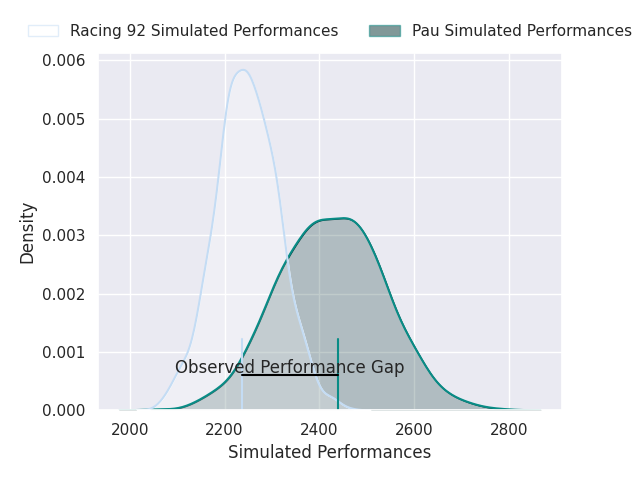
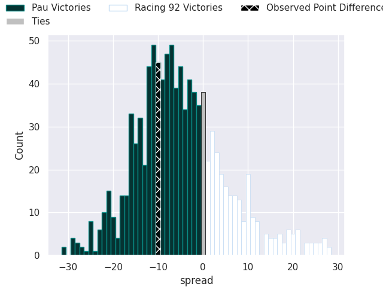
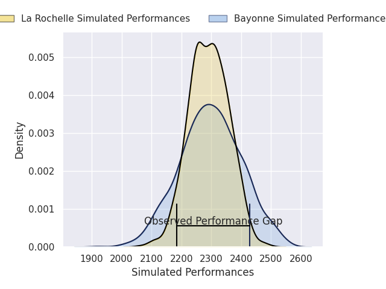
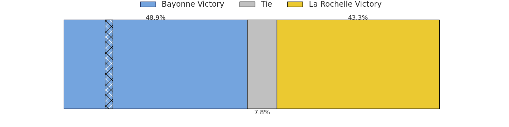
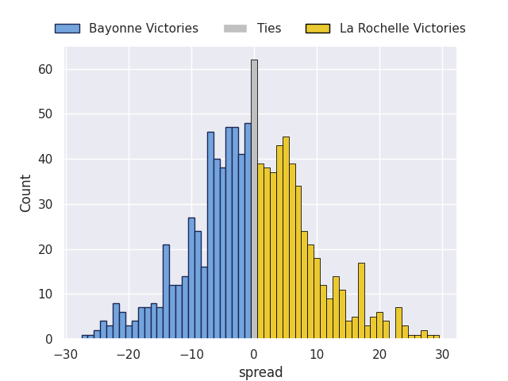
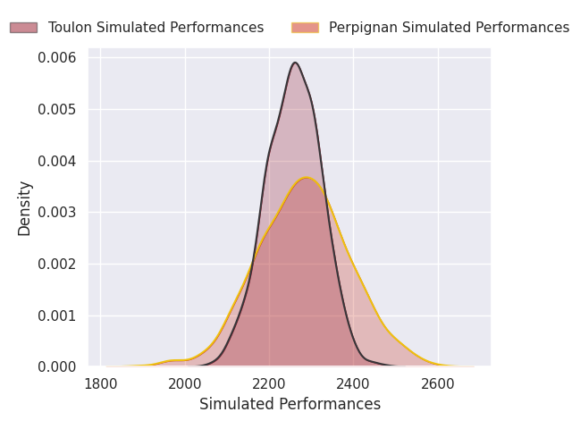
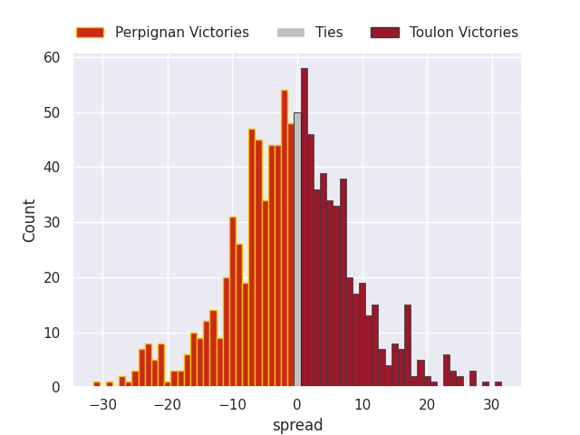
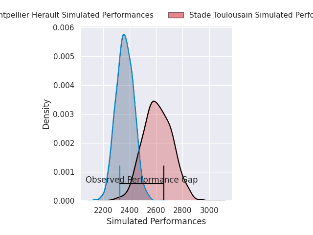
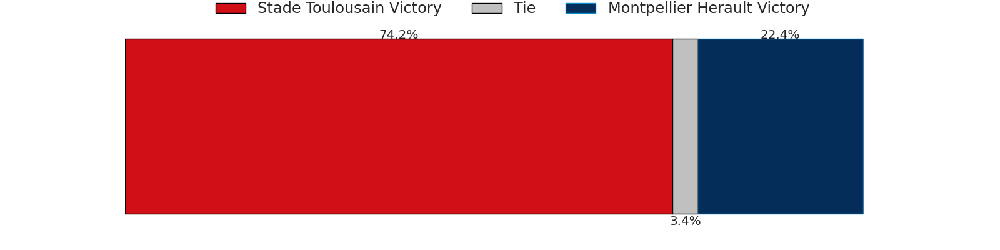
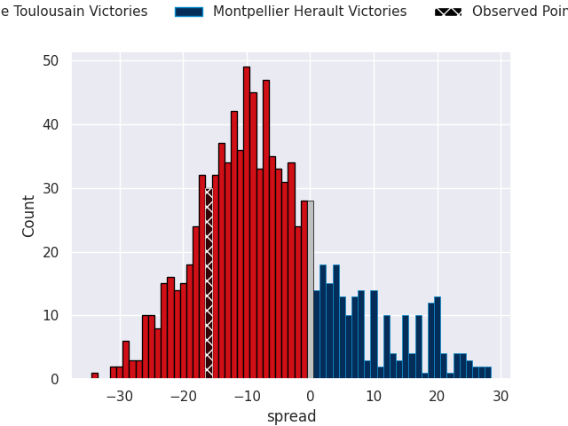

# Team Rankings

# Standings

## Current Standings

| Club                 |   Played |   Wins |   Point Differential |   Losing Bonus Points |   Try Bonus Points |   Competition Points |
|:---------------------|---------:|-------:|---------------------:|----------------------:|-------------------:|---------------------:|
| Stade Toulousain     |       19 |     14 |                  365 |                     2 |                 13 |                   73 |
| Montpellier Herault  |       19 |     11 |                  174 |                     5 |                  8 |                   59 |
| Pau                  |       18 |     12 |                   83 |                     2 |                  9 |                   59 |
| Stade Francais Paris |       19 |     10 |                   84 |                     5 |                 11 |                   58 |
| Clermont Auvergne    |       19 |     11 |                  126 |                     3 |                  9 |                   56 |
| Bordeaux Begles      |       19 |     10 |                  108 |                     3 |                 11 |                   56 |
| Racing 92            |       19 |     11 |                  -13 |                     1 |                  8 |                   55 |
| La Rochelle          |       20 |      9 |                   78 |                     4 |                  8 |                   50 |
| Toulon               |       20 |      9 |                  -90 |                     1 |                  8 |                   49 |
| Lyon                 |       19 |      9 |                   23 |                     2 |                  7 |                   47 |
| Castres Olympique    |       19 |      9 |                 -101 |                     5 |                  6 |                   47 |
| Bayonne              |       19 |      9 |                  -94 |                     2 |                  5 |                   43 |
| Perpignan            |       18 |      3 |                 -187 |                     5 |                  3 |                   20 |
| US Montauban         |       19 |      1 |                 -556 |                     2 |                  5 |                   13 |

## Projected Remaining Table

| Club                 |   To Play |   Projected Wins |   Projected Differential |   Projected Losing Bonus Points | Projected Try Bonus Points   |   Projected Competition Points |
|:---------------------|----------:|-----------------:|-------------------------:|--------------------------------:|:-----------------------------|-------------------------------:|
| Stade Toulousain     |         7 |            4.555 |                   33.466 |                           1.227 |                              |                         20.083 |
| Pau                  |         8 |            4.31  |                   15.545 |                           1.652 |                              |                         19.622 |
| Stade Francais Paris |         7 |            4.432 |                   29.05  |                           1.224 |                              |                         19.52  |
| Bordeaux Begles      |         7 |            4.113 |                   20.774 |                           1.533 |                              |                         18.657 |
| La Rochelle          |         7 |            3.631 |                    6.651 |                           1.738 |                              |                         17.04  |
| Montpellier Herault  |         7 |            3.601 |                   17.645 |                           1.477 |                              |                         16.489 |
| Toulon               |         7 |            3.271 |                    0.405 |                           1.828 |                              |                         15.626 |
| Racing 92            |         7 |            3.278 |                   -0.237 |                           1.732 |                              |                         15.546 |
| Castres Olympique    |         7 |            3.122 |                    2.118 |                           1.831 |                              |                         14.979 |
| Lyon                 |         7 |            3.054 |                  -10.95  |                           1.555 |                              |                         14.415 |
| Perpignan            |         8 |            2.87  |                  -30.449 |                           1.932 |                              |                         14.142 |
| Clermont Auvergne    |         7 |            3.041 |                  -10.436 |                           1.314 |                              |                         14.012 |
| Bayonne              |         7 |            2.792 |                  -13.678 |                           1.785 |                              |                         13.597 |
| US Montauban         |         7 |            1.655 |                  -59.904 |                           1.351 |                              |                          8.451 |

## Projected Total Table

| Club                 |   Played |   Wins |   Point Differential |   Losing Bonus Points |   Try Bonus Points |   Competition Points |
|:---------------------|---------:|-------:|---------------------:|----------------------:|-------------------:|---------------------:|
| Stade Toulousain     |       26 | 18.555 |              398.466 |                 3.227 |                 13 |               93.083 |
| Pau                  |       26 | 16.31  |               98.545 |                 3.652 |                  9 |               78.622 |
| Stade Francais Paris |       26 | 14.432 |              113.05  |                 6.224 |                 11 |               77.52  |
| Montpellier Herault  |       26 | 14.601 |              191.645 |                 6.477 |                  8 |               75.489 |
| Bordeaux Begles      |       26 | 14.113 |              128.774 |                 4.533 |                 11 |               74.657 |
| Racing 92            |       26 | 14.278 |              -13.237 |                 2.732 |                  8 |               70.546 |
| Clermont Auvergne    |       26 | 14.041 |              115.564 |                 4.314 |                  9 |               70.012 |
| La Rochelle          |       27 | 12.631 |               84.651 |                 5.738 |                  8 |               67.04  |
| Toulon               |       27 | 12.271 |              -89.595 |                 2.828 |                  8 |               64.626 |
| Castres Olympique    |       26 | 12.122 |              -98.882 |                 6.831 |                  6 |               61.979 |
| Lyon                 |       26 | 12.054 |               12.05  |                 3.555 |                  7 |               61.415 |
| Bayonne              |       26 | 11.792 |             -107.678 |                 3.785 |                  5 |               56.597 |
| Perpignan            |       26 |  5.87  |             -217.449 |                 6.932 |                  3 |               34.142 |
| US Montauban         |       26 |  2.655 |             -615.904 |                 3.351 |                  5 |               21.451 |

# Completed Match Review

| Model | Percent Correct Predictions | Spread Error |
| ------ | ------ | ------ |
| Club Level | 72.7% | 12.4 |
| Player Level: Lineup | nan% | nan |
| Player Level: Minutes | nan% | nan |

# Future Predictions

## Week 21

### Perpignan V Pau on 2026/02/14

Average Margin: Pau by 0.1

## Week 22

### Stade Francais Paris V Clermont Auvergne on 2026/03/27

Average Margin: Stade Francais Paris by 6.2

### Castres Olympique V US Montauban on 2026/03/28

Average Margin: Castres Olympique by 11.5

### Lyon V Bordeaux Begles on 2026/03/28

Average Margin: Bordeaux Begles by 0.9

### Pau V Racing 92 on 2026/03/28

Average Margin: Pau by 5.1

### Bayonne V La Rochelle on 2026/03/28

Average Margin: Bayonne by 1.2

### Perpignan V Toulon on 2026/03/28

Average Margin: Perpignan by 0.9

### Stade Toulousain V Montpellier Herault on 2026/03/28

Average Margin: Stade Toulousain by 6.6

## Week 23

### US Montauban V Toulon on 2026/04/17

Average Margin: Toulon by 4.3

### Racing 92 V Stade Francais Paris on 2026/04/17

Average Margin: Stade Francais Paris by 0.0

### Clermont Auvergne V Lyon on 2026/04/17

Average Margin: Clermont Auvergne by 4.4

### La Rochelle V Bordeaux Begles on 2026/04/17

Average Margin: La Rochelle by 1.2

### Montpellier Herault V Perpignan on 2026/04/17

Average Margin: Montpellier Herault by 10.5

### Castres Olympique V Stade Toulousain on 2026/04/17

Average Margin: Stade Toulousain by 3.2

### Bayonne V Pau on 2026/04/17

Average Margin: Bayonne by 0.2

## Week 24

### Lyon V Castres Olympique on 2026/04/24

Average Margin: Lyon by 3.5

### Bordeaux Begles V Montpellier Herault on 2026/04/24

Average Margin: Bordeaux Begles by 4.3

### Toulon V Bayonne on 2026/04/24

Average Margin: Toulon by 5.0

### US Montauban V Racing 92 on 2026/04/24

Average Margin: Racing 92 by 5.9

### Stade Toulousain V Clermont Auvergne on 2026/04/24

Average Margin: Stade Toulousain by 9.3

### Stade Francais Paris V Pau on 2026/04/24

Average Margin: Stade Francais Paris by 5.1

### Perpignan V La Rochelle on 2026/04/24

Average Margin: La Rochelle by 0.6

## Week 25

### Racing 92 V La Rochelle on 2026/05/08

Average Margin: Racing 92 by 2.4

### Clermont Auvergne V Perpignan on 2026/05/08

Average Margin: Clermont Auvergne by 7.5

### Montpellier Herault V US Montauban on 2026/05/08

Average Margin: Montpellier Herault by 14.2

### Bayonne V Bordeaux Begles on 2026/05/08

Average Margin: Bordeaux Begles by 1.3

### Pau V Castres Olympique on 2026/05/08

Average Margin: Pau by 5.2

### Toulon V Stade Toulousain on 2026/05/08

Average Margin: Stade Toulousain by 2.1

### Stade Francais Paris V Lyon on 2026/05/08

Average Margin: Stade Francais Paris by 6.1

## Week 26

### Pau V Clermont Auvergne on 2026/05/15

Average Margin: Pau by 4.3

### Castres Olympique V Montpellier Herault on 2026/05/15

Average Margin: Castres Olympique by 0.7

### US Montauban V Stade Francais Paris on 2026/05/15

Average Margin: Stade Francais Paris by 6.7

### Racing 92 V Toulon on 2026/05/15

Average Margin: Racing 92 by 3.1

### Lyon V Bayonne on 2026/05/15

Average Margin: Lyon by 5.7

### La Rochelle V Stade Toulousain on 2026/05/15

Average Margin: Stade Toulousain by 0.2

### Bordeaux Begles V Perpignan on 2026/05/15

Average Margin: Bordeaux Begles by 9.1

## Week 27

### US Montauban V La Rochelle on 2026/05/29

Average Margin: La Rochelle by 5.9

### Toulon V Bordeaux Begles on 2026/05/29

Average Margin: Toulon by 0.2

### Clermont Auvergne V Racing 92 on 2026/05/29

Average Margin: Clermont Auvergne by 4.1

### Stade Francais Paris V Bayonne on 2026/05/29

Average Margin: Stade Francais Paris by 7.8

### Perpignan V Castres Olympique on 2026/05/29

Average Margin: Perpignan by 1.4

### Stade Toulousain V Lyon on 2026/05/29

Average Margin: Stade Toulousain by 9.6

### Montpellier Herault V Pau on 2026/05/29

Average Margin: Montpellier Herault by 5.3

## Week 28

### Racing 92 V Stade Toulousain on 2026/06/06

Average Margin: Stade Toulousain by 2.4

### Lyon V Montpellier Herault on 2026/06/06

Average Margin: Lyon by 0.8

### Castres Olympique V Toulon on 2026/06/06

Average Margin: Castres Olympique by 3.1

### Pau V US Montauban on 2026/06/06

Average Margin: Pau by 11.4

### La Rochelle V Stade Francais Paris on 2026/06/06

Average Margin: La Rochelle by 2.8

### Bayonne V Perpignan on 2026/06/06

Average Margin: Bayonne by 4.8

### Bordeaux Begles V Clermont Auvergne on 2026/06/06

Average Margin: Bordeaux Begles by 6.6

