# Team Rankings

# Standings

## Current Standings

| Club                 |   Played |   Wins |   Point Differential |   Losing Bonus Points |   Try Bonus Points |   Competition Points |
|:---------------------|---------:|-------:|---------------------:|----------------------:|-------------------:|---------------------:|
| Stade Toulousain     |       16 |     12 |                  306 |                     2 |                 12 |                   62 |
| Pau                  |       16 |     11 |                   75 |                     2 |                  8 |                   54 |
| Bordeaux Begles      |       16 |      9 |                  105 |                     3 |                 10 |                   49 |
| Stade Francais Paris |       16 |      8 |                   48 |                     4 |                  9 |                   47 |
| Toulon               |       17 |      9 |                  -51 |                     1 |                  8 |                   47 |
| Montpellier Herault  |       16 |      8 |                  137 |                     5 |                  7 |                   46 |
| Clermont Auvergne    |       16 |      9 |                   86 |                     2 |                  8 |                   46 |
| Racing 92            |       16 |      9 |                  -25 |                     1 |                  7 |                   46 |
| Castres Olympique    |       16 |      9 |                  -40 |                     4 |                  6 |                   46 |
| La Rochelle          |       17 |      7 |                   69 |                     4 |                  8 |                   42 |
| Bayonne              |       16 |      8 |                 -100 |                     1 |                  4 |                   37 |
| Lyon                 |       16 |      7 |                  -42 |                     2 |                  6 |                   36 |
| Perpignan            |       16 |      3 |                 -162 |                     4 |                  3 |                   19 |
| US Montauban         |       16 |      1 |                 -406 |                     2 |                  4 |                   12 |

## Projected Remaining Table

| Club                 |   To Play |   Projected Wins |   Projected Differential |   Projected Losing Bonus Points | Projected Try Bonus Points   |   Projected Competition Points |
|:---------------------|----------:|-----------------:|-------------------------:|--------------------------------:|:-----------------------------|-------------------------------:|
| Bordeaux Begles      |        10 |            5.942 |                   30.316 |                           1.974 |                              |                         26.706 |
| Stade Francais Paris |        10 |            5.927 |                   32.833 |                           1.981 |                              |                         26.585 |
| Stade Toulousain     |        10 |            5.814 |                   41.911 |                           2.116 |                              |                         26.34  |
| Toulon               |        10 |            5.314 |                   15.401 |                           2.398 |                              |                         24.668 |
| La Rochelle          |        10 |            5.066 |                    5.76  |                           2.484 |                              |                         23.87  |
| Pau                  |        10 |            5.002 |                   10.452 |                           2.326 |                              |                         23.306 |
| Montpellier Herault  |        10 |            4.992 |                   14.911 |                           2.172 |                              |                         22.966 |
| Castres Olympique    |        10 |            4.785 |                    4.074 |                           2.402 |                              |                         22.482 |
| Lyon                 |        10 |            4.458 |                   -6.37  |                           2.323 |                              |                         21.095 |
| Clermont Auvergne    |        10 |            4.527 |                  -13.188 |                           1.898 |                              |                         20.8   |
| Racing 92            |        10 |            4.298 |                  -11.238 |                           2.575 |                              |                         20.729 |
| Bayonne              |        10 |            4.24  |                  -16.046 |                           2.475 |                              |                         20.337 |
| Perpignan            |        10 |            3.76  |                  -31.188 |                           2.425 |                              |                         18.373 |
| US Montauban         |        10 |            2.641 |                  -77.628 |                           2.109 |                              |                         13.401 |

## Projected Total Table

| Club                 |   Played |   Wins |   Point Differential |   Losing Bonus Points |   Try Bonus Points |   Competition Points |
|:---------------------|---------:|-------:|---------------------:|----------------------:|-------------------:|---------------------:|
| Stade Toulousain     |       26 | 17.814 |              347.911 |                 4.116 |                 12 |               88.34  |
| Pau                  |       26 | 16.002 |               85.452 |                 4.326 |                  8 |               77.306 |
| Bordeaux Begles      |       26 | 14.942 |              135.316 |                 4.974 |                 10 |               75.706 |
| Stade Francais Paris |       26 | 13.927 |               80.833 |                 5.981 |                  9 |               73.585 |
| Toulon               |       27 | 14.314 |              -35.599 |                 3.398 |                  8 |               71.668 |
| Montpellier Herault  |       26 | 12.992 |              151.911 |                 7.172 |                  7 |               68.966 |
| Castres Olympique    |       26 | 13.785 |              -35.926 |                 6.402 |                  6 |               68.482 |
| Clermont Auvergne    |       26 | 13.527 |               72.812 |                 3.898 |                  8 |               66.8   |
| Racing 92            |       26 | 13.298 |              -36.238 |                 3.575 |                  7 |               66.729 |
| La Rochelle          |       27 | 12.066 |               74.76  |                 6.484 |                  8 |               65.87  |
| Bayonne              |       26 | 12.24  |             -116.046 |                 3.475 |                  4 |               57.337 |
| Lyon                 |       26 | 11.458 |              -48.37  |                 4.323 |                  6 |               57.095 |
| Perpignan            |       26 |  6.76  |             -193.188 |                 6.425 |                  3 |               37.373 |
| US Montauban         |       26 |  3.641 |             -483.628 |                 4.109 |                  4 |               25.401 |

# Completed Match Review

| Model | Percent Correct Predictions | Spread Error |
| ------ | ------ | ------ |
| Club Level | 72.1% | 11.6 |
| Player Level: Lineup | nan% | nan |
| Player Level: Minutes | nan% | nan |

# Future Predictions

## Week 18

### Stade Francais Paris V Stade Toulousain on 2026/02/13

Average Margin: Stade Francais Paris by 0.6

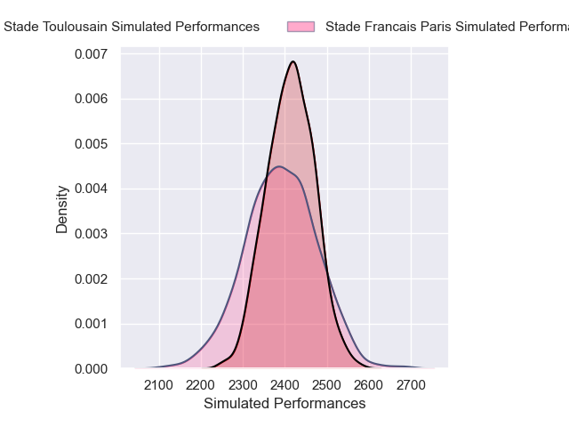
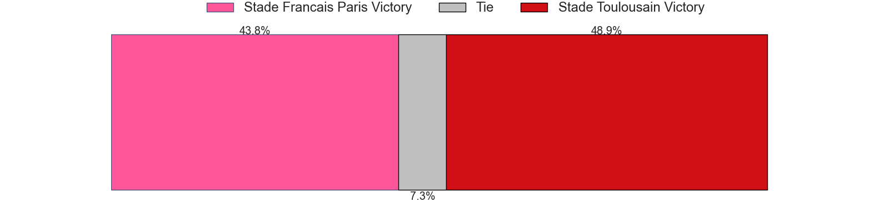
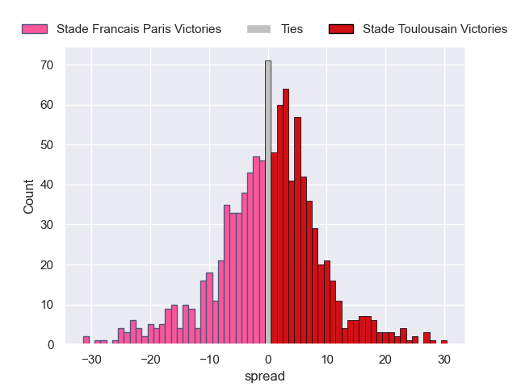

### Bordeaux Begles V Castres Olympique on 2026/02/14

Average Margin: Bordeaux Begles by 7.4

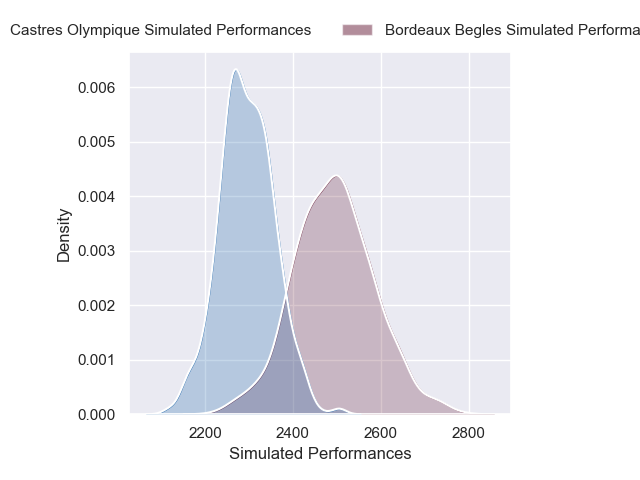
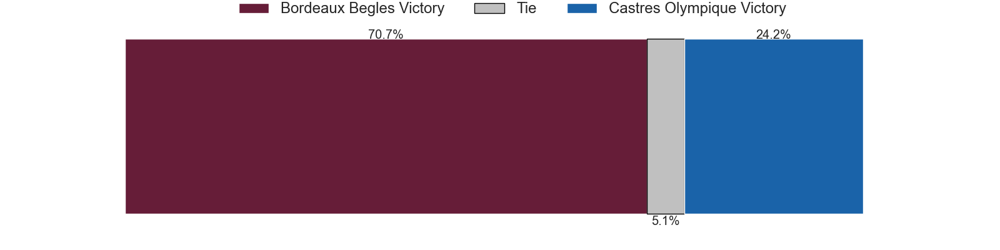
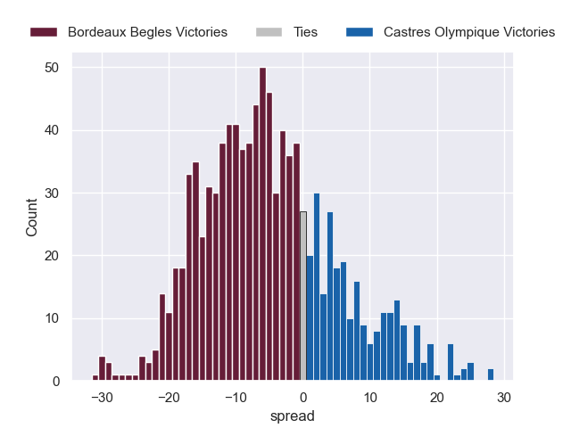

### Perpignan V Pau on 2026/02/14

Average Margin: Pau by 0.1

### La Rochelle V Montpellier Herault on 2026/02/14

Average Margin: La Rochelle by 2.0

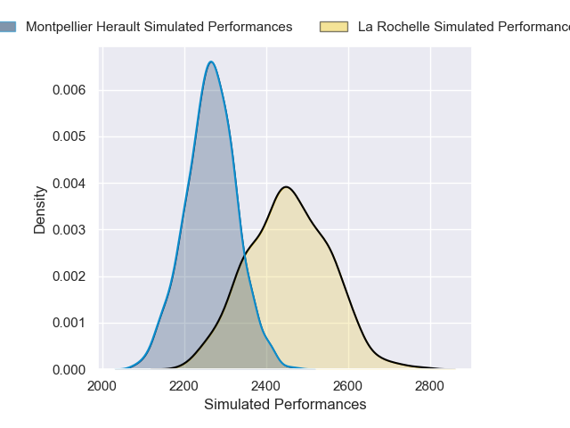
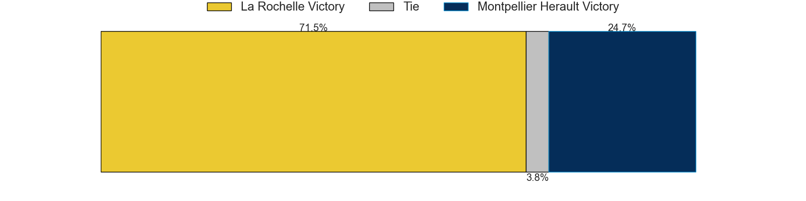
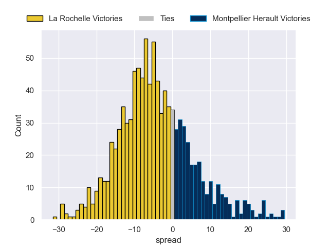

### Bayonne V Racing 92 on 2026/02/14

Average Margin: Bayonne by 2.0

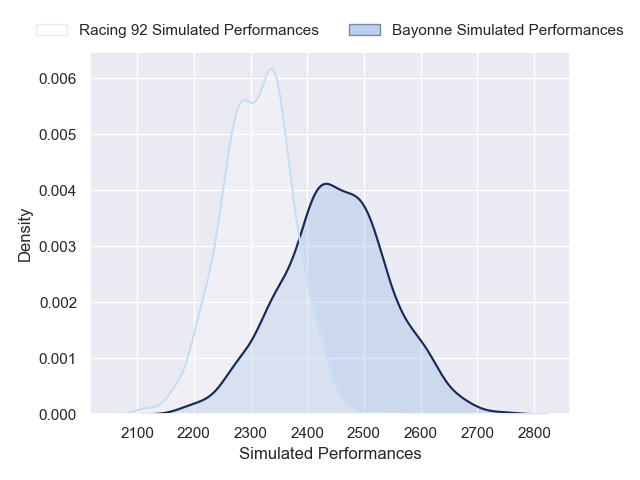
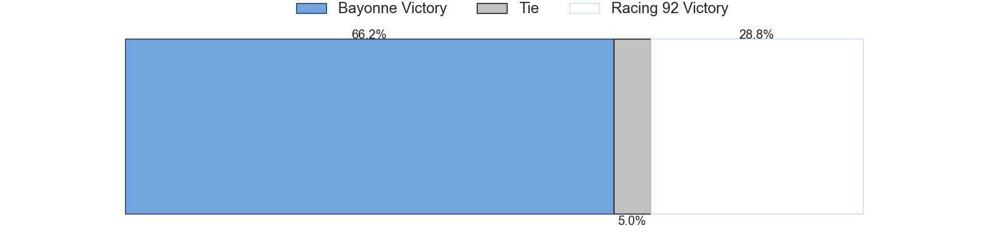
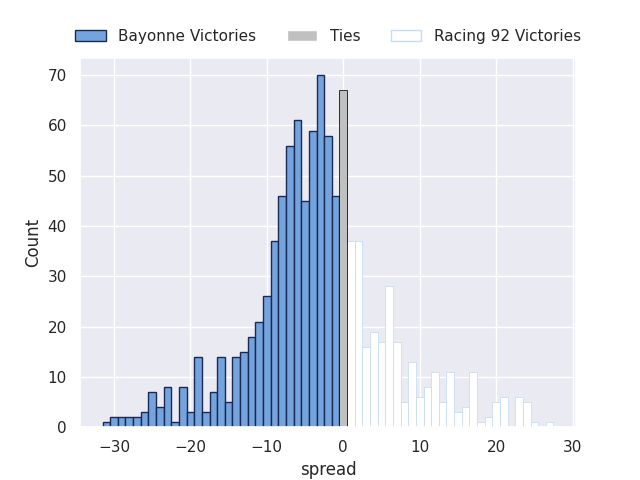

### Toulon V Clermont Auvergne on 2026/02/14

Average Margin: Toulon by 6.5

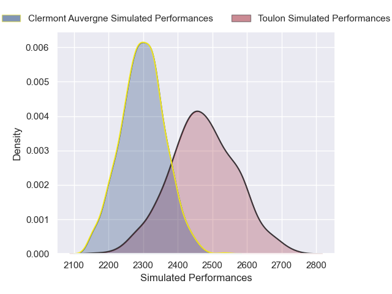
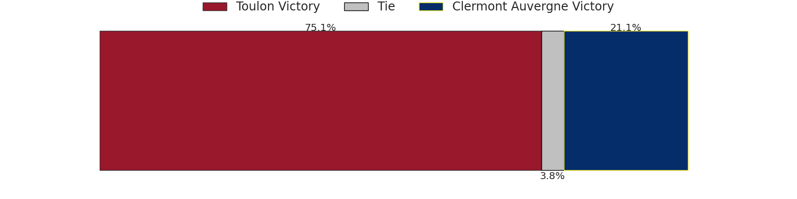
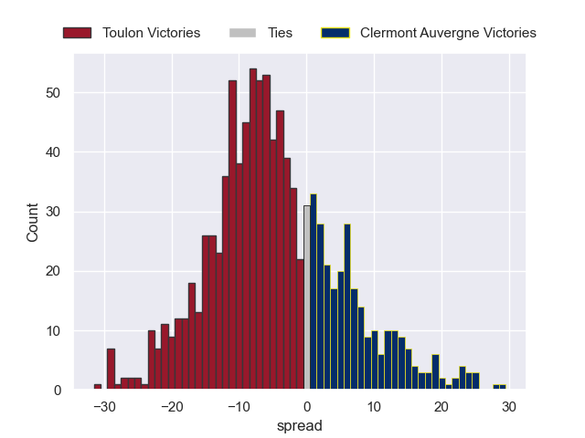

### Lyon V US Montauban on 2026/02/14

Average Margin: Lyon by 10.3

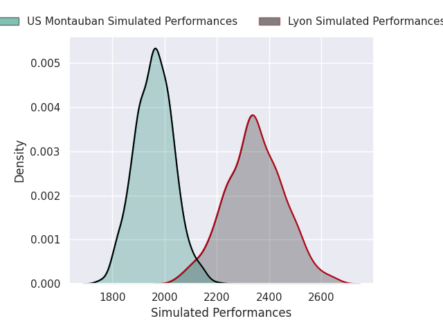
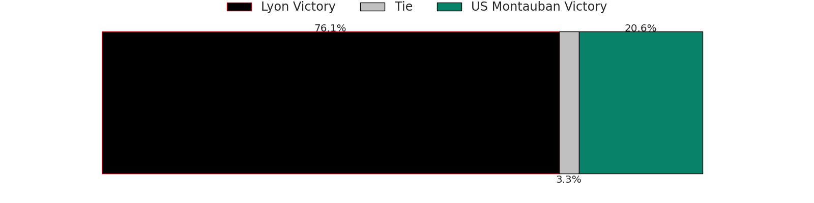
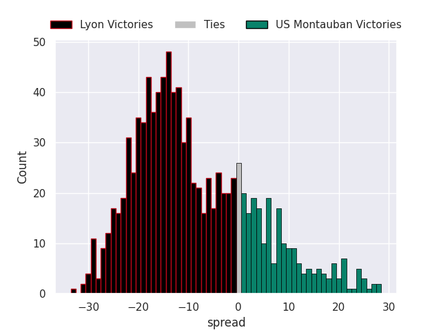

## Week 19

### Montpellier Herault V Racing 92 on 2026/02/27

Average Margin: Montpellier Herault by 6.8

### Clermont Auvergne V Bayonne on 2026/02/27

Average Margin: Clermont Auvergne by 5.1

### Pau V Bordeaux Begles on 2026/02/27

Average Margin: Pau by 0.4

### Castres Olympique V La Rochelle on 2026/02/27

Average Margin: Castres Olympique by 3.6

### Stade Toulousain V US Montauban on 2026/02/27

Average Margin: Stade Toulousain by 16.1

### Stade Francais Paris V Perpignan on 2026/02/27

Average Margin: Stade Francais Paris by 8.1

### Lyon V Toulon on 2026/02/27

Average Margin: Lyon by 1.1

## Week 20

### Racing 92 V Castres Olympique on 2026/03/20

Average Margin: Racing 92 by 2.0

### La Rochelle V Pau on 2026/03/20

Average Margin: La Rochelle by 3.3

### Bordeaux Begles V Stade Toulousain on 2026/03/20

Average Margin: Bordeaux Begles by 2.4

### Perpignan V Lyon on 2026/03/20

Average Margin: Perpignan by 2.8

### US Montauban V Bayonne on 2026/03/20

Average Margin: Bayonne by 2.1

### Clermont Auvergne V Montpellier Herault on 2026/03/20

Average Margin: Clermont Auvergne by 1.3

### Toulon V Stade Francais Paris on 2026/03/20

Average Margin: Toulon by 2.8

## Week 21

### Pau V Racing 92 on 2026/03/27

Average Margin: Pau by 4.8

### Castres Olympique V US Montauban on 2026/03/27

Average Margin: Castres Olympique by 10.5

### Bayonne V La Rochelle on 2026/03/27

Average Margin: Bayonne by 1.2

### Perpignan V Toulon on 2026/03/27

Average Margin: Toulon by 0.3

### Stade Toulousain V Montpellier Herault on 2026/03/27

Average Margin: Stade Toulousain by 6.7

### Lyon V Bordeaux Begles on 2026/03/27

Average Margin: Bordeaux Begles by 1.5

### Stade Francais Paris V Clermont Auvergne on 2026/03/27

Average Margin: Stade Francais Paris by 6.6

## Week 22

### Montpellier Herault V Perpignan on 2026/04/17

Average Margin: Montpellier Herault by 8.5

### Clermont Auvergne V Lyon on 2026/04/17

Average Margin: Clermont Auvergne by 5.0

### Racing 92 V Stade Francais Paris on 2026/04/17

Average Margin: Racing 92 by 0.4

### US Montauban V Toulon on 2026/04/17

Average Margin: Toulon by 4.4

### Bayonne V Pau on 2026/04/17

Average Margin: Bayonne by 0.7

### La Rochelle V Bordeaux Begles on 2026/04/17

Average Margin: La Rochelle by 0.9

### Castres Olympique V Stade Toulousain on 2026/04/17

Average Margin: Stade Toulousain by 1.4

## Week 23

### US Montauban V Racing 92 on 2026/04/24

Average Margin: Racing 92 by 3.4

### Stade Toulousain V Clermont Auvergne on 2026/04/24

Average Margin: Stade Toulousain by 8.9

### Toulon V Bayonne on 2026/04/24

Average Margin: Toulon by 7.4

### Lyon V Castres Olympique on 2026/04/24

Average Margin: Lyon by 1.3

### Bordeaux Begles V Montpellier Herault on 2026/04/24

Average Margin: Bordeaux Begles by 4.9

### Stade Francais Paris V Pau on 2026/04/24

Average Margin: Stade Francais Paris by 4.9

### Perpignan V La Rochelle on 2026/04/24

Average Margin: Perpignan by 0.4

## Week 24

### Stade Francais Paris V Lyon on 2026/05/08

Average Margin: Stade Francais Paris by 6.5

### Bayonne V Bordeaux Begles on 2026/05/08

Average Margin: Bordeaux Begles by 1.6

### Montpellier Herault V US Montauban on 2026/05/08

Average Margin: Montpellier Herault by 12.4

### Toulon V Stade Toulousain on 2026/05/08

Average Margin: Stade Toulousain by 0.1

### Racing 92 V La Rochelle on 2026/05/08

Average Margin: Racing 92 by 1.5

### Clermont Auvergne V Perpignan on 2026/05/08

Average Margin: Clermont Auvergne by 5.1

### Pau V Castres Olympique on 2026/05/08

Average Margin: Pau by 3.3

## Week 25

### Lyon V Bayonne on 2026/05/15

Average Margin: Lyon by 5.0

### US Montauban V Stade Francais Paris on 2026/05/15

Average Margin: Stade Francais Paris by 5.0

### Bordeaux Begles V Perpignan on 2026/05/15

Average Margin: Bordeaux Begles by 8.4

### Castres Olympique V Montpellier Herault on 2026/05/15

Average Margin: Castres Olympique by 2.0

### Pau V Clermont Auvergne on 2026/05/15

Average Margin: Pau by 5.4

### Racing 92 V Toulon on 2026/05/15

Average Margin: Racing 92 by 2.3

### La Rochelle V Stade Toulousain on 2026/05/15

Average Margin: Stade Toulousain by 0.1

## Week 26

### Perpignan V Castres Olympique on 2026/05/29

Average Margin: Perpignan by 0.5

### Montpellier Herault V Pau on 2026/05/29

Average Margin: Montpellier Herault by 4.8

### US Montauban V La Rochelle on 2026/05/29

Average Margin: La Rochelle by 3.3

### Clermont Auvergne V Racing 92 on 2026/05/29

Average Margin: Clermont Auvergne by 4.8

### Stade Francais Paris V Bayonne on 2026/05/29

Average Margin: Stade Francais Paris by 7.3

### Stade Toulousain V Lyon on 2026/05/29

Average Margin: Stade Toulousain by 9.1

### Toulon V Bordeaux Begles on 2026/05/29

Average Margin: Toulon by 1.5

## Week 27

### Lyon V Montpellier Herault on 2026/06/06

Average Margin: Lyon by 0.8

### Castres Olympique V Toulon on 2026/06/06

Average Margin: Castres Olympique by 4.0

### La Rochelle V Stade Francais Paris on 2026/06/06

Average Margin: La Rochelle by 3.0

### Bayonne V Perpignan on 2026/06/06

Average Margin: Bayonne by 4.2

### Racing 92 V Stade Toulousain on 2026/06/06

Average Margin: Stade Toulousain by 2.4

### Pau V US Montauban on 2026/06/06

Average Margin: Pau by 10.1

### Bordeaux Begles V Clermont Auvergne on 2026/06/06

Average Margin: Bordeaux Begles by 7.0

